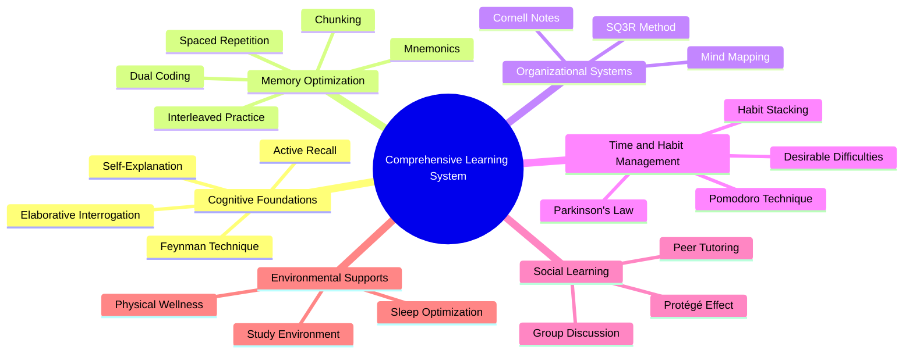

    

<h3 align="center">WELCOME TO</h3>
<h1 align="center">ADVANCED CYBER INTELLIGENCE R&D PROGRAM!</h1>
 
  
 

    

  

  

    

> [NOTE]

This document is a living resource. Suggestions for improvement are welcome and should be directed to the author.

 

> [!IMPORTANT]

This work is licensed under the **Creative Commons Attribution-ShareAlike 4.0 International License** (CC BY-SA 4.0).

When using, redistributing, adapting, or building upon this material, you **must** provide proper attribution by:

- 1. **Clearly stating the original source** as the **ACI R&D GitHub repository**.
- 2. **Including the exact URL(s)** to the relevant repository or file(s).

**Example Attribution Format:**  
- This work is based on content from the ACI R&D GitHub repository, available at:  
- https://github.com/acirdindia/acirdindia

Under the CC BY-SA license, you **must also**:
- Indicate if changes were made.
- License any adapted material under **identical terms** (CC BY-SA 4.0).

Failure to provide accurate source attribution violates the license terms.

    

<h1 align="center">Comprehensive Compendium of Study Techniques and Methodologies.</h1> 

  
 
 

## Table of Contents

1.  **Introduction:** The Science of Effective Learning
2.  **Section I:** Cognitive Foundations of Active Engagement
    - Active Recall (Retrieval Practice)
    - The Feynman Technique (Teaching for Understanding)
    - Self-Explanation and Elaborative Interrogation
3.  **Section II:** Memory Architecture and Optimization Strategies
    - Spaced Repetition and the Leitner System
    - Interleaved Practice
    - Dual Coding
    - Mnemonics and the Method of Loci (Memory Palace)
    - Chunking
4.  **Section III:** Organizational Frameworks for Comprehension
    - The Cornell Note-Taking System
    - Mind Mapping and Concept Mapping
    - The SQ3R Reading Method
5.  **Section IV:** Metacognitive Strategies, Time Management, and Habit Formation
    - The Pomodoro Technique
    - Parkinson's Law and Timeboxing
    - Habit Stacking for Sustainable Learning
    - Desirable Difficulties
6.  **Section V:** Collaborative and Social Learning Dynamics
    - The Protégé Effect: Learning by Teaching
    - Structured Group Discussion and Peer Tutoring
7.  **Section VI:** Contextual and Environmental Optimizers
    - Environmental Design for Focused Work
    - The "Sleep Sandwich" and Sleep-Based Consolidation
    - Physiological Supports: Hydration, Nutrition, and Movement
8.  **Section VII:** Implementation Framework and Synergistic Integration
9.  **Conclusion:** Cultivating Mastery Through Strategic Learning
10. **Appendix:** Quick-Reference Guide for Technique Selection

 

## 1. Introduction: The Science of Effective Learning

Effective learning is not a passive process of consumption but an active, strategic endeavor grounded in the principles of cognitive psychology, educational neuroscience, and behavioral science. After two decades of observing learners at the university level, one truth stands clear: students who succeed are not necessarily those who study the longest hours, but those who study smartest by using techniques aligned with how the brain naturally learns.

This compendium moves beyond anecdotal study tips to present a synthesis of empirically validated methodologies. It is authored from the dual perspective of a senior clinical psychologist and an educationalist, designed to translate complex research into actionable strategies for learners at all stages—from students navigating academic curricula to professionals pursuing lifelong mastery.

The human brain is not designed for the endless rehearsal of information but for its meaningful integration, application, and retrieval. When we simply reread textbooks or highlight passages, we create an illusion of familiarity without building durable memory traces. Techniques that leverage the brain's natural architecture—such as forcing recall, building explanatory frameworks, and strategically spacing exposure—consistently outperform these traditional, passive methods by significant margins.

This document is organized thematically, progressing from the core cognitive processes of learning to the practical frameworks and environmental factors that support them. Each technique is presented with a clear operational definition, an evidence-based rationale drawn from peer-reviewed research, and a deployment-ready implementation protocol. The goal is not merely to inform but to transform how readers approach the lifelong journey of learning.

 

## 2. Section I: Cognitive Foundations of Active Engagement

Cognitive science unequivocally demonstrates that deep, durable learning requires active mental construction. When learners passively receive information, the brain remains in a state of shallow processing. The following techniques replace passive review with generative processing, forcing the brain to engage with material in ways that solidify understanding and create robust memory networks.

### Active Recall (Retrieval Practice)

**Core Concept:** Active recall is the practice of actively stimulating memory retrieval without the aid of reference materials. It is fundamentally the act of generating an answer from memory rather than recognizing it from a list or textbook. This seemingly simple shift in behavior has profound implications for learning effectiveness.

**Psychological Rationale:** This technique leverages what cognitive psychologists call the "testing effect," a robust phenomenon documented in over a century of research. When you successfully retrieve information from memory, you do more than merely check whether you know it. The act of retrieval itself strengthens the neural pathway that leads to that memory, making future access easier and faster. Each successful recall builds a more accessible neural trace, while the effort expended during difficult retrievals signals to the brain that this information carries importance worth preserving. Failure during retrieval, contrary to student intuition, is not a waste of time but a critical component of the learning process that primes the brain for better encoding during subsequent exposure.

**Implementation Protocol:**
- After reviewing a chapter or attending a lecture, close all books and notes, then write down or verbally articulate everything you can remember without any prompts.
- Create flashcards, either physical cards or digital decks using applications like Anki or Quizlet, where the prompt appears on one side and you must actively produce the answer before checking.
- When preparing for examinations, complete practice problems without first reviewing solved examples or solution guides.
- Before rereading any material, pause and attempt to recall the main points you learned in your previous study session.

**Key Insight for Learners:** Many students abandon active recall because it feels difficult and exposes gaps in knowledge. This discomfort, however, is precisely the signal that learning is occurring. The effort and occasional failure inherent in active recall are not signs of poor learning but are critical to the process of long-term consolidation. Embrace the struggle as evidence that your brain is doing the work of building durable memories.

 

### The Feynman Technique (Teaching for Understanding)

**Core Concept:** Named after the Nobel Prize-winning physicist Richard Feynman, this technique involves mastering a concept by explaining it in simple, plain language as if teaching it to someone with no background in the subject. The constraint of using everyday vocabulary forces the learner to strip away jargon and identify the essential core of an idea.

**Psychological Rationale:** Teaching another person requires what psychologists call explanatory depth. When you attempt to simplify a concept for a novice, you must identify its core principles, recognize how different elements relate to one another, and confront any gaps or contradictions lurking in your own understanding. This process moves knowledge from superficial familiarity—where you can recognize the concept when you see it—to true conceptual mastery where you can reconstruct the idea from first principles. The technique leverages the cognitive dissonance created when you realize you cannot explain something simply, motivating deeper investigation of the underlying material.

**Implementation Steps:**

1.  **Choose Your Target:** Select a specific concept you wish to learn or understand more deeply. Write its name at the top of a blank page.

2.  **Teach It to a Child:** Below the concept, write an explanation using only simple language and avoiding all technical terms. Imagine you are teaching someone young enough that they lack your specialized vocabulary. If you find yourself using jargon or writing complicated sentences, you have identified a gap in your understanding.

3.  **Identify Knowledge Gaps:** Review your explanation and mark every place where you struggled to be clear, resorted to vague language, or relied on undefined terms. Each of these marks represents a gap in your comprehension that requires attention.

4.  **Review and Refine:** Return to your source materials—textbooks, lecture notes, research papers—to clarify the identified gaps. Then rewrite your explanation, incorporating this new understanding while maintaining simplicity. Repeat this cycle until your explanation flows clearly and completely.

 

### Self-Explanation and Elaborative Interrogation

**Core Concept:** This family of techniques focuses on the fundamental questions of "how" and "why" in learning. Self-explanation involves verbally narrating your reasoning process as you work through a problem or read a text. Elaborative interrogation takes this further by proactively questioning the material, asking "Why is this true?" or "How does this connect to what I already know?" throughout the learning process.

**Psychological Rationale:** These strategies promote what memory researchers call relational and causal encoding. By connecting new information to existing knowledge structures and explaining the underlying mechanisms that make facts true, learners embed individual pieces of information within a rich network of meaning. This network serves multiple functions: it provides multiple pathways for retrieval, it makes the information more resistant to forgetting, and it enables flexible application to novel situations. When you understand why something works, you can reconstruct the details even if your memory of the exact facts fades.

**Implementation Guidelines:**
- While reading textbook chapters, pause at the end of each paragraph or section and ask yourself genuine "why" questions about the content. Why did this event occur? Why is this formula structured this way? Why does this concept matter?
- When solving practice problems, talk through each step aloud, explaining to yourself why you are taking that particular action and how it connects to the principles you have learned.
- Create "why chains" for complex systems by repeatedly asking why each component exists, tracing the logic back to foundational principles.
- After learning a new fact, actively search for connections to material you already know, asking yourself how this new piece fits with or challenges your existing understanding.

 

## 3. Section II: Memory Architecture and Optimization Strategies

Human memory operates according to predictable patterns of encoding, storage, and decay that have been studied systematically since the pioneering work of Hermann Ebbinghaus in the 1880s. These strategies work with the brain's architecture rather than against it, combating the natural forgetting curve and building robust, long-term knowledge structures that remain accessible when needed.

### Spaced Repetition and the Leitner System

**Core Concept:** Spaced repetition involves reviewing information at systematically increasing intervals over time. Rather than massing all practice into a single session, learners distribute their encounters with material across days, weeks, and months. The intervals are calibrated to be long enough that retrieval requires effort but short enough that the information has not been completely forgotten.

**Psychological Rationale:** This approach directly counters Ebbinghaus's forgetting curve, which demonstrates that memory decay is steepest immediately after learning and gradually levels off. When you review information just as it begins to fade from memory, you powerfully reinforce the neural trace and signal to your brain that this content deserves long-term storage. Each successful retrieval at increasing intervals strengthens the memory further, and the spacing effect—one of the most robust findings in all of cognitive psychology—ensures that spaced practice produces dramatically better long-term retention than massed practice of equal total duration.

**Implementation Methods:**

**Digital Approach:** Use algorithm-driven software such as Anki, SuperMemo, or Quizlet. These applications track your performance on each piece of information and schedule reviews at optimal intervals based on your recall history. The algorithms are designed to present material for review just before you would likely forget it, maximizing efficiency.

**Manual Approach - The Leitner System:** Create a set of physical flashcards and obtain five small boxes or envelopes. Label them with increasing review intervals:

| Box Number | Review Frequency | Card Movement Rule |
|------------|------------------|---------------------|
| Box 1 | Daily | Correct answers move to Box 2; incorrect answers stay in Box 1 |
| Box 2 | Every 3 days | Correct answers move to Box 3; incorrect answers return to Box 1 |
| Box 3 | Weekly | Correct answers move to Box 4; incorrect answers return to Box 1 |
| Box 4 | Every 2 weeks | Correct answers move to Box 5; incorrect answers return to Box 1 |
| Box 5 | Monthly | Correct answers stay in Box 5; incorrect answers return to Box 1 |

Each study session consists of reviewing the cards due in each box according to their schedule. Cards answered correctly advance to the next box with its longer interval, while cards answered incorrectly return to Box 1 for more frequent practice. This system automatically allocates more study time to difficult material while efficiently maintaining easy material with minimal effort.

 

### Interleaved Practice

**Core Concept:** Interleaved practice involves mixing different topics or types of problems within a single study session, rather than blocking practice on one skill at a time before moving to the next. In blocked practice, you might complete twenty algebra problems followed by twenty geometry problems. In interleaved practice, you would mix algebra, geometry, and calculus problems in a random or varied sequence.

**Psychological Rationale:** Blocked practice creates a dangerous illusion of mastery. When you solve twenty consecutive problems requiring the same procedure, you can complete each one by rote application without thinking deeply about the underlying principles. This leads to what researchers call contextual overfitting—you learn to execute the procedure without understanding when and why to apply it. Interleaving forces constant retrieval practice and discriminative contrast. With each problem, you must pause, analyze the situation, and consciously select the appropriate strategy from your growing repertoire. This effortful selection process builds the mental flexibility needed for real-world application, where problems do not arrive conveniently labeled with their solution method.

**Implementation Examples:**
- During mathematics study sessions, create problem sets that randomly mix algebra equations, geometry proofs, and calculus derivatives rather than practicing each type separately.
- When learning a foreign language, alternate between vocabulary memorization, grammar exercises, translation practice, and listening comprehension within a single study period.
- For history courses, mix questions about different time periods and geographical regions rather than studying each unit in isolation.
- In preparation for comprehensive examinations, design practice sessions that draw randomly from all course material covered to date.

 

### Dual Coding

**Core Concept:** Dual coding is the practice of combining verbal information—words, explanations, written notes—with visual information such as diagrams, charts, sketches, timelines, or concept maps. The two representations are created together and linked in the learner's mind, providing complementary channels for encoding and retrieval.

**Psychological Rationale:** The brain processes visual and verbal information through partially distinct channels, often described by cognitive psychologists as the visuospatial sketchpad and the phonological loop within working memory. When you create both a verbal and a visual representation of the same information, you build two separate but linked memory traces. This dual encoding provides two potential pathways for later retrieval. If one pathway becomes temporarily inaccessible, the other may still lead to the information. Moreover, the process of translating information from one format to another requires deep processing that itself strengthens memory, regardless of which format you ultimately use for recall.

**Implementation Guidelines:**
- When taking notes during lectures or while reading, always supplement your written text with simple diagrams, flowcharts, or timelines that illustrate the relationships you are describing.
- For processes or sequences, draw step-by-step visual representations that capture the flow of events or operations.
- When learning anatomical structures, mechanical systems, or organizational hierarchies, create labeled diagrams rather than relying solely on lists of components.
- Annotate diagrams and images provided in textbooks with your own written summaries, connecting the visual representation to your verbal understanding.
- Use color coding systematically to represent categories, relationships, or levels of importance across your visual materials.

 

### Mnemonics and the Method of Loci (Memory Palace)

**Core Concept:** Mnemonics are systematic techniques for making abstract or list-based information more memorable by imposing meaningful structure. They transform arbitrary sequences into organized patterns that leverage the brain's natural strengths in processing narratives, spatial relationships, rhythms, and vivid imagery. The Method of Loci, also known as the Memory Palace technique, represents one of the most powerful and historically validated mnemonic systems.

**Psychological Rationale:** Human memory evolved primarily to navigate physical environments and track socially relevant information, not to remember random lists of facts. Mnemonics exploit this evolutionary heritage by converting abstract information into formats the brain handles naturally. When you create a vivid mental image and place it in a familiar spatial location, you engage neural systems specialized for visual processing and spatial navigation, dramatically increasing the probability of later recall. The effort invested in constructing these mental representations also promotes deeper processing, further strengthening memory traces.

**Implementation Methods:**

**Acronyms and Acrostics:**
- Create a word where each letter stands for an item you need to remember. For example, "HOMES" helps recall the Great Lakes: Huron, Ontario, Michigan, Erie, Superior.
- Construct a sentence where the first letter of each word represents a term in sequence. Medical students often use "On Old Olympus Towering Tops" to remember cranial nerves.

**Method of Loci (Memory Palace):**

1.  **Select Your Palace:** Choose a familiar location you can visualize in rich detail. Your current home, your childhood home, your daily commute route, or your workplace all work well. The key requirement is that you can mentally walk through this space and identify distinct locations along the way.

2.  **Define Your Loci:** Identify specific stopping points or loci along a mental journey through your chosen space. For a house, these might include the front door, the coat rack in the entryway, the kitchen sink, the refrigerator, the dining table, and so on. You need one locus for each item you plan to remember.

3.  **Create Vivid Images:** For each item you need to remember, construct a mental image that is as bizarre, exaggerated, and emotionally charged as possible. The human brain remembers unusual and striking images far better than ordinary ones. If you need to remember to buy milk, imagine a cow sitting in your living room wearing a hat and drinking tea.

4.  **Place the Images:** Mentally place each vivid image at one of your loci along the journey. Associate the first item with the first locus, the second with the second locus, and continue through your sequence.

5.  **Retrieve Through Mental Walking:** When you need to recall the information, mentally walk through your palace, visiting each locus in order. At each stop, observe the image you placed there and translate it back into the information it represents.

**Research Evidence:** A 2014 study conducted with medical students demonstrated the power of this technique. Students who learned to use the Method of Loci for studying insulin and diabetes showed significantly improved performance on subsequent assessments compared to a control group using their preferred self-directed study methods. The improvement was not marginal but substantial, suggesting that even experienced learners benefit from structured mnemonic approaches.

 

### Chunking

**Core Concept:** Chunking involves grouping individual pieces of information into larger, meaningful units or "chunks." Rather than treating each discrete element separately, the learner organizes related elements into coherent clusters that function as single units in working memory.

**Psychological Rationale:** Working memory, the mental workspace where conscious processing occurs, has a severe capacity limitation. Classic research by George Miller in 1956 suggested that most adults can hold only about seven items in working memory simultaneously, and more recent work suggests the limit may be as low as four items for complex information. Chunking allows learners to overcome this fundamental constraint by treating a cluster of related information as a single item. Instead of holding seven individual digits in mind, you might hold one seven-digit phone number as a single chunk, dramatically increasing your functional memory capacity. The process of creating chunks also promotes meaningful organization of knowledge, as the chunks themselves reflect your understanding of how pieces fit together.

**Implementation Examples:**
- Memorize telephone numbers as "555-0198" rather than as a sequence of seven individual digits.
- When learning vocabulary in a new language, group words by thematic categories such as all kitchen items, all emotion words, or all business terms, rather than learning them in random order.
- For complex procedures with many steps, identify natural break points and organize the steps into three or four larger phases, then practice executing each phase as a unit.
- In programming, learn to recognize common patterns and structures rather than memorizing individual lines of code. Experienced programmers "chunk" code into functional blocks.
- When studying anatomy, learn the bones of the hand as a group organized by their natural categories (carpals, metacarpals, phalanges) rather than as a list of twenty-seven individual names.

 

## 4. Section III: Organizational Frameworks for Comprehension

Effective learning requires not just intake of information but its systematic organization. Raw data, whether from lectures or texts, must be transformed into coherent knowledge structures that support understanding, retention, and application. These frameworks provide structured processes for capturing, connecting, and reviewing information.

### The Cornell Note-Taking System

**Core Concept:** Developed in the 1950s by Walter Pauk at Cornell University, this system divides the note-taking page into three functionally distinct sections: a main notes column, a cue column, and a summary area at the bottom. The physical layout of the page guides the learner through a process of active engagement with the material before, during, and after the initial note-taking.

**Psychological Rationale:** The Cornell System integrates multiple learning principles into a single framework. The initial note-taking during lectures or reading provides encoding benefits. The cue column, completed afterward, supports retrieval practice by prompting self-testing. The summary section requires synthesis and consolidation. This combination of encoding, retrieval, and consolidation addresses all phases of the learning cycle within a single, elegantly simple format.

**Implementation Steps:**

1.  **Prepare Your Page:** Before the lecture or reading session, draw a vertical line about two and a half inches from the left edge of your paper. Leave a horizontal section of about two inches at the bottom. You now have three areas: a narrow left column (the cue column), a wide right column (the notes column), and a bottom section (the summary area).

2.  **Record Notes During Learning:** During the lecture or while reading, write your main notes in the wide right column. Use sentences, bullet points, or short paragraphs. Focus on capturing main ideas, key facts, and important details. Write legibly but do not worry about perfect organization at this stage.

3.  **Create Cues After Learning:** Within 24 hours of taking the notes, review the right column and distill the content into key questions, main ideas, or prompts. Write these in the left cue column. These cues should be designed to trigger recall of the corresponding notes when you cover the right column.

4.  **Write a Summary:** At the bottom of the page, write a brief synthesis of the entire page's content in two to four sentences. This forces you to identify the most important concepts and articulate how they connect.

5.  **Review Using the Cues:** For ongoing review, fold the page or cover the right column so only the cue column is visible. Use each cue as a test question, attempting to recall the related notes fully before checking your answer. This transforms passive rereading into active retrieval practice.

 

### Mind Mapping and Concept Mapping

**Core Concept:** Mind mapping is a visual, non-linear method of organizing ideas around a central concept. From this central topic, branches radiate outward representing major subtopics, with further sub-branches for finer details. Keywords, colors, symbols, and images enrich the map, creating a rich visual representation of interconnected knowledge. Concept mapping is a related but more structured technique that explicitly labels the relationships between concepts.

**Psychological Rationale:** These visual approaches mirror the brain's associative, networked structure. Unlike linear outlines, which impose a hierarchical order that may not reflect how ideas actually connect, mind maps externalize the relational structure of knowledge. This format facilitates holistic understanding by showing how pieces fit together, and it leverages visual-spatial memory by associating information with its position, color, and imagery within the map. The act of constructing a map also requires active decision-making about relationships and categories, deepening processing.

**Implementation Guidelines for Mind Mapping:**

- Begin with a blank page oriented horizontally to provide maximum space for branching.
- Write the central topic in the middle of the page and draw a circle or image around it.
- For each major subtopic, draw a thick branch radiating outward from the center. Label each branch with a single keyword representing that subtopic.
- From these main branches, draw thinner sub-branches for supporting details, examples, and finer points. Use single words or very short phrases on each branch.
- Use colors systematically: assign different colors to different major branches, use color to indicate relationships, or employ color coding for categories of information.
- Incorporate simple drawings, symbols, or icons wherever possible to create visual hooks for memory.
- Connect related ideas across different branches with arrows or lines to show cross-connections.

The following mind map visualizes the relationships among the major learning strategies discussed in this compendium, illustrating how different techniques serve complementary functions in an integrated learning system:

 

### The SQ3R Reading Method

**Core Concept:** SQ3R is a five-step method for engaged, strategic reading of textbooks and academic papers. The acronym stands for Survey, Question, Read, Recite, and Review. This structured approach transforms reading from passive consumption of text into an active, goal-directed inquiry.

**Psychological Rationale:** Most students approach textbook reading as they would a novel: they begin at page one and read straight through, hoping that meaning will emerge. This passive approach leads to poor comprehension and rapid forgetting. SQ3R addresses this by establishing a purpose for reading before any detailed engagement begins. By surveying the structure and formulating questions, the learner activates relevant prior knowledge and creates mental frameworks that organize incoming information. The reading phase becomes a search for answers rather than aimless consumption, and the recite and review phases provide essential retrieval practice.

**Implementation Steps:**

1.  **Survey (5-10 minutes):** Before reading in detail, skim the entire chapter or section. Read headings, subheadings, and highlighted terms. Examine figures, charts, and diagrams. Read the introductory paragraphs and the chapter summary or conclusion. This survey provides a mental map of the territory you are about to explore.

2.  **Question (2-3 minutes):** Convert each major heading into a question. If a heading reads "The Causes of the French Revolution," your question becomes "What were the causes of the French Revolution?" These questions establish a purpose for reading and activate curiosity.

3.  **Read (Variable time):** Read the section actively, searching for answers to your questions. Pay attention to emphasized terms, topic sentences, and concluding paragraphs. Read with your questions in mind, marking or noting information that addresses them.

4.  **Recite/Recall (5 minutes per section):** After completing each section, close the book and attempt to recite the answers to your questions from memory. Use your own words rather than trying to reproduce the text verbatim. If you cannot recall the main points, return to the section and review before continuing.

5.  **Review (10-15 minutes):** After completing all sections, review your questions and answers to consolidate the material. Create brief notes or a summary if helpful. This final review strengthens retention and identifies any remaining gaps in understanding.

 

## 5. Section IV: Metacognitive Strategies, Time Management, and Habit Formation

Sustaining the cognitive effort required for deep learning demands more than knowledge of effective techniques. Learners must also manage their attention, time, and behavior strategically. These metacognitive and behavioral techniques provide the scaffolding for consistent, focused effort over the long term.

### The Pomodoro Technique

**Core Concept:** Developed by Francesco Cirillo in the late 1980s, the Pomodoro Technique involves working in focused, timed intervals traditionally set at 25 minutes, separated by short breaks of 5 minutes. After completing four such intervals, the learner takes a longer break of 15 to 30 minutes. The name derives from the tomato-shaped kitchen timer Cirillo used as a university student.

**Psychological Rationale:** This technique aligns with the brain's natural attention rhythms. Sustaining intense focus for hours without breaks leads to diminishing returns as mental fatigue accumulates. The structured intervals of the Pomodoro Technique prevent this fatigue by building in regular opportunities for recovery. Additionally, the technique balances what cognitive scientists call focused mode thinking—intense concentration on a specific problem—with diffuse mode thinking, the relaxed mental state during breaks that allows for background processing and creative connections. Breaking daunting tasks into 25-minute chunks also reduces the psychological barrier to starting, combating procrastination effectively.

**Implementation Guidelines:**

- Select a single task to accomplish during your Pomodoro session. Commit to working on only that task until the timer rings.
- Set a timer for 25 minutes. During this interval, eliminate all distractions. Close unnecessary browser tabs, put your phone out of sight, and resist any impulse to switch tasks.
- Work with full focus until the timer rings. If a distracting thought arises, write it down quickly to address later and return immediately to your work.
- When the timer rings, take a strict 5-minute break. Step away from your workspace, stretch, walk around, or rest your eyes. Avoid starting any new work during this break.
- After four Pomodoros, take a longer break of 15 to 30 minutes to allow more substantial recovery.
- Track your completed Pomodoros to maintain awareness of your actual focused work time and to identify patterns in your productivity.

 

### Parkinson's Law and Timeboxing

**Core Concept:** Parkinson's Law states that "work expands to fill the time available for its completion." This observation, first articulated by Cyril Northcote Parkinson in a humorous 1955 essay, captures a fundamental truth about human behavior: when given unlimited time, we tend to use it inefficiently, allowing tasks to grow in complexity and duration. Timeboxing is the practical application of this insight—assigning fixed, limited time periods to complete specific tasks and adhering strictly to those boundaries.

**Psychological Rationale:** Open-ended tasks invite procrastination, perfectionism, and inefficient work patterns. When no deadline looms, the mind wanders, and the task expands to consume whatever time is available. Timeboxing creates beneficial temporal urgency that focuses attention, reduces the temptation to perfect minor details unnecessarily, and provides clear termination points that make starting easier. The constraint of limited time forces prioritization and efficient work habits.

**Implementation Methods:**

- Transform open-ended goals into timeboxed commitments. Instead of "study Chapter 5," set the goal "outline the key points of Chapter 5 in 30 minutes."
- When beginning a work session, decide in advance how much time you will allocate to each task and set timers accordingly.
- When the timebox expires, stop work on that task even if it feels incomplete. Move to your next scheduled activity. This discipline trains you to work efficiently within constraints.
- For larger projects, break them into smaller components and assign each component its own timebox across multiple sessions.
- Use timeboxing proactively for tasks you tend to avoid. Knowing that you only need to work on an unpleasant task for a fixed, limited period makes starting easier.

 

### Habit Stacking for Sustainable Learning

**Core Concept:** Habit stacking is the practice of attaching a new, desired habit to an existing, well-established habit by using the existing behavior as a trigger. The formula is simple: "After I [existing habit], I will [new habit]." This approach leverages the power of existing neural pathways to support the development of new routines.

**Psychological Rationale:** Willpower and motivation are limited resources that fluctuate daily. Relying on them to initiate new behaviors is unreliable. Habit stacking bypasses this problem by using an existing automatic behavior as a reliable cue. The established habit, deeply encoded in neural circuits, acts as a trigger that reduces the cognitive load and decision-making required to start the new behavior. Over time, the new behavior becomes similarly automatic, requiring minimal conscious effort to maintain.

**Implementation Steps:**

1.  **Identify a Reliable Current Habit:** Choose a habit you perform consistently without fail each day. Examples include pouring your morning coffee, brushing your teeth, sitting down at your desk, finishing lunch, or changing into comfortable clothes after work.

2.  **Define Your New Learning Habit:** Specify the new behavior you wish to establish. Make it small and achievable at first to ensure success. Rather than "study for two hours," start with "review one flashcard deck" or "read one page of my textbook."

3.  **Create the Stack Statement:** Combine the cue and the new habit into a clear implementation intention: "After I pour my morning coffee, I will complete one round of flashcards." "After I brush my teeth at night, I will spend five minutes reviewing today's notes."

4.  **Start Small and Build Consistency:** Focus on performing the stack consistently every day, even if the new habit feels trivial. Consistency builds the automaticity you need. Once the stack feels natural, gradually increase the duration or complexity of the new habit.

5.  **Design Your Environment to Support the Stack:** Place your flashcards next to the coffee maker. Keep your notes on your nightstand. Remove barriers that might interrupt the automatic flow from cue to behavior.

**Expert Consideration:** Psychologist Dr. Lauren Alexander, drawing on extensive clinical experience with behavior change, offers important nuance to the habit stacking approach. While habit stacking can be effective, it is not a universal solution. Success depends critically on the difficulty of the new habit and the individual's intrinsic motivation for the learning goal. For complex habits requiring significant time or cognitive effort, pairing the stack with an immediate reward can strengthen the association, a principle known as the Premack Principle where a more probable behavior reinforces a less probable one. Alternatively, using an approach called shaping—gradually building up to the target behavior through a series of successively closer approximations—can be more effective than attempting to establish the full habit immediately. The key insight is that habit formation is a skill that can be developed, and different challenges may require different behavioral strategies.

 

### Desirable Difficulties

**Core Concept:** Introduced by cognitive psychologists Robert and Elizabeth Bjork, the concept of desirable difficulties refers to the counterintuitive principle that introducing certain obstacles or challenges during learning creates more effortful processing, which leads to superior long-term retention and transfer compared to easier, more fluent learning experiences. These difficulties are "desirable" because, although they slow apparent progress in the short term, they produce dramatically better outcomes over time.

**Psychological Rationale:** When learning feels easy, the brain often engages in shallow processing that creates an illusion of mastery without building durable memory. Students who highlight text or reread passages experience fluency—the material feels familiar—and mistakenly conclude they have learned it. In contrast, when learning requires effortful retrieval, problem-solving, or generation, the brain engages in deeper processing that strengthens memory traces and creates multiple retrieval pathways. The effort itself signals to the brain that the information is important and worth preserving. Bjork's Richness of Encoding Principle explains that the more elaborate and effortful the encoding process, the more robust the resulting memory.

**Implementation Examples:**

- **Generate Before Receiving:** Before reading an explanation or being shown a solution, attempt to solve the problem or generate the answer yourself, even if you are unsure. The attempt, even if incorrect, primes your brain to learn more effectively from the subsequent feedback.
- **Space Practice:** Distribute learning across multiple sessions rather than cramming. The forgetting that occurs between sessions creates desirable difficulty during review.
- **Interleave Topics:** Mix different types of problems rather than blocking practice on a single type. The need to select the correct approach for each problem adds desirable difficulty.
- **Vary Practice Conditions:** Study in different locations, at different times, or using different modalities. Contextual variation makes retrieval more challenging but also more robust.
- **Use Testing as Learning:** Regularly test yourself on material rather than simply rereading. Retrieval effort strengthens memory even when you fail to recall correctly.
- **Handwrite Notes:** Writing by hand is slower and less fluent than typing, but the effort of paraphrasing and organizing information during writing leads to better encoding than verbatim typing.

 

## 6. Section V: Collaborative and Social Learning Dynamics

Learning, while often pursued individually, is fundamentally a social endeavor. Interaction with others provides accountability, exposes blind spots in understanding, and creates opportunities for the powerful cognitive restructuring that occurs when we teach and explain to others. These collaborative approaches leverage social dynamics to enhance individual learning outcomes.

### The Protégé Effect: Learning by Teaching

**Core Concept:** The protégé effect describes the phenomenon whereby individuals who teach a topic to others develop a deeper and more durable understanding of the material themselves. The act of preparing to teach transforms how learners engage with content, leading to superior learning outcomes compared to studying solely for personal mastery.

**Psychological Rationale:** Preparing to teach triggers multiple cognitive processes that enhance learning. First, it requires metacognitive organization: you must structure knowledge logically, identify core concepts, and understand relationships between ideas to present them coherently. Second, it generates anticipatory thinking: you consider what questions your audience might ask and what points might be confusing, which deepens your own analysis. Third, the social responsibility of teaching increases motivation and leads to more thorough preparation. Finally, the act of explaining forces you to translate information into your own words, promoting deeper encoding than passive review.

**Implementation Methods:**

- **Peer Tutoring Partnerships:** Form a study partnership with a classmate and take turns teaching each other different concepts. After one person teaches, the other asks questions and seeks clarification, further deepening both participants' understanding.

- **Study Group Teaching Rotations:** Within a small study group, assign different topics to different members who then prepare mini-lessons to present to the group. Rotate responsibilities so everyone experiences teaching and being taught.

- **The Rubber Duck Method:** When stuck on a difficult problem or concept, explain it aloud to an inanimate object—a rubber duck on your desk, a stuffed animal, or even an empty chair. The act of verbalizing forces you to organize your thoughts and often reveals gaps or solutions that were not apparent during silent contemplation.

- **Create Teaching Materials:** Develop study guides, explanatory videos, or practice problems as if you were preparing them for other students. Even if no one else uses these materials, the act of creating them forces you into the teacher's mindset and deepens your understanding.

**Research Insight:** A 2019 meta-analytic review of learning-by-teaching studies revealed an important nuance: the benefits of teaching are maximized when the teaching involves direct, interactive engagement with learners. Preparing for face-to-face teaching, with its expectation of questions and dialogue, produces greater learning gains than preparing indirect teaching materials like videos or written guides. The anticipation of live interaction, with its demands for flexible explanation and immediate response, creates richer cognitive engagement than preparing one-way communication.

 

### Structured Group Discussion and Peer Tutoring

**Core Concept:** Moving beyond casual study groups, structured collaborative learning implements purposeful, role-driven interactions designed to maximize cognitive benefits. Rather than simply gathering to review material together, participants adopt specific roles and follow structured protocols that ensure active engagement from all members.

**Psychological Rationale:** Well-structured group discussion exposes learners to multiple perspectives and alternative explanations, challenging them to examine their own understanding critically. Defending your interpretation against questions from peers forces you to articulate reasoning and evidence, consolidating knowledge. Hearing others' explanations provides alternative mental models that may clarify concepts you find difficult. The social accountability of group commitment also motivates preparation and sustained engagement.

**Implementation Framework for Study Groups:**

**Assign Rotating Roles:** Each group meeting should assign specific responsibilities to ensure balanced participation and productive discussion:

| Role | Responsibilities |
|------|-------------------|
| Discussion Leader | Prepares key questions in advance, facilitates discussion, ensures all voices are heard, keeps group on topic |
| Skeptic | Questions assumptions, asks for evidence, challenges superficial explanations, plays devil's advocate |
| Synthesizer | Summarizes main points at intervals, identifies emerging themes, connects different contributions |
| Connector | Relates discussion to previous material, identifies real-world applications, links to other courses or contexts |
| Recorder | Takes notes on key insights, questions raised, and conclusions reached; distributes summary after meeting |

**Structured Discussion Protocols:**

- **Think-Pair-Share:** Individuals think silently about a question for several minutes, then discuss their thoughts with a partner, and finally share insights with the full group. This ensures everyone processes the question individually before hearing others' ideas.

- **Round Robin:** Each person in turn shares one insight or question without interruption. This prevents domination by vocal members and ensures all perspectives are heard.

- **Debate Format:** Assign opposing viewpoints on a controversial topic and require each side to prepare arguments and evidence. The process of constructing and defending a position deepens understanding even if you personally hold the opposing view.

- **Peer Tutoring Rotations:** Pair group members and assign each pair responsibility for teaching a specific concept to the others. After preparation time, each pair presents their concept and fields questions.

 

## 7. Section VI: Contextual and Environmental Optimizers

Cognitive performance does not occur in a vacuum. The physical state of the learner and the characteristics of the learning environment significantly influence the effectiveness of any study technique. These contextual factors, often overlooked in discussions of learning strategies, can be harnessed to enhance efficiency and outcomes substantially.

### Environmental Design for Focused Work

**Core Concept:** Environmental design involves intentionally shaping your physical study surroundings to minimize distractions, cue focused behavior, and support sustained concentration. Rather than fighting against a distracting environment through sheer willpower, you modify the environment itself to make desired behaviors easier and undesired behaviors harder.

**Psychological Rationale:** The physical environment constantly influences attention and behavior, often below conscious awareness. Clutter competes for neural resources, increasing cognitive load and reducing the capacity available for learning. Digital notifications create interruptions that fragment attention and require time to recover from after each disruption. Conversely, a well-designed environment can automatically cue focused behavior: entering a dedicated study space triggers a mental shift into work mode. By reducing friction for desired behaviors and increasing friction for distractions, environmental design conserves limited willpower for actual learning rather than for resisting temptation.

**Implementation Guidelines:**

- **Designate a Dedicated Study Space:** Choose a specific location used only for focused academic work. Avoid using this space for entertainment, social media, or relaxation. Over time, your brain will associate this location with concentration, making it easier to enter a focused state when you arrive.

- **Eliminate Visual Clutter:** Keep your study surface clear of everything except materials needed for your current task. Store unrelated items out of sight. A clean visual field reduces competing stimuli and supports sustained attention.

- **Control Digital Distractions:** Use website blockers during focused sessions to prevent access to social media and entertainment sites. Put your phone in another room or in a drawer where you cannot see it. Turn off all notifications except those from essential communication channels.

- **Optimize Lighting:** Ensure your study space has adequate, preferably natural, lighting. Dim lighting can induce drowsiness, while harsh fluorescent lighting may cause eye strain. Position your desk to minimize glare on screens and materials.

- **Manage Noise:** If you require silence, use noise-canceling headphones or earplugs. If ambient noise helps you focus, curate it deliberately using instrumental music, nature sounds, or white noise. Avoid music with lyrics when processing verbal information, as lyrics compete for language-processing resources.

- **Personalize Strategically:** Add a few meaningful items to your space—a plant, a inspiring image, a comfortable chair—but avoid clutter. Personal touches can increase your willingness to spend time in the space without creating distraction.

 

### The "Sleep Sandwich" and Sleep-Based Consolidation

**Core Concept:** The sleep sandwich is a strategic approach to scheduling study sessions around sleep to leverage the brain's natural memory consolidation processes. The technique involves reviewing difficult material shortly before sleeping, allowing a full night's sleep for consolidation, and then conducting a brief review upon waking. This "sandwiches" the consolidation period between two active learning sessions.

**Psychological Rationale:** During sleep, particularly during deep slow-wave sleep and REM sleep, the brain does not simply rest. It actively processes and consolidates memories from the preceding day. Neural patterns activated during learning are reactivated during sleep, strengthening the synaptic connections that underlie those memories. This process, known as synaptic consolidation, integrates new information with existing knowledge networks and transfers memories from temporary storage in the hippocampus to more permanent storage in the neocortex. By reviewing material immediately before sleep, you ensure that the targeted information is among the memories selected for this overnight processing. Morning review then reinforces the consolidated traces and identifies any gaps that remain.

**Implementation Protocol:**

- **Evening Review Session:** In the hour before going to sleep, spend 15 to 30 minutes reviewing the most challenging material you need to learn. Use active recall methods rather than passive rereading. This primes the neural circuits that will be strengthened during sleep.

- **Prioritize Sleep Quality:** Ensure you obtain a full night of uninterrupted sleep. Seven to nine hours is typical for adults, though individual needs vary. Maintain consistent sleep and wake times to support natural sleep architecture.

- **Morning Reinforcement:** Within an hour of waking, spend 5 to 10 minutes briefly reviewing the same material. This quick review capitalizes on the strengthened memory traces and reinforces any elements that may not have been fully consolidated.

- **Extend the Principle:** Beyond the sandwich technique, recognize that consistent, high-quality sleep is itself one of the most powerful learning strategies available. Sleep deprivation impairs attention, working memory, and the consolidation processes essential for learning. Prioritizing sleep is not time lost from study but an investment in the effectiveness of all waking study time.

 

### Physiological Supports: Hydration, Nutrition, and Movement

**Core Concept:** The brain, like every other organ, depends on physiological support systems for optimal function. Hydration status, nutrient availability, and physical activity all influence cognitive performance in measurable ways. Attending to these basic biological needs is not separate from learning but integral to it.

**Psychological Rationale:** The brain consumes approximately 20% of the body's energy despite representing only about 2% of its mass. This energy-intensive organ requires a steady supply of glucose, oxygen, and nutrients to function optimally. Even mild dehydration, as little as 2% loss of body fluid, impairs attention, executive function, and short-term memory. Glucose from complex carbohydrates provides sustained mental energy, while the spike-and-crash pattern from simple sugars disrupts consistent performance. Physical activity increases blood flow to the brain, stimulates release of neurotrophic factors that support neuron health, and reduces stress hormones that impair cognition.

**Implementation Guidelines:**

**Hydration:**
- Keep a water bottle at your study desk and drink regularly throughout sessions rather than waiting until you feel thirsty. Thirst already indicates mild dehydration.
- Monitor urine color as a rough indicator: pale yellow suggests adequate hydration; dark yellow signals need for more fluids.
- Limit caffeine and alcohol, both of which have diuretic effects that can contribute to dehydration.

**Nutrition:**
- Choose brain-healthy snacks that provide steady energy: nuts, seeds, fresh fruit, yogurt, vegetables with hummus.
- For longer study sessions, consume meals that combine complex carbohydrates (whole grains, vegetables) with protein to provide sustained glucose release.
- Avoid high-sugar snacks and beverages that produce energy spikes followed by crashes that impair concentration.
- Consider the timing of meals: heavy meals can induce drowsiness, while studying on empty stomach can be distracting. Moderate meals at regular intervals support consistent performance.

**Movement:**
- Incorporate brief movement breaks during longer study sessions. Even 5 minutes of walking, stretching, or simple exercises can restore attention and reduce physical tension.
- Use the Pomodoro Technique's breaks as opportunities for movement rather than remaining seated.
- Consider standing or using a treadmill desk for some study activities, particularly those involving listening or review rather than intensive writing.
- Regular aerobic exercise, separate from study sessions, supports overall brain health, neuroplasticity, and stress management.

 

## 8. Section VII: Implementation Framework and Synergistic Integration

The preceding sections have presented numerous techniques, each validated by cognitive research and each valuable in its own right. However, the true power of this compendium lies not in using any single technique in isolation but in strategically combining multiple approaches into a personalized, synergistic learning system. This section provides a framework for integrating these techniques into coherent workflows that address different learning goals and contexts.

### Diagnose and Align: Matching Techniques to Goals

Different learning objectives require different cognitive processes and therefore benefit from different technique combinations. Before selecting techniques, clarify your primary learning goal for the material at hand.

| Primary Learning Goal | Cognitive Demands | Highly Recommended Techniques |
|----------------------|-------------------|------------------------------|
| Memorizing facts, terms, lists | Accurate retention, rapid retrieval | Spaced Repetition, Mnemonics (Method of Loci), Active Recall, Chunking |
| Understanding complex concepts | Relational understanding, explanatory depth | Feynman Technique, Self-Explanation, Elaborative Interrogation, Mind Mapping |
| Problem-solving and skill application | Strategy selection, procedural fluency | Interleaved Practice, Active Recall (on problems), Desirable Difficulties |
| Comprehending and retaining texts | Information extraction, organization | SQ3R Method, Cornell Notes, Dual Coding |
| Managing time and building consistency | Behavioral regulation, habit formation | Pomodoro Technique, Timeboxing, Habit Stacking |
| Preparing for comprehensive exams | Integration across topics, fluent retrieval | Protégé Effect, Practice Testing, Spaced Repetition, Interleaving |

### Personalize Based on Learning Preferences

While all learners can benefit from all techniques, individual differences in cognitive style, sensory preferences, and personality suggest that some techniques may feel more natural and be easier to sustain. Adapt frameworks to your preferences without abandoning core principles.

- **Visual learners** may emphasize Dual Coding and Mind Mapping, creating rich visual representations of material.
- **Verbal learners** may lean on Self-Explanation and the Feynman Technique, talking through concepts aloud.
- **Kinesthetic learners** may benefit from hands-on activities, movement during review, and teaching others.
- **Social learners** may thrive in study groups and peer tutoring arrangements.
- **Independent learners** may prefer individual techniques but can still benefit from occasional collaborative work.

The key is to maintain the underlying cognitive principles—active engagement, retrieval practice, spaced review—while adapting the surface form to your preferences.

### Integrate Synergistically: Creating Learning Workflows

The most powerful applications emerge when techniques are chained together into coherent workflows that address the entire learning cycle from initial exposure to long-term mastery.

**Example Workflow A: For Lecture-Based Courses**

1.  **Before Lecture:** Briefly survey the assigned reading or previous notes to activate prior knowledge (SQ3R Survey phase).

2.  **During Lecture:** Take notes using the Cornell format, focusing on capturing main ideas and key details in the notes column.

3.  **Within 24 Hours:** Review your notes and create cue column questions. Write a summary at the bottom of each page. Transfer key facts and concepts to a spaced repetition system like Anki.

4.  **Weekly Review:** Create a mind map synthesizing the week's lectures, showing connections between topics. Use this map for holistic review.

5.  **Ongoing Practice:** Use your spaced repetition system daily for 10-15 minutes to maintain factual knowledge. When exams approach, the material will already be well learned.

6.  **Before Exams:** Form a study group and teach each other major concepts (Protégé Effect). Create and take practice tests under timed conditions.

**Example Workflow B: For Textbook Reading and Concept Mastery**

1.  **Survey:** Before detailed reading, survey the chapter using SQ3R to understand its structure and main arguments.

2.  **Question:** Convert headings to questions that will guide your reading.

3.  **Read and Dual Code:** Read actively, searching for answers to your questions. Create simple diagrams or sketches that illustrate key relationships.

4.  **Recite and Self-Explain:** After each section, close the book and recite answers to your questions. Explain the concepts to yourself in simple language, noting any gaps.

5.  **Feynman Technique for Difficult Concepts:** For any concept that remains unclear, apply the Feynman Technique: explain it simply, identify gaps, review source material, and refine your explanation.

6.  **Review and Connect:** After completing the chapter, create a concept map showing relationships among the main ideas. Add the key facts to your spaced repetition system.

**Example Workflow C: For Problem-Solving Skills**

1.  **Study Worked Examples:** Before attempting problems, study solved examples to understand the reasoning process. Use self-explanation to verbalize why each step was taken.

2.  **Attempt Before Solution:** For new problem types, attempt to solve before looking at the solution. The effort, even if unsuccessful, primes learning.

3.  **Interleaved Practice:** Create mixed problem sets that require you to select the appropriate strategy for each problem. Complete these under timed conditions.

4.  **Review with Feynman:** For problems you missed, explain the correct approach aloud as if teaching someone. Identify where your reasoning went wrong.

5.  **Spaced Review:** Return to challenging problem types at increasing intervals to maintain proficiency.

### Iterate with Metacognition

No single combination of techniques works optimally for every learner or every subject. The final and most important component of any implementation framework is ongoing reflection and adjustment based on personal experience.

- **Maintain a Simple Learning Journal:** After major exams, projects, or study blocks, spend 10 minutes reflecting on your process. What techniques did you use? Which felt most effective? Where did you struggle? What would you do differently next time?

- **Collect Data:** Track objective outcomes when possible. Compare your performance on material learned with different techniques. Notice patterns in what works for different types of content.

- **Experiment Systematically:** When you encounter a learning challenge, consciously select techniques based on your goals and your reflection on past experience. Treat each learning cycle as an experiment from which you can gather data.

- **Adjust Quarterly:** Every few months, review your learning journal and make intentional adjustments to your approach. Drop techniques that consistently underperform for you. Experiment with new combinations. Your learning system should evolve as you gain experience and as your learning contexts change.

 

## 9. Conclusion: Cultivating Mastery Through Strategic Learning

This compendium has synthesized centuries of pedagogical wisdom and decades of cognitive science research into a unified framework for intellectual growth. The techniques presented here are not merely study tips or academic tricks; they represent fundamental principles of how the human brain learns, remembers, and understands. By understanding the why behind these techniques—the principles of active retrieval, spaced reinforcement, desirable difficulty, and explanatory depth—you move beyond collecting random tips to developing a principled approach to mastery.

Effective learning is itself a skill that can be systematically developed. The students and lifelong learners who succeed are not those blessed with superior memories or innate intelligence, but those who have learned how to learn. They understand that discomfort during learning is not a sign of failure but evidence that their brains are doing the work of building durable knowledge. They recognize that rereading and highlighting create illusions of mastery, while testing and explaining build genuine understanding. They design their environments, manage their time, and attend to their physical states to support rather than fight their cognitive processes.

The journey toward mastery is iterative and deeply personal. Begin by selecting one or two techniques from different sections that address your most pressing current challenge. Implement them consistently for several weeks, reflect on their impact, and gradually build your integrated system. As you gain experience, you will develop an intuitive sense for which combinations work best for different subjects and situations.

In doing so, you will not only learn your subject matter more deeply but also cultivate the far more valuable meta-skill of learning how to learn. This capability will propel academic achievement, professional development, and personal growth for a lifetime. The techniques in this compendium are tools; the skill of strategic learning is the craft that uses them. Master the craft, and no subject will remain beyond your reach.

 

## 10. Appendix: Quick-Reference Guide for Technique Selection

| **Primary Learning Goal** | **Highly Recommended Techniques** | **Synergistic Combinations** |
|---------------------------|-----------------------------------|------------------------------|
| **Memorizing Facts, Terms, Lists** | Spaced Repetition, Mnemonics (Method of Loci), Active Recall, Chunking | Create vivid mnemonic images for key terms, then drill them using spaced repetition flashcards in Anki. Use chunking to organize lists into meaningful groups before memorizing. |
| **Understanding Complex Concepts** | Feynman Technique, Self-Explanation, Elaborative Interrogation, Mind Mapping | Use mind mapping to visualize relationships among concepts, then explain the entire map aloud using the Feynman Technique. Ask "why" questions about each connection. |
| **Problem-Solving and Skill Application** | Interleaved Practice, Active Recall (on problems), Desirable Difficulties | Create mixed problem sets that draw from all topics studied. Attempt problems before reviewing solutions. After completing, explain your reasoning process aloud. |
| **Comprehending and Retaining Texts** | SQ3R Method, Cornell Notes, Dual Coding | Use SQ3R to structure your reading. Take Cornell notes during the process, adding simple diagrams in the notes column. Review using the cue column for active recall. |
| **Managing Time and Building Consistency** | Pomodoro Technique, Timeboxing, Habit Stacking | Use habit stacking to trigger a daily Pomodoro session. Within each Pomodoro, timebox specific tasks. Track completed Pomodoros to maintain awareness. |
| **Preparing for Exams Holistically** | Protégé Effect (teach others), Practice Testing, Spaced Repetition, Interleaving | Form a study group where each member teaches different topics. Create practice exams for each other. Review using spaced repetition in the weeks before the exam. |
| **Mastering Procedural Skills** | Deliberate Practice, Self-Explanation, Immediate Feedback | Break the skill into components. Practice each component with full attention, explaining your actions. Seek immediate feedback and adjust accordingly. |
| **Learning from Lectures** | Cornell Notes, Spaced Repetition, Elaborative Interrogation | Take Cornell notes during lecture. Within 24 hours, create cue questions and transfer key points to spaced repetition. Ask elaboration questions about connections to prior material. |
| **Learning from Videos or Online Content** | Active Recall, Dual Coding, Pomodoro Technique | Watch in focused Pomodoro intervals. Pause frequently to summarize and sketch. After viewing, write a brief summary without rewatching. |

    

<h2 align="center">STAY TUNED FOR THE LATEST UPDATES!</h2>

  

    

 
