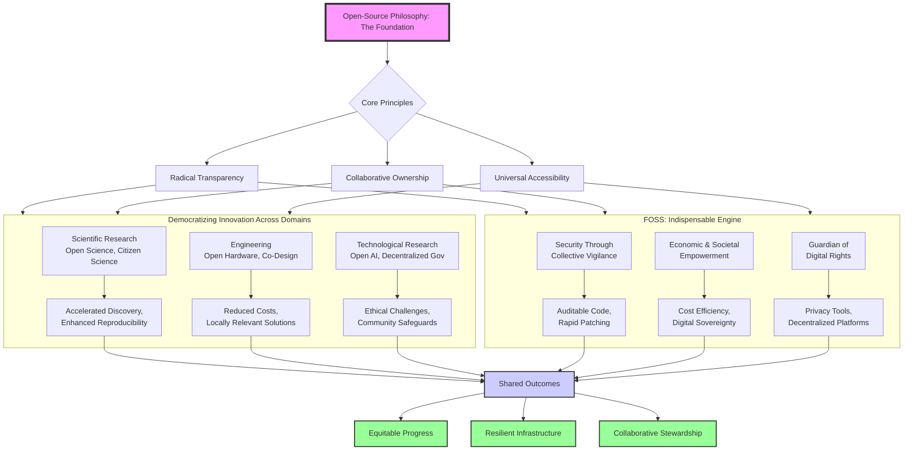

    

<h3 align="center">WELCOME TO</h3>
<h1 align="center">ADVANCED CYBER INTELLIGENCE R&D PROGRAM!</h1>
 
  
 

    

  

  

    

> [NOTE]

This document is a living resource. Suggestions for improvement are welcome and should be directed to the author.

 

> [!IMPORTANT]

This work is licensed under the **Creative Commons Attribution-ShareAlike 4.0 International License** (CC BY-SA 4.0).

When using, redistributing, adapting, or building upon this material, you **must** provide proper attribution by:

- 1. **Clearly stating the original source** as the **ACI R&D GitHub repository**.
- 2. **Including the exact URL(s)** to the relevant repository or file(s).

**Example Attribution Format:**  
- This work is based on content from the ACI R&D GitHub repository, available at:  
- https://github.com/acirdindia/acirdindia

Under the CC BY-SA license, you **must also**:
- Indicate if changes were made.
- License any adapted material under **identical terms** (CC BY-SA 4.0).

Failure to provide accurate source attribution violates the license terms.

    

<h1 align="center">Democratizing Innovation: The Open-Source Paradigm As The Foundation Of Secure And Equitable Progress.</h1>
 
  

### Table of Contents

1.  **Introduction:** The Convergence of Two Transformative Forces
2.  **Part I: The Foundational Framework - Principles Beyond Code**
    - From Software to Society: The Core Tenets of Open Source
    - The Ethical and Legal Scaffold: OSI Criteria and Open Science
3.  **Part II: The Transformative Impact Across Domains**
    - **A. Scientific Research:** Open Science and the Empowerment of Global Citizens
    - **B. Engineering Innovation:** Open Hardware and the Rise of Participatory Co-Design
    - **C. Technological Advancement:** Open-Source AI and the Governance of Digital Futures
    - **D. The Digital Backbone:** FOSS as the Engine of Secure Infrastructure and Societal Resilience
4.  **Part III: Navigating the Challenges - A Strategic Framework for Sustainability**
    - The Sustainability Paradox: Funding and Maintaining the Digital Commons
    - Governance and Compliance: Ensuring Integrity in an Open World
    - Ethical Boundaries: Mitigating Risks in Democratized Technology
5.  **Conclusion:** The Open Imperative - Forging a Collaborative and Secure Future
6.  **A Roadmap for Action:** Strategic Imperatives for Stakeholders

 

### 1. Introduction: The Convergence of Two Transformative Forces

The open-source philosophy has evolved from a niche software development methodology into one of the most powerful and transformative paradigms of the 21st century. Initially rooted in the collaborative creation of code, its core tenets—radical transparency, collaborative ownership, and universal accessibility—have proven to be universally applicable. Today, this philosophy is fundamentally reshaping the processes of knowledge creation and dissemination across scientific discovery, engineering design, and technological advancement. This document serves as a comprehensive analysis of this paradigm shift, integrating two critical dimensions of the open-source movement.

First, we explore how the **democratization of innovation** is dismantling traditional barriers to entry, such as proprietary monopolies and expensive paywalls, empowering a global community of contributors to participate in research and development. Second, we examine the indispensable role of **Free and Open Source Software (FOSS)** as the bedrock of secure digital infrastructure and a catalyst for democratic societal transformation. By weaving these two concepts together, we reveal a unified truth: open-source is not merely a technical methodology but a foundational principle for building a more resilient, equitable, and innovative future. It is a practical imperative for navigating the complex challenges of the modern era, from cybersecurity threats to the ethical governance of artificial intelligence.

 

### 2. Part I: The Foundational Framework - Principles Beyond Code

#### From Software to Society: The Core Tenets of Open Source

At its heart, the open-source philosophy is a fundamental reorientation of how we perceive knowledge and creation. It challenges the long-held notion that innovation is a commodity to be owned, siloed, and sold. Instead, it posits that knowledge is a shared human commons, and that collective, transparent collaboration can yield results superior to those achieved in isolation. This ethos is built on a foundation of key principles that have proven their value far beyond the realm of software.

| **Principle** | **Description** | **Societal Impact** |
| :--- | :--- | :--- |
| **Radical Transparency** | The full "source code"—whether for software, a scientific method, or a hardware design—is openly available for inspection. | Builds trust, enables independent verification, and allows for the identification and correction of errors or biases by a global community. |
| **Collaborative Ownership** | No single entity holds exclusive control. The work is a shared asset, developed and stewarded by a community of contributors. | Distributes power away from traditional gatekeepers, fosters a sense of shared responsibility, and accelerates iteration through diverse input. |
| **Universal Accessibility** | The work is freely available for anyone to use, study, modify, and share for any purpose. | Dismantles economic and geographic barriers to participation, empowers marginalized communities, and ensures that critical tools remain public goods. |
| **Iterative Improvement** | Progress is achieved through continuous cycles of feedback, modification, and enhancement by a distributed network of peers. | Creates a powerful engine for rapid evolution, resilience, and adaptation, often outpacing the linear development models of proprietary systems. |

#### The Ethical and Legal Scaffold: OSI Criteria and Open Science

These abstract principles are operationalized through a robust ethical and legal framework. The Open Source Initiative's (OSI) ten criteria provide the definitive standard for open-source licenses, mandating free redistribution, unfettered access to source code, and non-discriminatory practices. This ensures that collaborative efforts remain true to the core ethos. Iconic projects like the Linux kernel and the Apache HTTP Server are living proof that this model can produce technology of unparalleled scalability, security, and reliability.

Crucially, this framework has inspired similar movements across disciplines. UNESCO's 2023 Recommendation on Open Science is a landmark global policy that applies these same principles to the entire research lifecycle. It mandates open access to publications and data, advocates for open research infrastructure, and importantly, recognizes the value of integrating diverse knowledge systems, including indigenous and local knowledge. This demonstrates a global consensus that the future of research—and by extension, the future of societal progress—must be built on a foundation of openness and collaboration.

 

### 3. Part II: The Transformative Impact Across Domains

#### A. Scientific Research: Open Science and the Empowerment of Global Citizens

Scientific inquiry, once largely confined to well-funded institutions and hidden behind expensive journal paywalls, is undergoing a profound transformation. Open Science is democratizing the entire research process, from data collection to peer review.

- **Open Access and Open Data as Public Goods:** The shift towards open access is no longer just an academic preference but an essential public good. During the COVID-19 pandemic, for instance, the rapid sharing of the viral genome on open platforms like **GenBank** and the proliferation of preprints on servers like **arXiv** and **bioRxiv** accelerated vaccine development at an unprecedented pace. This model empowers researchers in under-resourced institutions and developing nations to not only access the latest findings but also to actively contribute data, analyses, and critiques, enriching the global scientific discourse.
- **Citizen Science and Public Engagement:** Large-scale citizen science projects like **Zooniverse** exemplify the power of radical inclusivity. By engaging millions of volunteers worldwide in tasks like classifying galaxies or transcribing historical documents, these initiatives merge broad public participation with rigorous academic methodology. This not only scales research capacity but also enhances public trust in science by making the process more transparent and accessible.
- **Enhancing Reproducibility and Reducing Bias:** The inherent transparency of open science is a powerful antidote to the reproducibility crisis that has plagued several scientific fields. When data and methodologies are openly available, they can be independently scrutinized and validated. As emphasized by institutions like the World Bank, this collective scrutiny helps identify and mitigate methodological biases and systemic errors, leading to more robust and trustworthy research outcomes. The challenge remains to develop robust validation protocols for non-expert contributions and to bridge the digital divide, ensuring equitable access to the necessary cyberinfrastructure for all.

#### B. Engineering Innovation: Open Hardware and the Rise of Participatory Co-Design

The democratizing wave has also swept through engineering, where the open-hardware movement is revolutionizing prototyping, manufacturing, and problem-solving by treating physical designs as shareable code.

- **Democratizing Design and Manufacturing:** Open-source process design kits (PDKs), pioneered by institutions like the University of Michigan, are a prime example. They empower startups and academic labs to design sophisticated integrated circuits without the multi-million-dollar investments required for proprietary Electronic Design Automation (EDA) tools. This lowers the barrier to entry for hardware innovation, fostering a new wave of entrepreneurship and research.
- **Community-Driven Solutions for Local Challenges:** Collaborative platforms and communities are now tackling diverse engineering challenges through open sharing. Projects range from developing low-cost, 3D-printed prosthetics like the **Open Bionics** initiative to creating open-source, solar-powered environmental sensors for community-led pollution monitoring. The **OpenFlexure Microscope**, a 3D-printed, high-resolution microscope, demonstrates how open designs can reduce costs by orders of magnitude and accelerate lab innovation, especially in low-resource settings.
- **The Power and Complexity of Co-Design:** This participatory approach, often called co-design, involves end-user communities directly in the engineering process. While it yields solutions of unparalleled local relevance—such as water purification systems tailored for a specific rural environment—it also requires careful navigation. Engineers must balance technical feasibility and cost constraints with diverse stakeholder input. This process, while resource-intensive, ensures that the resulting technology is not only functional but also adopted and sustained by the community it was designed to serve.

#### C. Technological Advancement: Open-Source AI and the Governance of Digital Futures

In the rapidly evolving field of artificial intelligence, the open-source philosophy presents both a powerful accelerator of innovation and a source of significant ethical and security challenges.

- **Accelerating Innovation and Challenging Monopolies:** The release of powerful open-source AI models like Meta's **Llama 2** and **DeepSeek's R1** has democratized access to cutting-edge AI. Startups and researchers in places like Tulsa, Oklahoma, can now build novel, affordable applications, such as AI-driven job-matching platforms, without relying on expensive proprietary APIs from a few dominant tech giants. Frameworks like **TensorFlow** and **PyTorch** have become the ubiquitous building blocks of the AI world, fostering a global community of developers and researchers.
- **The Dual-Use Dilemma and the Need for Safeguards:** However, as highlighted by policy institutes like Chatham House, the accessibility of powerful AI models raises legitimate concerns. The same technology that can be used to accelerate drug discovery can also be misused to generate sophisticated disinformation, develop autonomous weapons, or power unethical surveillance systems. This dual-use dilemma necessitates proactive, community-driven safeguards.
- **Community-Driven Governance and Ethical Frameworks:** The open-source community is actively developing these safeguards. Initiatives include:
    - **Federated Learning:** Architectures that allow models to be trained on decentralized data without compromising privacy.
    - **Ethical-Use Licenses:** Licenses like the Responsible AI License (RAIL) that explicitly prohibit specific harmful use cases.
    - **Robust Provenance Tracking:** Tools and standards to track the lineage and modifications of AI models, ensuring transparency and accountability.
- **Decentralized Governance of Technology:** Beyond AI, decentralized governance platforms like Barcelona's **Decidim** demonstrate how open-source principles can reshape civic participation. By using blockchain-backed transparency, these platforms allow citizens to propose, debate, and vote on urban policies, redistributing authority from centralized bodies to the community. This represents a powerful application of technological democracy, though it underscores the critical need for interoperable standards to prevent ecosystem fragmentation and ensure accountability.

#### D. The Digital Backbone: FOSS as the Engine of Secure Infrastructure and Societal Resilience

Free and Open Source Software (FOSS) is not just a development model; it is the indispensable engine powering the modern digital world and a cornerstone of democratic societal transformation. Its principles of transparency and collaborative security provide the only scalable framework for addressing today's escalating cyber threats.

- **Security Through Collective Vigilance:** The security model of FOSS is fundamentally different from that of proprietary software.
    - **Auditable Code:** The global community of expert developers can scrutinize the source code of a critical library like **OpenSSL**, leading to the rapid identification and patching of vulnerabilities like the infamous **Heartbleed bug**. In a proprietary model, such flaws could remain hidden and exploitable for years.
    - **Trust Minimization:** Transparency eliminates hidden attack surfaces and potential backdoors. Privacy-critical tools like the **Signal** messaging protocol and **VeraCrypt** encryption software leverage this transparency to provide users with verifiable security guarantees, not just corporate promises.
    - **Supply Chain Integrity:** The ability to generate and verify a Software Bill of Materials (SBOM) is inherent in the FOSS model. This is a critical factor in securing complex software supply chains, allowing organizations to know exactly what components are in their software and to quickly assess their vulnerability to newly discovered threats.
- **Economic and Societal Empowerment:**
    - **Cost Efficiency and Access:** FOSS eliminates prohibitive license fees, saving governments, businesses, and individuals billions of dollars annually. **LibreOffice**, **WordPress** (powering over 40% of the web), and the professional-grade VFX tool **Blender** are prime examples of how FOSS removes financial barriers and levels the playing field.
    - **Digital Sovereignty:** Nations are increasingly turning to FOSS to reduce dependence on foreign technology vendors and secure their critical infrastructure. France's migration to LibreOffice, saving an estimated €400 million annually, and India's use of FOSS in its massive **Aadhaar** digital identity system are powerful examples of this trend.
    - **Guardian of Digital Rights:** FOSS tools are essential for protecting fundamental freedoms in the digital age. The **Tor Project** enables private communication and circumvention of censorship for users under repressive regimes. Federated social media platforms like **Mastodon** offer a viable, user-centric alternative to corporate-controlled networks, giving control back to the users and communities.
- **Localized Impact and Glocalization:** FOSS enables the creation of context-specific solutions that address unique local challenges. The **Raspberry Pi**, combined with FOSS educational tools, has democratized STEM education in tens of thousands of schools worldwide. **OpenMRS**, an open-source medical records system, is tailored for and successfully deployed in over 80% of low-infrastructure clinics globally, proving that globally developed software can be locally adapted to meet critical needs.

 

### 4. Part III: Navigating the Challenges - A Strategic Framework for Sustainability

The immense promise of the open-source ecosystem is not without its challenges. Addressing these requires a concerted, strategic effort from all stakeholders.

#### The Sustainability Paradox: Funding and Maintaining the Digital Commons

The very foundation of the internet and modern computing rests on a vast pyramid of FOSS projects, many of which are maintained by a small group of overworked, underfunded volunteers. This is a critical vulnerability.

| **Challenge** | **Mitigation Framework** |
| :--- | :--- |
| **Critical Project Underfunding:** Projects like OpenSSL and Log4j, which are single points of failure for the entire internet, often lack sustainable funding. | **Tiered Funding Models:** Implement structured funding initiatives like the OpenSSF's **Alpha-Omega** project, which prioritizes funding for projects with the highest dependency impact. |
| **Burnout and Unreliable Maintenance:** Reliance on volunteer labor creates risks of project abandonment and slow response to critical security flaws. | **Corporate and Government Allocation Mandates:** Enterprises and governments should allocate a minimum percentage (e.g., 5%) of their IT/security budgets to directly fund the maintenance and security of the critical FOSS projects they depend on. |
| **Inadequate Resource Allocation:** Funding is often concentrated on popular, user-facing projects, while the underlying infrastructure libraries remain neglected. | **SBOM-Driven Risk Prioritization:** Use dependency mapping tools to identify critical but often-overlooked underlying components and direct funding to them. |

#### Governance and Compliance: Ensuring Integrity in an Open World

The openness that makes FOSS so powerful also creates challenges related to legal compliance and project integrity.

- **License Complexity and Compliance:** The proliferation of different open-source licenses (GPL, MIT, Apache, etc.) can create complex compliance challenges, especially for commercial entities integrating FOSS into their products.
    - **Mitigation:** Employ automated license management tools like **FOSSA** and **Snyk** to proactively track dependencies, ensure compliance, and resolve license conflicts.
- **Malicious Contributions and Supply Chain Attacks:** The collaborative nature of FOSS makes it a potential target for bad actors attempting to inject malicious code into widely used projects.
    - **Mitigation:** Enforce robust contribution integrity measures, including the **Developer Certificate of Origin (DCO)** , mandatory code reviews, and clear `SECURITY.md` policies. Adopting governance frameworks like the **OpenChain ISO/IEC 5230** standard can help organizations establish mature and secure FOSS management practices.
- **Ethical Commercialization and Community Trust:** The "open-core" business model, where a company offers a FOSS core with proprietary extensions, can sometimes lead to conflict if the core is neglected or its features are intentionally degraded to push users toward paid versions—a phenomenon sometimes called "enshittification."
    - **Mitigation:** Maintain community trust by ensuring feature parity between the open-core and proprietary versions. Support patent risk mitigation initiatives like the **Open Invention Network (OIN)** and foster inclusive communities by upholding strict codes of conduct to prevent toxicity and encourage diverse participation.

 

### 5. Conclusion: The Open Imperative - Forging a Collaborative and Secure Future

The open-source philosophy has irrevocably transitioned from an ideological movement to an operational and societal necessity. Its core principles of transparency, collaboration, and user freedom provide the only scalable framework capable of addressing the dual challenges of securing an exponentially expanding digital world and ensuring equitable access to transformative technology. By systematically eroding traditional barriers to participation, it amplifies marginalized voices, dramatically accelerates the pace of discovery, and fosters essential trust through uncompromising openness.

The path forward requires deliberate and sustained nurturing of this open ecosystem. The democratization of innovation, championed by the open-source ethos, powerfully affirms that collaboration, not isolationist competition, is the true cornerstone of enduring human advancement. By empowering every potential contributor—irrespective of geography, institutional affiliation, or economic resources—to enrich the collective tapestry of knowledge, we collectively forge a more resilient, equitable, and innovative future. This collaborative stewardship is not merely an ideal; it is the practical imperative for navigating the complex challenges and opportunities of the 21st century.

### 6. A Roadmap for Action: Strategic Imperatives for Stakeholders

To secure this indispensable engine of progress, concerted action is required from all stakeholders.

- **For Governments and Policymakers:**
    - **Mandate FOSS in Critical Systems:** Prioritize FOSS in public procurement for national infrastructure, healthcare, and public services to ensure security, transparency, and digital sovereignty.
    - **Integrate SBOMs into Regulation:** Mandate the use and verification of Software Bills of Materials (SBOMs) across the software supply chain.
    - **Fund the Digital Commons:** Establish grant programs and public-private partnerships to provide sustainable funding for critical FOSS infrastructure projects.

- **For Enterprises and Corporations:**
    - **Invest Strategically in FOSS:** Allocate a percentage of IT and security budgets to directly fund the projects you depend on, through foundations like the Linux Foundation or platforms like Open Collective.
    - **Engage as Ethical Stewards:** Contribute code, participate in security initiatives (e.g., OSS-Fuzz), and ensure your use of FOSS is compliant with its licenses.
    - **Adopt Standardized Security Practices:** Implement frameworks like OpenChain to mature your internal FOSS governance and compliance processes.

- **For Researchers and Academics:**
    - **Embed Open Science Principles:** Make publications, data, and methodologies openly accessible by default.
    - **Engage with Citizen Science:** Develop projects that leverage public participation while maintaining rigorous scientific integrity.
    - **Contribute to Open Frameworks:** Actively contribute to open-source tools, datasets, and models in your field to accelerate collective progress.

- **For Individual Developers and Users:**
    - **Contribute and Give Back:** Report bugs, contribute code, improve documentation, or financially support the FOSS projects you use and love.
    - **Advocate for Openness:** Choose FOSS alternatives when possible, and champion the principles of transparency and digital rights in your community.

 
 
    

<h2 align="center">STAY TUNED FOR THE LATEST UPDATES!</h2>

  

    

 
