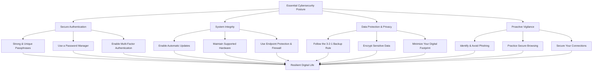

    

<h3 align="center">WELCOME TO</h3>
<h1 align="center">ADVANCED CYBER INTELLIGENCE R&D PROGRAM!</h1>
 
  
 

    

  

  

    

> [NOTE]

This document is a living resource. Suggestions for improvement are welcome and should be directed to the author.

 

> [!IMPORTANT]

This work is licensed under the **Creative Commons Attribution-ShareAlike 4.0 International License** (CC BY-SA 4.0).

When using, redistributing, adapting, or building upon this material, you **must** provide proper attribution by:

- 1. **Clearly stating the original source** as the **ACI R&D GitHub repository**.
- 2. **Including the exact URL(s)** to the relevant repository or file(s).

**Example Attribution Format:**  
- This work is based on content from the ACI R&D GitHub repository, available at:  
- https://github.com/acirdindia/acirdindia

Under the CC BY-SA license, you **must also**:
- Indicate if changes were made.
- License any adapted material under **identical terms** (CC BY-SA 4.0).

Failure to provide accurate source attribution violates the license terms.

    

<h1 align="center">Essential Cybersecurity Guide: Protecting Your Digital Life.</h1>

  

>
> **Disclaimer**
>
> *The information provided in this guide is for general informational and educational purposes only. It reflects common cybersecurity best practices as of the publication date. Cybersecurity is a rapidly evolving field, and threats and defenses are subject to change. Readers are encouraged to stay informed about the latest security developments and to consult with qualified IT professionals for advice tailored to their specific situation. The university and the guide's authors assume no responsibility for any loss or damage resulting from the use of, or reliance upon, the information contained herein.*
>

  

### Introduction: A Shared Responsibility in the Digital Age

In our increasingly interconnected world, the security of our digital information is not just a matter for IT professionals; it is a fundamental responsibility shared by everyone. From students managing academic records and faculty conducting sensitive research to administrative staff handling institutional data, every member of our university community is a potential target for cyber threats. These threats, including data breaches, identity theft, and ransomware attacks, are growing in both sophistication and frequency.

While the university invests in robust security infrastructure, individual actions form the first and most critical line of defense. This guide is designed to equip you with clear, actionable, and effective cybersecurity practices. By integrating these habits into your daily digital life, you significantly reduce your vulnerability to cyberattacks and contribute to a safer, more resilient digital ecosystem for our entire community.

 

### 1. The First Line of Defense: Secure Authentication

The foundation of digital security rests on how you prove your identity online. Weak or reused passwords are akin to leaving your front door unlocked. Strengthening your authentication practices is the single most impactful step you can take.

- **Create Strong, Unique Passphrases:** Gone are the days of simple, dictionary-word passwords. The modern standard is a passphrase—a string of at least four unrelated words combined with numbers and symbols (e.g., `Correct-Horse-Battery-Staple#17`). This method creates credentials that are both complex for attackers to crack and easier for you to remember. More importantly, you must use a unique passphrase for every single account. This practice prevents "credential stuffing," a common attack where cybercriminals use credentials leaked from one service to try and break into your other, more valuable accounts like email or banking.

- **Embrace a Password Manager:** Remembering dozens of unique, complex passphrases is humanly impossible. A password manager is the essential tool that solves this problem. These applications securely store all your credentials in an encrypted digital vault, accessible only through a single, strong master password. They can automatically generate and fill in complex passwords for you, eliminating the hassle of password fatigue and the security risk of password reuse. By adopting a password manager, you only need to remember one supreme password, while the tool ensures every other account is protected by a unique and virtually uncrackable key.

- **Activate Multi-Factor Authentication (MFA) Everywhere:** A password, no matter how strong, is a single point of failure. Multi-factor authentication adds a vital second layer of security by requiring an additional verification step. This could be a temporary code from an authenticator app (like Google Authenticator or Duo), a biometric scan like your fingerprint or face, or a physical security key. Even if a malicious actor manages to steal your password, MFA acts as an impassable barrier, preventing them from accessing your account without that second factor. For this reason, enabling MFA on your email, financial, and university accounts is one of the most powerful defenses available to you.

 

### 2. System Integrity: Maintaining a Healthy Digital Environment

Just as you would service a car to prevent breakdowns, your digital devices require regular maintenance to stay secure. Outdated software is a primary entry point for attackers, who actively scan for known, unpatched vulnerabilities.

- **Enable Automatic Updates for All Software:** Modern operating systems (Windows, macOS, iOS, Android), applications, and web browsers frequently release updates. These updates do more than just add new features; they often contain critical security patches that fix newly discovered vulnerabilities. By enabling automatic updates, you ensure these defenses are installed as soon as they are available. Delaying or ignoring update notifications leaves your devices—and the university network they connect to—exposed to attacks that could have been easily prevented. This includes all software on your computers, smartphones, and tablets, as well as browser plugins and extensions.

- **Keep Your Hardware Current and Secure:** Software and hardware are partners in security. As technology evolves, older devices may eventually be unable to run the latest, most secure operating systems. A device that no longer receives security updates from its manufacturer is a significant liability. Periodically evaluate whether your personal computers, smartphones, and even your home Wi-Fi router are still supported. An outdated router with unpatched firmware can be a gateway for attackers to access every device on your home network.

- **Deploy and Maintain Endpoint Protection:** "Endpoint protection" is the modern term for comprehensive security software installed on your devices. This goes beyond traditional antivirus to include firewalls, anti-malware, and intrusion detection. Ensure you have a reputable security suite installed and active on all your computers, and be aware of the built-in security features on your smartphones and tablets. A properly configured firewall acts as a gatekeeper, monitoring and controlling network traffic to block unauthorized connection attempts, both incoming and outgoing.

 

### 3. Data Protection: Safeguarding Your Digital Assets

Your personal information, academic work, financial records, and precious memories are all digital assets that need protection from loss, theft, or destruction. A proactive approach to data management is essential.

- **Adopt a Robust 3-2-1 Backup Strategy:** Data loss can occur from ransomware, hardware failure, theft, or accidental deletion. The most reliable defense is a solid backup plan. The industry-standard 3-2-1 rule is simple to follow: maintain at least **three** total copies of your important data, stored on **two** different types of media (e.g., your computer's hard drive and an external USB drive), with **one** of those copies located off-site (such as in a secure cloud storage service). Automating this backup process ensures your irreplaceable work and memories are never lost to a single point of failure.

- **Encrypt Your Sensitive Information:** Encryption scrambles your data, making it unreadable to anyone without the correct decryption key. You should use encryption in two primary scenarios. First, for data "at rest," ensure your device's hard drive is encrypted (e.g., using BitLocker on Windows or FileVault on macOS). Second, for data "in transit," always look for the padlock icon in your browser's address bar, which indicates the website uses HTTPS encryption. Avoid entering personal or financial information on sites that do not use this secure connection. When sharing sensitive files with others, use the university's approved secure file-sharing service rather than unencrypted standard email.

- **Minimize Your Digital Footprint:** The less personal information you have online, the less there is for attackers to steal or exploit. Be judicious about what you share on social media and other public platforms. Personal Identifiable Information (PII) like your birthdate, address, or pet's name can be used to answer security questions or craft convincing phishing attacks. Regularly review and tighten the privacy settings on your accounts. Furthermore, make it a habit to securely delete old accounts and files you no longer need, reducing the overall amount of data you are responsible for protecting.

 

### 4. Proactive Vigilance: The Human Firewall

Technology alone cannot stop all attacks. Many cyber threats, particularly phishing and social engineering, are designed to exploit human psychology. Cultivating a mindset of healthy skepticism and caution is your final, and often most effective, layer of defense.

- **Master the Art of Phishing Detection:** Phishing attacks arrive as deceptive emails, text messages, or even phone calls designed to trick you into revealing sensitive information or installing malware. Be highly suspicious of any unsolicited message that creates a sense of urgency, requests personal information, or asks you to click on a link or open an attachment. Before engaging, scrutinize the sender's email address for subtle misspellings (e.g., `@universty.edu` instead of `@university.edu`). Hover your mouse over any link to see the true destination URL before clicking. If a message claims to be from a legitimate organization like the university or your bank, do not use the contact information in the message; instead, contact them directly through a verified phone number or website.

- **Cultivate Secure Browsing Habits:** The websites you visit can pose a significant risk. Avoid untrustworthy sites, especially those offering pirated software, media, or other illegal content, as they are often riddled with malware. Pay attention to your browser's security warnings. If your browser blocks a site or displays a certificate error, heed the warning and leave the page. Consider using browser extensions that block intrusive ads and trackers, as these can also prevent "malvertising" (malicious advertising) that can compromise your device even on legitimate websites.

- **Secure Your Network Connections, Especially in Public:** Public Wi-Fi networks, such as those in coffee shops or airports, are notoriously insecure. Other users on the same network can potentially intercept your internet traffic. Avoid conducting sensitive activities like online banking or accessing confidential university systems while on public Wi-Fi. If you must use a public network, protect yourself by using a reputable Virtual Private Network (VPN). A VPN creates an encrypted tunnel for all your data, shielding your activity from prying eyes. As a general precaution when in public places, disable automatic connections, as well as Bluetooth and file-sharing features, to prevent unauthorized access to your device.

 

### 5. Building a Culture of Security: For Families and Teams

If you are responsible for the digital safety of others, whether family members, a student team, or departmental colleagues, your role expands to include fostering a shared culture of security awareness.

- **Champion Continuous Security Education:** Security is not a one-time lesson but an ongoing practice. Engage your family or team in regular, informal discussions about common threats like phishing. Share examples of suspicious emails you have encountered and explain how you identified them. Encourage an environment where people feel comfortable reporting a potential security mistake without fear of blame. This open culture transforms everyone from a potential weak link into an active, vigilant participant in your collective defense.

- **Embrace a Defense-in-Depth Philosophy:** Move away from the idea that you are ever "secure enough." Effective security is layered and constantly evolving. This means proactively investing in security upgrades for software and hardware. For anyone managing a website, enforcing HTTPS with a valid SSL/TLS certificate is non-negotiable; it protects your visitors' data and builds trust. Assume that your primary defenses will eventually be challenged, and have secondary controls, like MFA and robust backups, already in place.

- **Consider Proactive Security Testing:** For teams or organizations managing critical systems or sensitive data, consider going on the offensive with your defenses. Engaging qualified security professionals, often called "white-hat" hackers or penetration testers, to conduct ethical hacking exercises on your systems can be invaluable. They will attempt to find and exploit vulnerabilities just as a real attacker would, providing you with a clear, prioritized roadmap for fixing weaknesses before they can be discovered and used maliciously.

 

### Quick Reference: Backup Strategy Comparison

Choosing the right backup strategy is critical. This table compares common approaches to help you make an informed decision.

| Strategy | Description | Best For | Key Consideration |
| :--- | :--- | :--- | :--- |
| **Local Backup** | Copying data to an external device like a USB hard drive or a Network Attached Storage (NAS) system kept in your home or office. | Quick recovery of large volumes of data; full control over your media. | Vulnerable to local threats like theft, fire, or flood. To protect against ransomware, the backup drive must be disconnected from your computer when not actively backing up. |
| **Cloud Backup** | Automatically copying data to a secure, off-site server managed by a service provider (e.g., Backblaze, iCloud, OneDrive). | Off-site protection; data accessibility from anywhere; set-and-forget automation. | Requires an ongoing subscription. The initial backup of a large amount of data can be slow. It is vital to choose a reputable provider that uses strong encryption for your data both in transit and at rest. |
| **Hybrid (3-2-1)** | A combined approach using both local and cloud backups to meet the 3-2-1 rule: multiple copies on different media, with one copy off-site. | Maximum protection for irreplaceable data, such as family photos, dissertations, or critical financial documents. | Requires managing two separate backup systems but offers the highest level of resilience against virtually any type of data loss scenario. |

 

### Conclusion: Your Role in a Resilient University Community

Cybersecurity is not a distant concept managed by a central IT department; it is a daily practice woven into the fabric of our digital interactions. By internalizing and applying the principles outlined in this guide—securing your access, maintaining your systems, protecting your data, staying vigilant, and fostering a security-conscious environment—you become an integral part of the university's cyber defense.

The journey to a more secure digital life does not require perfection overnight. We encourage you to start by adopting one or two new habits this week. Perhaps enable MFA on your primary email account or set up a password manager. As these practices become routine, gradually incorporate the others. Share this knowledge and these habits with your peers, students, and colleagues. Together, through informed and proactive efforts, we can build a safer and more resilient digital community for teaching, learning, and discovery.

    

<h2 align="center">STAY TUNED FOR THE LATEST UPDATES!</h2>

  

    

 
