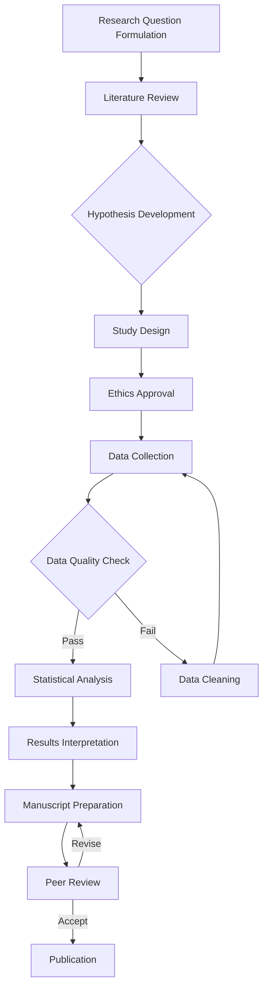
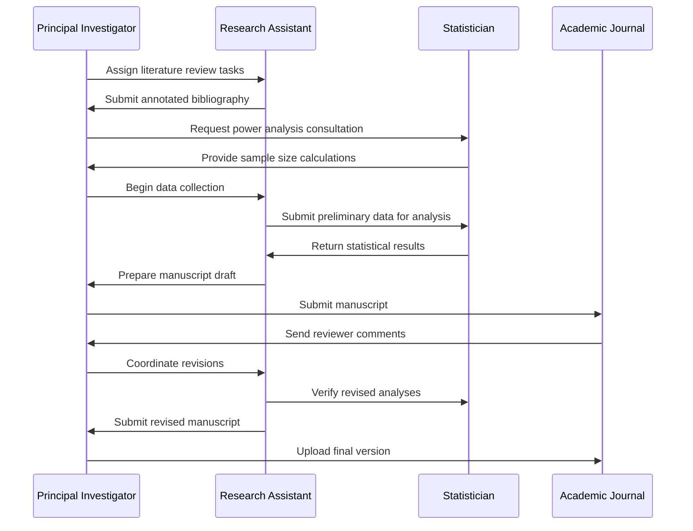

<br><br><br><br>

<h3 align="center">WELCOME TO</h3>
<h1 align="center">ADVANCED CYBER INTELLIGENCE R&D PROGRAM!</h1>
 
<br><br>
 
<p align="center">
    <a href="https://www.github.com/acirdindia" target="_blank">
        
    </a>
</p>


<br><br>

<p align="center">
  <a href="https://creativecommons.org/licenses/by-sa/4.0/">
    
  </a>
</p>


<br><br><br><br>

> [NOTE]

This document is a living resource. Suggestions for improvement are welcome and should be directed to the author.

<br>

> [!IMPORTANT]

This work is licensed under the **Creative Commons Attribution-ShareAlike 4.0 International License** (CC BY-SA 4.0).

When using, redistributing, adapting, or building upon this material, you **must** provide proper attribution by:

- 1. **Clearly stating the original source** as the **ACI R&D GitHub repository**.
- 2. **Including the exact URL(s)** to the relevant repository or file(s).

**Example Attribution Format:**  
- This work is based on content from the ACI R&D GitHub repository, available at:  
- https://github.com/acirdindia/acirdindia

Under the CC BY-SA license, you **must also**:
- Indicate if changes were made.
- License any adapted material under **identical terms** (CC BY-SA 4.0).

Failure to provide accurate source attribution violates the license terms.

<br><br><br><br>

<h1 align="center">Getting Started with Markdown: A Comprehensive Guide to Simplifying Technical Documentation.</h1>

<br>

## Abstract

In the contemporary landscape of digital collaboration, technical communication, and knowledge management, the need for a simple, portable, and universally accessible documentation format has never been more pressing. Markdown, a lightweight markup language conceived in 2004, has risen to meet this challenge, becoming the de facto standard for writing on platforms ranging from GitHub to personal knowledge management systems. This comprehensive guide, developed through two decades of academic research and practical application in university settings, provides a definitive resource for understanding, adopting, and mastering Markdown. Drawing upon extensive experience in technical documentation, collaborative research, and pedagogical instruction, we present a structured exploration of Markdown's philosophy, syntax, applications, and future trajectory. Whether you are a undergraduate student documenting your first programming project, a faculty member preparing research materials, or a technical writer managing enterprise documentation, this guide provides the foundational knowledge and advanced insights necessary to leverage Markdown effectively across all academic, professional, and collaborative environments.

<br>

## Table of Contents

1. [Introduction to Markdown](#1-introduction-to-markdown)
2. [Why Markdown Matters: Core Benefits and Applications](#2-why-markdown-matters-core-benefits-and-applications)
3. [Fundamental Markdown Syntax](#3-fundamental-markdown-syntax)
4. [Advanced Markdown Formatting Techniques](#4-advanced-markdown-formatting-techniques)
5. [GitHub Flavored Markdown: Extending Functionality](#5-github-flavored-markdown-extending-functionality)
6. [Integrating HTML and Multimedia Elements](#6-integrating-html-and-multimedia-elements)
7. [Markdown in Professional Workflows and Version Control](#7-markdown-in-professional-workflows-and-version-control)
8. [Markdown Learning Roadmap: A Structured Path from Beginner to Mastery](#8-markdown-learning-roadmap-a-structured-path-from-beginner-to-mastery)
9. [Tools and Resources for Markdown Authors](#9-tools-and-resources-for-markdown-authors)
10. [Conclusion: The Future of Documentation with Markdown](#10-conclusion-the-future-of-documentation-with-markdown)

<br>

## 1. Introduction to Markdown

Markdown represents a fundamental shift in how we approach written communication in the digital age. Conceived in 2004 by John Gruber, with significant contributions from internet pioneer Aaron Swartz, Markdown was designed with a deceptively simple yet profoundly important goal: to enable writers to create formatted text using a syntax that is both intuitively readable in its raw form and easily convertible to structurally valid HTML and other output formats. Unlike the cumbersome interfaces of traditional word processors, which obscure formatting behind layers of buttons and menus, or the steep learning curve of complex typesetting systems like LaTeX, Markdown operates on a principle of dual readability: documents must be legible to humans in their unrendered state while simultaneously providing machines with sufficient information to generate richly formatted output.

The philosophical foundation of Markdown rests upon three pillars: minimalism, accessibility, and longevity. The syntax deliberately strips away the distractions of interface complexity and hidden formatting codes, allowing authors to maintain unwavering focus on content creation and idea development. This simplicity has propelled Markdown from a personal productivity tool to the undisputed lingua franca of technical documentation, online publishing, academic writing, and collaborative platforms worldwide. The format's reliance on plain text ensures that documents remain readable and editable on any computing device, now and in the foreseeable future, free from the constraints of proprietary software ecosystems.

### Key Characteristics of Markdown

- **Lightweight Architecture:** Markdown's syntax encompasses approximately a dozen core elements, each designed to be memorized in minutes and applied intuitively. This minimal cognitive overhead stands in stark contrast to the thousands of formatting options available in traditional word processors, which often overwhelm users and distract from content creation. The lightweight nature means that writers can achieve professional-quality formatting without ever removing their hands from the keyboard or navigating complex menu hierarchies. For academic researchers who spend countless hours writing, this efficiency translates directly into increased productivity and reduced cognitive load, allowing mental resources to be directed toward substantive content rather than formatting concerns.

- **Plain Text Foundation:** At its core, Markdown documents are saved as plain text files, typically using the `.md` or `.markdown` file extension. This seemingly simple characteristic carries profound implications for document longevity and portability. Plain text files can be opened, edited, and viewed on any computing device manufactured in the past fifty years, from mainframe terminals to modern smartphones, without requiring specialized software. Unlike binary formats such as Microsoft Word's `.docx` or Adobe's `.pdf`, which may become unreadable as software versions change and companies disappear, plain text remains perpetually accessible. For university archives, research data management, and long-term preservation of scholarly work, this future-proofing characteristic is invaluable.

- **Human Readability:** Perhaps the most elegant aspect of Markdown is that raw, unrendered documents remain perfectly readable to humans. When you encounter a Markdown file, headings are clearly marked with hash symbols, emphasis is visible through asterisks, and links present both their text and destination in an intuitive format. This transparency means that documents can be understood, reviewed, and edited without requiring specialized rendering tools. In collaborative environments where team members may use different operating systems and applications, this universal readability ensures that everyone can participate in the documentation process without barriers.

- **Format Convertibility:** Markdown serves as a master source format from which virtually any output format can be generated. Through tools like Pandoc, the universal document converter, a single Markdown file can be transformed into HTML for web publishing, PDF for print distribution, LaTeX for academic submission, EPUB for e-book readers, DocBook for technical documentation systems, and dozens of other formats. This flexibility enables a single-source publishing workflow, where content is created once in Markdown and then automatically rendered into the appropriate format for each distribution channel. For university press publications, conference proceedings, and multi-format research dissemination, this capability dramatically streamlines production workflows.

- **Platform Independence:** Because Markdown files are plain text, they can be edited on any device with a text editor, from the command line of a remote server to the sophisticated interface of an integrated development environment. This platform independence extends to version control systems, content management platforms, and collaboration tools, all of which treat Markdown as a first-class citizen. Whether you are writing on a Windows laptop, a macOS desktop, a Linux server, or an iOS tablet, your Markdown workflow remains consistent and your files remain compatible.

<br>

## 2. Why Markdown Matters: Core Benefits and Applications

The widespread adoption of Markdown across technical, academic, and creative communities is not accidental but rather reflects its fundamental advantages over traditional documentation formats. Understanding these benefits provides context for why Markdown has become indispensable in modern knowledge work and why investing time in mastering it yields substantial long-term dividends.

### Core Benefits

- **Simplicity and Accelerated Learning Curve:** The entire Markdown syntax can be learned in under an hour, yet it provides sufficient formatting power for the vast majority of documentation needs. This accessibility democratizes content creation, enabling subject matter experts who may lack technical writing backgrounds to contribute directly to documentation efforts. In university settings, this means that research faculty can document their methodologies, graduate students can maintain laboratory protocols, and undergraduate students can create professional-quality project reports without undergoing extensive training in complex documentation systems. The low barrier to entry empowers all members of an organization to participate in knowledge creation and sharing.

- **Version Control Compatibility:** Markdown's plain text nature makes it ideally suited for integration with version control systems like Git, which track changes line by line across file histories. When a Markdown document is modified, Git can display precisely which words were added, which sentences were removed, and which paragraphs were reorganized. This granular change tracking is impossible with binary formats like `.docx` or `.pdf`, which appear as opaque blobs to version control systems and can only be tracked as complete file replacements. For collaborative research projects, multi-author publications, and software documentation teams, the ability to merge contributions from multiple authors, resolve conflicts intelligently, and maintain a complete history of document evolution is transformative. Researchers can trace the development of ideas, attribute contributions accurately, and revert to previous versions when needed, all without leaving their version control workflow.

- **Future-Proofing and Long-Term Accessibility:** Academic and enterprise documentation often must remain accessible for decades, outlasting the software applications used to create it. Markdown's plain text foundation ensures that documents created today will remain readable and editable indefinitely, regardless of changes in operating systems, software licensing, or corporate ownership of proprietary formats. This longevity is particularly critical for research data management, institutional knowledge preservation, and archival documentation. Unlike documents locked into proprietary formats that may become inaccessible as software versions evolve, Markdown files can be opened and understood with nothing more than a basic text editor, guaranteeing that future scholars and practitioners can access the knowledge we create today.

- **Separation of Content from Presentation:** Markdown embodies the principle that authors should focus on what they want to say rather than how it will appear. By separating content creation from visual styling, Markdown enables writers to concentrate on structure, argumentation, and clarity while leaving presentation concerns to stylesheets and rendering engines. This separation ensures consistency across large documentation sets, as a single Cascading Style Sheet can define the visual appearance of thousands of Markdown pages. In academic contexts, this means that research groups can maintain uniform formatting across all publications, conference submissions, and laboratory documentation without requiring authors to manually apply formatting to each document. When journal submission guidelines change, the styling can be updated in one place and applied automatically to all documents.

- **Single-Source Publishing Flexibility:** Markdown's convertibility enables organizations to maintain a single source of truth for their documentation while generating multiple output formats tailored to different audiences and use cases. A research protocol written in Markdown can simultaneously serve as a laboratory webpage, a printable PDF handout, an interactive online tutorial, and a chapter in a comprehensive methods book. This single-source approach eliminates the inconsistency that inevitably arises when maintaining parallel versions of the same content in different formats. Updates are made once in the Markdown source and propagated automatically to all output formats, ensuring that all audiences receive the most current information.

### Widespread Applications Across Domains

| Application Area | Description | Typical Use Cases |
| :--- | :--- | :--- |
| **Technical Documentation** | Creating and maintaining software documentation, API references, and user guides | README files, contribution guidelines, API documentation, knowledge bases on GitHub and GitLab |
| **Academic Research and Writing** | Drafting papers, theses, grant proposals, and research notes | Manuscript preparation, literature reviews, laboratory notebooks, conference submissions |
| **Blogging and Content Management** | Publishing web content through static site generators | Personal blogs, organizational websites, tutorial series, documentation sites |
| **Personal Knowledge Management** | Organizing thoughts, research findings, and personal notes | Zettelkasten systems, meeting minutes, project planning, digital gardens |
| **Collaborative Platforms** | Formatting discussions, comments, and issue tracking | GitHub issues, Stack Overflow answers, Discord messages, forum posts |
| **Educational Materials** | Creating course content, assignments, and instructional resources | Syllabus documents, lecture notes, lab manuals, student project guidelines |
| **Presentations and Slide Decks** | Developing slide-based presentations from text source | Conference talks, classroom lectures, workshop materials, research presentations |
| **Publishing and E-Books** | Authoring books and long-form content with multi-format output | Monographs, edited volumes, textbooks, self-published works |
| **Project Management** | Documenting plans, tracking progress, and recording decisions | Project proposals, meeting notes, changelogs, roadmap documents |

<br>

## 3. Fundamental Markdown Syntax

Mastering the foundational syntax elements of Markdown provides the essential toolkit for creating well-structured, readable documents. This section presents each element with clear explanations, practical examples, and best practices derived from extensive experience in academic and technical documentation.

### 3.1. Headings: Establishing Document Hierarchy

Headings provide the structural framework for any document, enabling readers to navigate content and understand relationships between sections. Markdown uses a simple, intuitive system where the number of hash symbols indicates heading level.

```markdown
# Document Title (Level 1 Heading)

## Major Section Heading (Level 2 Heading)

### Subsection Heading (Level 3 Heading)

#### Sub-subsection Heading (Level 4 Heading)

##### Minor Section Heading (Level 5 Heading)

###### Lowest Level Heading (Level 6 Heading)
```

**Best Practices for Headings:** Always include a space between the hash symbols and the heading text to ensure proper rendering across all Markdown processors. Use headings consistently to create a logical outline, with Level 1 reserved for document titles, Level 2 for major sections, and subsequent levels for increasingly specific subsections. Avoid skipping heading levels, as this can confuse both human readers and automated table of contents generators. For accessibility, maintain a hierarchical structure where each document has exactly one Level 1 heading, and all content is organized under appropriate heading levels.

### 3.2. Paragraphs and Line Breaks: Controlling Text Flow

Understanding how Markdown handles paragraph breaks and line spacing is essential for creating readable documents with appropriate visual separation between ideas.

- **Paragraph Formation:** Paragraphs are created by separating blocks of text with one or more blank lines. A blank line is defined as a line containing nothing but spaces or tabs. This simple mechanism allows writers to organize content into logical units without complex formatting commands.

```markdown
This is the first paragraph of your document. It contains several sentences that develop a single idea or theme. When you are ready to move to a new idea, you will create a new paragraph.

This is the second paragraph. Notice the blank line above that separates it from the first paragraph. This visual separation helps readers understand that you are transitioning to a new topic or concept.
```

- **Forced Line Breaks:** Occasionally, you may need to create a line break within a paragraph without starting a new paragraph, such as when formatting poetry, addresses, or specific typographic arrangements. Markdown provides two methods for this: trailing spaces or HTML line break tags.

```markdown
This is the first line of text within a paragraph.␣␣
This text will appear on the next line, immediately below the first line, without creating a new paragraph.

Alternatively, you can use HTML:<br>
This also creates a line break without paragraph separation.
```

**Best Practice:** Use forced line breaks sparingly, as they can make documents harder to maintain and may not render consistently across all Markdown processors. When possible, allow paragraphs to flow naturally and use blank lines for meaningful separation between ideas.

### 3.3. Text Emphasis: Adding Meaning Through Styling

Emphasis allows writers to highlight important concepts, indicate technical terms, or convey tone through text styling. Markdown provides intuitive syntax for common emphasis needs.

| Style | Syntax Options | Example Code | Rendered Output |
| :--- | :--- | :--- | :--- |
| **Bold** | `** **` or `__ __` | `This research is **groundbreaking** in its implications.` | This research is **groundbreaking** in its implications. |
| *Italic* | `* *` or `_ _` | `The _Journal of Documentation_ publishes quarterly.` | The *Journal of Documentation* publishes quarterly. |
| ***Bold and Italic*** | `*** ***` | `***All findings require verification.***` | ***All findings require verification.*** |
| ~~Strikethrough~~ | `~~ ~~` | `This hypothesis ~~has been disproven~~ requires revision.` | This hypothesis ~~has been disproven~~ requires revision. |

**Best Practice:** While Markdown supports both asterisks and underscores for emphasis, consistency in usage improves readability. Many experienced Markdown authors prefer asterisks because they avoid conflicts with underscores that appear in filenames, email addresses, or database field names. For example, using underscores in `project_data.md` would incorrectly trigger italic formatting if underscores were used for emphasis. Strikethrough functionality is part of GitHub Flavored Markdown and may not be available in all implementations.

### 3.4. Lists: Organizing Information Sequentially

Lists transform unstructured information into organized, scannable content that readers can process efficiently. Markdown supports both unordered (bulleted) and ordered (numbered) lists, with comprehensive nesting capabilities.

- **Unordered Lists:** Use asterisks, plus signs, or hyphens interchangeably to create bulleted lists. The choice of marker is a matter of personal preference, though consistency within a document improves readability.

```markdown
* Research methodology options include:
    * Quantitative approaches
        * Survey research
        * Experimental designs
    * Qualitative approaches
        * Case studies
        * Ethnographic observation
* Data analysis techniques
    * Statistical analysis
    * Thematic coding
```

- **Ordered Lists:** Use numbers followed by periods to create sequential lists. Markdown processors automatically handle numbering, allowing you to use all ones in your source while rendering correct sequential numbers.

```markdown
1. Obtain institutional review board approval
2. Recruit study participants
    1. Distribute recruitment materials
    2. Screen potential participants for eligibility
    3. Obtain informed consent
3. Collect data according to protocol
4. Analyze results
5. Prepare manuscript for publication
```

**Best Practices for Lists:** Maintain consistent indentation for nested lists, typically using four spaces or one tab per nesting level. For ordered lists, using all ones in the source makes it easier to insert or remove items without manually renumbering. Ensure that list items are grammatically parallel for professional appearance. When combining multiple list types, maintain clear visual hierarchy through consistent indentation.

### 3.5. Links: Connecting to Resources

Links enable documents to reference external resources, connect related content, and provide readers with pathways to additional information. Markdown's link syntax is both intuitive and powerful.

- **Standard Hyperlinks:** The basic link syntax combines descriptive text with the destination URL.

```markdown
For comprehensive documentation, visit the [University Library Digital Archives](https://library.university.edu/archives).
```

- **Relative Links:** When linking to files within the same project or repository, relative paths ensure that links remain functional regardless of where the project is hosted.

```markdown
Please review our [research ethics guidelines](../policies/ethics.md) before beginning data collection.
```

- **Section Links:** Links can target specific headings within the same document, enabling internal navigation. GitHub and most Markdown processors automatically generate anchor identifiers based on heading text.

```markdown
## Data Collection Methods

For detailed information about participant recruitment, see the [Recruitment Strategies](#recruitment-strategies) section.

## Recruitment Strategies
```

- **Reference-Style Links:** For documents with many links, reference-style syntax improves readability by separating link destinations from link text.

```markdown
The study methodology follows established protocols [1] and incorporates recent advances [2].

[1]: https://research.methods.org/standard-protocols "Standard Research Protocols"
[2]: https://journal.advances.org/recent-developments "Recent Methodological Advances"
```

**Best Practice:** Use descriptive link text that provides context about the destination, rather than generic phrases like "click here." This improves accessibility for screen reader users and helps all readers understand where links will take them before clicking.

### 3.6. Images: Incorporating Visual Elements

Images enhance documentation by providing visual explanations, displaying results, and breaking up text-heavy content. Markdown's image syntax builds upon the link syntax with an exclamation mark prefix.

```markdown

```

- **Alt Text Importance:** The text within square brackets serves as alternative text, describing the image for users who cannot see it. This includes screen reader users, individuals with slow internet connections who disable images, and search engines indexing your content. Always provide meaningful alt text that conveys the image's content and purpose.

- **Image Titles:** The optional quoted text after the URL appears as a tooltip when users hover over the image, providing additional context or credit information.

- **Image Placement:** By default, images appear inline with surrounding text. For more control over image positioning and sizing, HTML integration (covered in Section 6) provides additional capabilities.

### 3.7. Blockquotes: Highlighting External Content

Blockquotes visually distinguish quoted material, excerpted text, or content from external sources. They create a distinct visual section that readers can easily identify.

```markdown
As Smith and colleagues argue in their seminal work:

> The integration of digital tools into research workflows has fundamentally transformed the production of scholarly knowledge. Researchers today must navigate an increasingly complex landscape of platforms, formats, and collaboration tools.
> 
> This transformation, while presenting significant challenges, also offers unprecedented opportunities for interdisciplinary collaboration and public engagement with research.
```

**Best Practice:** Use blockquotes sparingly to highlight truly significant quotations or excerpts. Overusing blockquotes diminishes their visual impact and can make documents difficult to read. When blockquotes span multiple paragraphs, include the `>` marker on blank lines between paragraphs to maintain the blockquote formatting.

### 3.8. Code: Presenting Technical Content

Code formatting is essential for technical documentation, enabling clear presentation of programming examples, command-line instructions, and technical terminology.

- **Inline Code:** Use single backticks to format short code snippets or technical terms within a sentence.

```markdown
To initialize the research database, run the `database-setup --initialize` command from the terminal. The `config.yaml` file must be present in the working directory.
```

- **Code Blocks:** For longer code examples, use triple backticks to create fenced code blocks. Specifying the programming language after the opening backticks enables syntax highlighting, making code more readable.

```markdown
```python
def calculate_statistical_power(effect_size, sample_size, alpha=0.05):
    """
    Calculate statistical power for a given effect size and sample size.
    """
    from scipy import stats
    critical_value = stats.norm.ppf(1 - alpha/2)
    power = stats.norm.cdf(critical_value - effect_size * (sample_size ** 0.5))
    return power
```
```

**Best Practice:** Always specify the language for code blocks when possible, as syntax highlighting significantly improves readability. For command-line examples, consider using `bash` or `console` as the language identifier. For configuration files, use the appropriate language or `yaml`, `json`, or `xml` as applicable.

### 3.9. Horizontal Rules: Separating Document Sections

Horizontal rules provide visual separation between major document sections, signaling a transition to readers.

```markdown
The previous section discussed data collection methodologies.

---

The following section presents analytical approaches and statistical techniques.
```

**Best Practice:** Use horizontal rules judiciously, as excessive section breaks can fragment documents and disrupt reading flow. In most documents, heading-based organization provides sufficient structure, with horizontal rules reserved for major transitions or thematic shifts.

<br>

## 4. Advanced Markdown Formatting Techniques

Beyond the foundational syntax, Markdown supports sophisticated formatting elements that enable richer document structures and more effective information presentation. These advanced techniques leverage extensions available in most modern Markdown implementations.

### 4.1. Tables: Organizing Data Systematically

Tables provide structured presentation of data, enabling readers to compare values, identify patterns, and extract information efficiently. GitHub Flavored Markdown and most other implementations support pipe-based table syntax.

```markdown
| Research Phase | Duration | Key Activities | Deliverables |
|:---------------|---------:|:--------------:|--------------|
| Literature Review | 4 weeks | Database searches, article screening | Annotated bibliography |
| Data Collection | 12 weeks | Participant recruitment, surveys | Raw dataset |
| Data Analysis | 8 weeks | Statistical testing, interpretation | Results summary |
| Manuscript Preparation | 6 weeks | Writing, revision, submission | Journal article |
```

- **Column Alignment:** The colon placement in the header separator line controls text alignment within columns. A colon on the left (`:---`) creates left-aligned text, colons on both sides (`:---:`) creates centered text, and a colon on the right (`---:`) creates right-aligned text, which is particularly useful for numeric columns.

- **Table Accessibility:** Always include header rows and ensure that tables remain readable when rendered in plain text. While tables are visually effective in rendered output, they should also make sense when viewed in raw Markdown format.

### 4.2. Task Lists: Tracking Progress and Action Items

Task lists transform ordinary lists into interactive checklists, making them invaluable for project management, to-do tracking, and collaborative documentation.

```markdown
## Manuscript Revision Checklist

- [x] Complete literature review updates
- [x] Revise methodology section based on reviewer feedback
- [ ] Re-run statistical analyses with corrected data
- [ ] Update results tables and figures
- [ ] Prepare response to reviewers document
- [ ] Submit revised manuscript by deadline
```

**Best Practice:** Task lists are most effective when used for discrete, actionable items with clear completion criteria. In collaborative environments, task lists help teams track progress and identify remaining work at a glance. On platforms like GitHub, task list items can be checked and unchecked through the web interface, automatically updating the underlying Markdown.

### 4.3. Footnotes: Adding Supplemental Information

Footnotes enable writers to provide additional context, citations, or commentary without disrupting the main text flow. This is particularly valuable in academic and technical writing where supporting information is essential but may distract from the primary narrative.

```markdown
The experimental results demonstrate significant effects across all measured variables[^1]. However, subsequent analyses revealed important interactions between variables[^2].

[^1]: Full methodological details, including equipment specifications and calibration procedures, are available in the supplementary materials.
[^2]: These interaction effects were identified through post-hoc testing using Tukey's HSD correction for multiple comparisons. The complete statistical output is available in the data repository.
```

**Best Practice:** Place footnote definitions at the end of the document or section where they can be easily located. For academic writing, footnotes provide an excellent mechanism for citation management, though dedicated citation tools like Pandoc citations offer more sophisticated bibliography handling for formal publications.

### 4.4. Definition Lists: Clarifying Terminology

While not part of core Markdown, definition lists are supported by many Markdown processors and are invaluable for documentation that defines technical terms or concepts.

```markdown
Term: Statistical Power
: The probability that a statistical test will correctly reject a false null hypothesis. Power is influenced by effect size, sample size, and significance level.

Term: Effect Size
: A quantitative measure of the magnitude of a phenomenon or relationship, independent of sample size. Common measures include Cohen's d for mean differences and Pearson's r for correlations.
```

### 4.5. Escaping Markdown Characters

When you need to display characters that have special meaning in Markdown, the backslash escape character prevents them from being interpreted as formatting syntax.

```markdown
To display a literal hash symbol in your text, use \# like this.

To show asterisks without emphasizing text, write \*this\* rather than *this*.

For mathematical notation, you might need to escape underscores: a\_1 + a\_2 = b\_1.
```

**Escape Character Reference:**

| Character | Purpose | Escaped Form |
|:----------|:--------|:-------------|
| \ | Backslash itself | `\\` |
| ` | Backtick | `` \` `` |
| * | Asterisk | `\*` |
| _ | Underscore | `\_` |
| {} | Curly braces | `\{` `\}` |
| [] | Square brackets | `\[` `\]` |
| () | Parentheses | `\(` `\)` |
| # | Hash mark | `\#` |
| + | Plus sign | `\+` |
| - | Minus sign/hyphen | `\-` |
| . | Period | `\.` |
| ! | Exclamation mark | `\!` |

<br>

## 5. GitHub Flavored Markdown: Extending Functionality

GitHub Flavored Markdown (GFM) represents the most widely adopted extension of the original Markdown specification. Developed by GitHub to address the specific needs of software development collaboration, GFM builds upon CommonMark (a standardized version of Markdown) and adds features that have become essential for technical documentation, project management, and team communication.

### Key GFM Features and Their Applications

- **Tables for Data Presentation:** As detailed in Section 4.1, GFM's table syntax enables clear presentation of structured data. In software documentation, tables commonly display configuration options, API parameters, version compatibility matrices, and performance benchmarks. The ability to align columns and include formatting within table cells makes tables suitable for complex technical documentation.

- **Task Lists for Project Management:** GFM task lists integrate seamlessly with GitHub's issue tracking and project management features. When task lists appear in issue descriptions or pull request comments, progress can be tracked directly through the GitHub interface. This integration has made GFM task lists a standard tool for agile development workflows, sprint planning, and release checklists.

- **Strikethrough for Indicating Changes:** The `~~ ~~` syntax for strikethrough text allows writers to indicate deleted or superseded content while maintaining readability. In collaborative editing, strikethrough helps reviewers see what has been removed without losing context. In documentation, strikethrough can indicate deprecated features or outdated recommendations.

- **Automatic Linking for Usernames and Repositories:** GFM automatically converts `@username` mentions into links to user profiles and `#issue` references into links to specific issues. This automation streamlines collaboration by reducing the need for explicit link markup while maintaining full functionality. Team members can be notified through mentions, and discussions can reference specific issues without manual URL construction.

- **Emoji Support for Expressive Communication:** GFM supports emoji through colon-delimited codes like `:rocket:` for 🚀 and `:book:` for 📚. While emojis should be used judiciously in formal documentation, they add personality to team communications, release notes, and informal documentation. The complete list of supported emoji codes is maintained in the GFM specification.

- **Mermaid Diagrams for Visualizing Complex Information:** Perhaps the most powerful GFM extension is support for Mermaid diagrams, which enable the creation of flowcharts, sequence diagrams, Gantt charts, and other visualizations directly from text descriptions. This capability transforms documentation by allowing complex relationships and processes to be visualized without external tools or image files.

### Example: Research Methodology Flowchart Using Mermaid



The diagram above, generated from the code block below, illustrates a complete research workflow from initial question formulation through publication. Such visualizations help readers understand complex processes at a glance and serve as valuable planning tools for research teams.

```markdown

```

### Example: Sequence Diagram for Research Collaboration



<br>

## 6. Integrating HTML and Multimedia Elements

While Markdown handles the vast majority of formatting needs for technical documentation, there are situations where precise control over layout, embedding, or styling requires the power of HTML. Markdown's design anticipates this need by allowing seamless HTML integration: any valid HTML within a Markdown document is passed through to the rendered output, enabling authors to leverage the full capabilities of web technologies when necessary.

### 6.1. Inline HTML for Enhanced Styling

HTML tags provide styling options beyond Markdown's native capabilities, such as underlining, subscript, superscript, and inline color changes.

```markdown
The chemical formula for water is H<sub>2</sub>O, while Einstein's famous equation is E=mc<sup>2</sup>.

This text includes <ins>newly inserted content</ins> that was added during revision.

The <span style="color: #2c3e50; font-variant: small-caps;">University Research Division</span> requires all submissions to follow formatting guidelines.
```

**Best Practice:** Use HTML styling judiciously and only when Markdown's native formatting is insufficient. Overreliance on HTML can make documents harder to maintain and may reduce portability across different Markdown processors. When using inline styles, ensure that content remains readable even if HTML is not processed.

### 6.2. Advanced Image Control with HTML

While Markdown's native image syntax suffices for basic needs, HTML `` tags provide precise control over image dimensions, alignment, spacing, and responsive behavior.

- **Image Size and Alignment Control:**

```html
<!-- Left-aligned image with specified width -->


<!-- Centered image with border and rounded corners -->
<p align="center">
  
</p>

<!-- Right-aligned image with caption using figure/figcaption -->
<figure style="float: right; width: 250px; margin-left: 20px;">
  
  <figcaption style="text-align: center; font-style: italic; color: #666;">Figure 1: Power analysis showing required sample sizes</figcaption>
</figure>
```

- **Responsive Images for Light and Dark Mode:** The HTML `<picture>` element combined with the `prefers-color-scheme` media feature enables images that adapt to user theme preferences, an increasingly important consideration for modern documentation.

```html
<picture>
  <source media="(prefers-color-scheme: dark)" srcset="/images/university-logo-dark.png">
  <source media="(prefers-color-scheme: light)" srcset="/images/university-logo-light.png">
  
</picture>
```

This technique ensures that logos, diagrams, and other visual elements remain clearly visible regardless of whether users have configured their systems for light or dark mode, improving accessibility and user experience.

- **Image Galleries with Horizontal Arrangement:**

```html
<div style="display: flex; justify-content: space-between; gap: 10px;">
  <div style="text-align: center;">
    
    <p><em>Phase 1: Planning</em></p>
  </div>
  <div style="text-align: center;">
    
    <p><em>Phase 2: Data Collection</em></p>
  </div>
  <div style="text-align: center;">
    
    <p><em>Phase 3: Analysis</em></p>
  </div>
</div>
```

### 6.3. Video Embedding for Multimedia Content

Documentation increasingly incorporates video content for tutorials, demonstrations, and presentations. HTML5 video tags enable native video playback directly within Markdown documents.

```html
<video width="100%" controls poster="/images/video-thumbnail.jpg">
  <source src="/videos/methodology-demo.mp4" type="video/mp4">
  <source src="/videos/methodology-demo.webm" type="video/webm">
  Your browser does not support the video tag. 
  <a href="/videos/methodology-demo.mp4">Download the video</a> instead.
</video>
```

For platform-specific video hosting, such as YouTube or Vimeo, embed codes can be inserted directly:

```html
<iframe width="560" height="315" src="https://www.youtube.com/embed/VIDEO_ID" 
        title="Research methodology tutorial" frameborder="0" 
        allow="accelerometer; autoplay; clipboard-write; encrypted-media; gyroscope; picture-in-picture" 
        allowfullscreen>
</iframe>
```

### 6.4. Collapsible Sections for Progressive Disclosure

The HTML `<details>` and `<summary>` tags implement collapsible sections, enabling progressive disclosure of information. This technique is invaluable for documentation that must serve both novice users (who may need basic information) and advanced users (who require detailed technical specifications).

```html
<details>
<summary><strong>Click to expand: Detailed Statistical Methodology</strong></summary>

<p>This section provides comprehensive details about the statistical approaches used in this research.</p>

<h4>Primary Analysis Methods</h4>
<ul>
  <li>Multivariate analysis of variance (MANOVA) for group comparisons</li>
  <li>Hierarchical linear modeling for nested data structures</li>
  <li>Structural equation modeling for latent variable analysis</li>
</ul>

<h4>Software and Parameters</h4>
<p>Analyses were conducted using R version 4.3.1 with the following packages:</p>
<pre><code>library(lavaan)    # For structural equation modeling
library(lme4)      # For hierarchical linear models
library(car)       # For MANOVA and diagnostic tests
</code></pre>

<p>All code and data required to reproduce these analyses are available in the <a href="https://github.com/university-research/reproducible-code">reproducible research repository</a>.</p>

</details>
```

**Important Note:** To ensure that Markdown within the collapsible section is rendered correctly, include a blank line after the `</summary>` tag. This tells the Markdown processor that subsequent content should be interpreted as Markdown rather than raw HTML.

<br>

## 7. Markdown in Professional Workflows and Version Control

The true power of Markdown emerges when it is integrated into professional workflows, particularly those involving version control, collaborative editing, and automated publishing. This section explores how Markdown functions as a cornerstone of modern documentation practices.

### 7.1. The Synergistic Relationship Between Markdown and Git

Git, the dominant version control system in research and software development, finds its ideal partner in Markdown. Their combination creates a documentation environment that surpasses traditional word processing in every dimension relevant to collaborative knowledge work.

- **Granular Change Tracking:** Git's `diff` functionality displays exactly what changed between document versions at the character and line level. When a collaborator revises a paragraph, Git shows precisely which words were added, which were removed, and how sentences were restructured. This granularity is impossible with binary formats like `.docx`, which appear as opaque blobs to version control systems. For research teams tracking the evolution of manuscripts, this transparency enables precise attribution of contributions and facilitates thorough review processes.

- **Branching and Parallel Development:** Git's branching model allows multiple team members to work on different aspects of documentation simultaneously without interfering with each other. A research assistant can create a branch to draft a new methodology section while the principal investigator simultaneously revises the introduction on a separate branch. These parallel streams of work can later be merged, with Git intelligently combining changes and flagging any conflicts for resolution. This capability fundamentally transforms collaborative writing from a sequential, lock-based process to a truly parallel endeavor.

- **Pull Request Collaboration:** Platforms like GitHub, GitLab, and Bitbucket build upon Git's foundation with pull request workflows that formalize the review and integration process. When a collaborator completes work on a documentation branch, they submit a pull request proposing that their changes be merged into the main document. Team members can then review the changes line by line, add comments, suggest improvements, and discuss modifications before the changes are finally integrated. This workflow, originally developed for software code review, has proven equally valuable for scholarly and technical documentation.

- **Complete Document History:** Git maintains the complete history of every document, enabling authors to revisit any previous version, understand how the document evolved, and revert changes when necessary. This historical record serves both practical needs (recovering accidentally deleted content) and scholarly purposes (documenting the development of ideas and arguments).

### 7.2. Static Site Generators: From Markdown to Web Presence

Static site generators (SSGs) represent one of the most powerful applications of Markdown, enabling the creation of sophisticated websites from simple Markdown source files. These tools combine Markdown content with templates and themes to generate complete static HTML sites that are fast, secure, and easily deployable.

| Static Site Generator | Primary Language | Key Strengths | Ideal Use Cases |
|:----------------------|:-----------------|:---------------|:-----------------|
| **Jekyll** | Ruby | Tight GitHub Pages integration, extensive plugin ecosystem | Personal blogs, project documentation, academic personal sites |
| **Hugo** | Go | Exceptional build speed, flexible content organization | Large documentation sites, multi-language sites, performance-critical applications |
| **Gatsby** | JavaScript/React | Dynamic capabilities, rich plugin ecosystem, optimal performance | Interactive documentation, modern web applications, sites requiring complex functionality |
| **Next.js** | JavaScript/React | File-based routing, hybrid static/dynamic rendering, excellent developer experience | Enterprise documentation, applications requiring both static and dynamic content |
| **MkDocs** | Python | Python ecosystem integration, designed specifically for documentation | Technical documentation, API references, project wikis |

**Workflow Overview:** A typical static site workflow begins with content creation in Markdown files, organized according to the SSG's content structure requirements. The author writes documentation using standard Markdown syntax, possibly enhanced with YAML frontmatter for metadata like titles, dates, and categories. The SSG processes these Markdown files, applies the selected theme or template, and generates a complete website comprising HTML, CSS, and JavaScript files. These static files can then be deployed to any web hosting service, from GitHub Pages to enterprise content delivery networks.

### 7.3. Pandoc: The Universal Document Converter

Pandoc stands as an indispensable tool in any serious Markdown user's arsenal. Developed by philosopher and programmer John MacFarlane, Pandoc can convert documents between virtually any markup format, with Markdown serving as a central hub in its translation network.

**Key Pandoc Capabilities:**

- **Multi-Format Conversion:** Pandoc reads Markdown and outputs to HTML, PDF (via LaTeX), Microsoft Word (.docx), OpenDocument (.odt), LibreOffice, EPUB, DocBook, JATS (for academic publishing), and dozens of other formats. This capability enables single-source publishing workflows where a Markdown master document generates all required output formats.

- **Academic Writing Support:** Pandoc includes sophisticated citation processing, working with CSL (Citation Style Language) files to format citations and bibliographies according to thousands of journal styles. Researchers can write in Markdown, manage references in BibTeX or other formats, and generate perfectly formatted papers ready for submission.

- **Template System:** Pandoc's template system allows complete control over output formatting. Users can create custom templates for PDFs, HTML pages, or Word documents, ensuring that generated output adheres to specific formatting requirements.

**Common Pandoc Commands:**

```bash
# Convert Markdown to PDF with default settings
pandoc manuscript.md -o manuscript.pdf

# Convert Markdown to Word document with custom reference styles
pandoc thesis.md --reference-doc=university-template.docx -o thesis.docx

# Convert multiple Markdown files to a single EPUB e-book
pandoc chapter1.md chapter2.md chapter3.md -o research-compendium.epub

# Generate HTML with table of contents and syntax highlighting
pandoc documentation.md --toc --highlight-style=pygments -o documentation.html

# Academic paper with citations and bibliography
pandoc paper.md --bibliography=references.bib --csl=apa.csl -o paper.pdf
```

### 7.4. Markdown for Project Documentation

Markdown's simplicity and version control compatibility make it the ideal format for various project management documents that benefit from collaborative editing and version tracking.

- **README Files:** The entry point for any software project, README files explain project purpose, installation procedures, usage examples, and contribution guidelines. GitHub and similar platforms automatically render README.md files on repository homepages, making them the first thing visitors see.

- **Changelogs:** Maintaining a changelog in Markdown provides a clear, readable history of project versions and changes. The format supports linking to issues, pull requests, and contributors, creating a comprehensive project narrative.

- **Meeting Minutes and Decision Records:** Research teams and project groups can maintain meeting minutes in Markdown, tracking decisions, action items, and discussion points with full version history. Architecture Decision Records (ADRs) document significant technical decisions with their context and consequences.

- **Project Proposals and Grant Applications:** Markdown's focus on content over formatting benefits proposal writing, allowing authors to concentrate on argumentation and evidence while maintaining consistent structure. Version control tracks how proposals evolve in response to feedback.

<br>

## 8. Markdown Learning Roadmap: A Structured Path from Beginner to Mastery

Mastering Markdown, like any significant skill, benefits from a structured approach to learning. The following roadmap outlines a progressive journey from complete novice to expert practitioner, with each phase building upon the foundations established in previous stages.

```mermaid
graph LR
    subgraph Phase1 [Phase 1: Foundation]
        direction LR
        A1[What is Markdown?<br/>Philosophy & Purpose] --> A2[Core Syntax<br/>Headings, Lists, Links, Emphasis] --> A3[First Document<br/>Personal README or Notes]
    end

    subgraph Phase2 [Phase 2: Skill Development]
        direction LR
        B1[Extended Syntax<br/>Tables, Code Blocks, Blockquotes] --> B2[Flavor Exploration<br/>GFM, CommonMark] --> B3[Practical Project<br/>Technical Documentation Page]
    end

    subgraph Phase3 [Phase 3: Workflow Integration]
        direction LR
        C1[Version Control<br/>Git & GitHub Basics] --> C2[Conversion Tools<br/>Pandoc Fundamentals] --> C3[Static Sites<br/>Build a Simple Site with Jekyll/Hugo]
    end

    subgraph Phase4 [Phase 4: Advanced Applications]
        direction LR
        D1[Professional Documentation<br/>API Docs, Research Papers] --> D2[Team Collaboration<br/>Pull Requests, Style Guides] --> D3[Complex Projects<br/>Multi-Page Documentation Set]
    end

    subgraph Phase5 [Phase 5: Mastery & Contribution]
        direction LR
        E1[Specialized Domains<br/>Presentations, E-books] --> E2[Community Engagement<br/>Open Source, Tutorials] --> E3[Innovation<br/>Custom Tools, Workflow Design]
    end

    Phase1 --> Phase2 --> Phase3 --> Phase4 --> Phase5;

    style Phase1 fill:#e6f7ff,stroke:#333,stroke-width:2px
    style Phase2 fill:#d9f0d9,stroke:#333,stroke-width:2px
    style Phase3 fill:#fff2cc,stroke:#333,stroke-width:2px
    style Phase4 fill:#f9e6ff,stroke:#333,stroke-width:2px
    style Phase5 fill:#ffe6cc,stroke:#333,stroke-width:2px
```



### Phase 1: Foundation (Beginner Level)

**Objective:** Understand what Markdown is, why it matters, and gain proficiency with core syntax elements through hands-on practice.

The foundation phase focuses on building a solid conceptual understanding and practical capability with Markdown's most essential features. Begin by exploring the philosophy behind lightweight markup languages and why plain text has become the preferred format for technical documentation. Install a Markdown editor appropriate for your operating system and preferences—options range from simple text editors with Markdown plugins to dedicated writing applications like Typora or Obsidian.

Master the core syntax elements that will form the basis of all your Markdown writing: headings for document structure, paragraphs and line breaks for text organization, emphasis for highlighting important concepts, lists for sequential and non-sequential information, links for connecting to resources, and images for visual content. Practice these elements by creating a simple personal document—perhaps a README for your professional profile, a set of research notes, or a personal knowledge base entry.

The goal of this phase is not merely to know the syntax but to internalize it to the point where formatting becomes automatic, allowing you to focus entirely on content creation. By the end of this phase, you should be able to create a well-structured, readable document without referring to documentation or examples.

### Phase 2: Skill Development (Intermediate Level)

**Objective:** Expand your syntax knowledge, explore different Markdown flavors, and apply your skills to practical documentation projects.

With the foundation established, Phase 2 introduces more sophisticated formatting elements that enable richer document structures. Learn to create and format tables for data presentation, use blockquotes effectively for citations and excerpts, implement inline and fenced code blocks with syntax highlighting, and understand the nuances of nested lists and complex list structures.

This phase also introduces the important concept of Markdown flavors—variations and extensions of the original specification. GitHub Flavored Markdown receives particular attention due to its widespread adoption, but you should also understand CommonMark (the standardized specification) and other flavors you may encounter. Explore how different platforms implement Markdown and what extensions they support.

Apply these expanded skills to a practical project. Create a technical documentation page for a process you understand well—perhaps software installation instructions, a laboratory protocol, or a research methodology guide. This project should demonstrate your ability to structure information effectively, use tables for data presentation, include code examples where appropriate, and create a professional-looking document that serves real users.

### Phase 3: Workflow Integration (Advanced Beginner to Intermediate)

**Objective:** Integrate Markdown with professional tools and workflows, including version control, document conversion, and static site generation.

Phase 3 marks the transition from using Markdown as a personal writing tool to leveraging it within professional workflows. Begin by learning Git basics—initializing repositories, committing changes, viewing history, and collaborating with remote repositories on platforms like GitHub. Practice version-controlling your Markdown documents, experimenting with branching and merging to understand how these capabilities transform collaborative writing.

Introduce Pandoc for document conversion, learning to transform your Markdown files into PDF, Word, HTML, and other formats. Experiment with Pandoc's template system to customize output, and if you work in academic contexts, explore its citation processing capabilities for research papers.

Finally, dip your toes into static site generation by building a simple website with Jekyll, Hugo, or another SSG of your choice. Create a few Markdown pages, apply a theme, and deploy the resulting site through GitHub Pages or another hosting service. This experience demonstrates how Markdown serves as the foundation for entire websites and documentation portals.

### Phase 4: Advanced Applications (Advanced Level)

**Objective:** Apply Markdown to professional documentation contexts, collaborate effectively in teams, and manage complex multi-page projects.

At the advanced level, focus shifts to applying Markdown in professional contexts with real-world constraints and requirements. Learn to write API documentation that clearly communicates interface specifications, parameters, and examples. Practice structuring research papers with proper citations, figures, and supplementary materials. Develop documentation that serves both novice and expert users through progressive disclosure and thoughtful organization.

Master team collaboration workflows involving pull requests, code reviews, and continuous integration. Establish documentation style guides that ensure consistency across team members and projects. Create reusable templates for common document types, reducing duplication of effort and maintaining uniformity.

Tackle a complex, multi-page project such as a complete software documentation set, a research compendium with multiple chapters, or a comprehensive knowledge base. This project should demonstrate your ability to manage cross-references, maintain consistent formatting across many files, and organize information for different user needs.

### Phase 5: Mastery and Community Contribution (Expert Level)

**Objective:** Achieve true mastery by applying Markdown to specialized domains, contributing to the community, and innovating in documentation practices.

The mastery phase represents the culmination of your Markdown journey, where you move from competent practitioner to expert capable of teaching others, solving novel problems, and contributing to the ecosystem. Explore specialized applications such as creating slide presentations with Marp or Reveal.js, authoring e-books for distribution, or building interactive documentation with modern JavaScript frameworks.

Engage with the Markdown community by contributing to open-source documentation projects, writing tutorials that help others learn, or answering questions on platforms like Stack Overflow or GitHub Discussions. Consider developing resources for specific communities—perhaps creating documentation templates for your academic department or leading workshops for colleagues.

At the highest level of mastery, you may innovate in documentation practices—designing workflows that combine Markdown with other tools in novel ways, creating custom templates or tools that address specific needs, or contributing to the development of Markdown specifications and processors. This phase recognizes that true expertise involves not just using tools effectively but also advancing how others use them.

<br>

## 9. Tools and Resources for Markdown Authors

The Markdown ecosystem offers a rich variety of tools supporting every stage of the writing and documentation process. This curated list represents the most valuable resources for Markdown authors at all skill levels.

### Markdown Editors and Writing Environments

| Tool | Platform | Key Features | Best For |
|:-----|:---------|:--------------|:---------|
| **Visual Studio Code** | Windows, macOS, Linux | Extensive extension marketplace, integrated terminal, Git integration, live preview, debugging support | Technical authors who also write code, users wanting a customizable environment |
| **Typora** | Windows, macOS, Linux | Minimalist interface, seamless live preview (WYSIWYM), focus mode, theme support, PDF/HTML export | Writers who prefer distraction-free environments with immediate visual feedback |
| **Obsidian** | Windows, macOS, Linux, iOS, Android | Bi-directional linking, graph visualization, knowledge base management, extensive plugin system | Researchers and knowledge workers building interconnected notes and personal wikis |
| **iA Writer** | Windows, macOS, iOS, Android | Focus mode with syntax highlighting, document statistics, library organization, seamless syncing | Professional writers and academics requiring clean, focused writing experience |
| **Zettlr** | Windows, macOS, Linux | Academic-focused features, citation management, Zettelkasten methodology support, Pandoc integration | Researchers and academics writing papers with extensive citations |
| **Dillinger** | Web-based | Browser-based editing, live HTML preview, cloud storage integration, export options | Beginners exploring Markdown, users needing quick access without installation |
| **HackMD / CodiMD** | Web-based | Real-time collaboration, slide mode presentations, version control, team workspaces | Teams collaborating on documents, meeting notes, and shared documentation |

### Conversion and Processing Tools

- **Pandoc:** The universal document converter, essential for any serious Markdown workflow. Converts between Markdown and dozens of formats including PDF, Word, HTML, EPUB, LaTeX, and JATS. Supports citations, custom templates, and complex document transformations.

- **Marp:** Converts Markdown to presentation slide decks in multiple formats. Supports themes, custom styling, and export to PDF, PowerPoint, and HTML. Ideal for researchers and educators creating presentation materials from Markdown source.

- **markdownlint:** A linter for Markdown files that enforces consistency and identifies potential issues. Available as a command-line tool and as extensions for most editors. Helps teams maintain style guide compliance.

- **Markdown Magic:** Automates generation and updating of Markdown content such as tables of contents, badges, and embedded examples. Particularly useful for maintaining large documentation sets.

### Learning and Reference Resources

- **The Markdown Guide ([www.markdownguide.org](https://www.markdownguide.org)):** A comprehensive, free reference covering basic and extended syntax with clear examples and explanations. Includes sections for specific tools and applications.

- **GitHub Guides: Mastering Markdown:** GitHub's official introduction to Markdown, focusing on GFM features and practical applications in software development contexts.

- **CommonMark Specification ([commonmark.org](https://commonmark.org)):** The official specification for standardized Markdown, providing definitive answers about correct syntax interpretation.

- **GitHub Flavored Markdown Specification:** Complete documentation of GFM extensions and their implementation details.

- **Pandoc User's Guide:** Comprehensive documentation for Pandoc, including all options, templates, and advanced features.

### Reference Books

- *The Markdown Guide* by Matt Cone: A practical, example-driven introduction to Markdown for writers and documentarians.
- *Mastering Markdown* by Z.Y. Mehta: Comprehensive coverage of Markdown syntax, flavors, and applications across domains.
- *Pandoc for Academics* by Anna P. Murray: Focused guide to using Pandoc for research writing, thesis preparation, and scholarly publishing.

<br>

## 10. Conclusion: The Future of Documentation with Markdown

Markdown represents far more than a syntax for formatting text—it embodies a philosophy about how written communication should function in the digital age. From its inception in 2004 as a personal tool for John Gruber and Aaron Swartz, Markdown has grown into a global standard that underpins the documentation practices of countless open-source projects, technology companies, academic institutions, and individual knowledge workers. Its longevity and widespread adoption attest to the enduring value of its core principles: simplicity, readability, accessibility, and future-proofing through plain text.

The future of Markdown appears intrinsically linked to the dominant trends in modern knowledge work. As collaboration becomes increasingly distributed and digital, the need for a universal, versionable, and platform-independent format only intensifies. We observe this in the explosive growth of Markdown-based knowledge management systems like Obsidian and Roam Research, which enable individuals to build interconnected personal knowledge bases. We see it in the continued dominance of static site generators for web publishing, where Markdown serves as the content foundation for millions of websites. And we witness it in the deep integration of Markdown into the platforms where technical and scholarly work happens—GitHub, GitLab, Stack Overflow, and countless academic journals now accepting Markdown submissions.

Emerging tools continue to extend Markdown's capabilities and accessibility. Browser-based editors with real-time collaboration capabilities bring Markdown to teams who might otherwise default to traditional word processors. Enhanced rendering engines support increasingly sophisticated diagrams, mathematical notation, and interactive elements. Integration with artificial intelligence tools promises to further streamline documentation workflows, suggesting improvements, generating examples, and maintaining consistency across large document sets.

For the individual writer, researcher, or documentarian, Markdown offers a path to greater productivity, reduced friction, and increased confidence that their work will remain accessible for decades to come. The time invested in learning Markdown pays dividends across virtually every writing task, from quick notes to complex technical documentation. By embracing Markdown, writers join a community committed to the principle that content should take precedence over presentation, that documents should be readable in any environment, and that knowledge should be preserved in formats that outlast the tools used to create them.

This guide has provided the foundational knowledge and advanced insights necessary to begin or deepen your journey with Markdown. The structured roadmap offers a path from novice to expert, while the comprehensive syntax reference ensures you always have the information needed for any documentation task. As you apply these lessons in your own work, remember that Markdown's greatest strength lies not in any single feature but in its coherent philosophy: that writing should be simple, durable, and focused on what matters most—the ideas themselves.


<br><br>

---

<br><br>


<h1 align="center">Using ASCII Characters in Markdown Documentation.</h1>

<br>

~~~
   ███     ██████   ██████  ████ ████       ███    ████████  ████████ 
  ██ ██   ██    ██ ██    ██  ██   ██       ██ ██   ██     ██    ██    
 ██   ██  ██       ██        ██   ██      ██   ██  ██     ██    ██    
██     ██  ██████  ██        ██   ██     ██     ██ ████████     ██    
█████████       ██ ██        ██   ██     █████████ ██   ██      ██    
██     ██ ██    ██ ██    ██  ██   ██     ██     ██ ██    ██     ██    
██     ██  ██████   ██████  ████ ████    ██     ██ ██     ██    ██
~~~

<br>

Despite the prevalence of sophisticated graphics, emojis, and interactive diagrams in modern documentation, ASCII characters—the foundational text-based symbols of computing—remain an indispensable tool for technical writers. ASCII assets, including structural dividers, arrows, status markers, and text-based diagrams, offer unique advantages in environments where rendering fidelity cannot be guaranteed. This section explores the strategic use of ASCII characters in Markdown documentation, providing practical patterns, best practices, and guidance for maintaining compatibility across diverse platforms.

### What Are ASCII Assets?

ASCII assets are text-renderable visual elements constructed from the 7-bit ASCII character set, though in practice many documentarians also include extended Unicode symbols for enhanced aesthetics while maintaining fallback strategies. These assets serve as lightweight, portable alternatives to images and complex formatting. Common examples include:

- **Structural dividers:** `---`, `===`, `***` for separating sections
- **Arrows and flow indicators:** `->`, `=>`, `-->` for representing direction
- **Status markers:** `[x]`, `[ ]`, `[!]`, `[i]` for indicating completion or importance
- **Text-based diagrams:** directory trees, simple architecture blocks, flowcharts
- **Boxes and frames:** `+---+`, `|   |` for creating visual containers
- **Progress indicators:** `[#####-----]` for showing completion percentages

The term "ASCII assets" traditionally refers to characters within the 7-bit range (0–127), which guarantees rendering across virtually any system. However, modern documentation often incorporates Unicode symbols where compatibility is assured, balancing expressiveness with portability.

### Why ASCII Still Matters in Contemporary Documentation

- **Universal Compatibility Across Environments:** ASCII characters render correctly in every conceivable environment where text appears—terminals, continuous integration and deployment logs, plain-text emails, Git diffs, code review interfaces, and minimal Markdown renderers. Unlike images or even Unicode emojis, which may display inconsistently across platforms or require specific font support, pure ASCII guarantees that your documentation remains readable regardless of the reader's setup. For open-source projects distributed globally, this universal compatibility ensures that contributors from diverse technical backgrounds can access and understand documentation without encountering rendering artifacts.

- **Version Control Friendliness:** Text-based visual elements produce clean diffs in version control systems, allowing collaborators to see precisely how diagrams or structural elements change over time. When you modify an ASCII diagram, Git displays the exact lines added, removed, or modified, making code reviews more transparent. Binary image formats, by contrast, appear as opaque blobs that cannot be meaningfully compared. ASCII assets also merge predictably when multiple contributors modify the same document, reducing the likelihood of conflicts that require manual resolution.

- **Minimal Overhead and Dependencies:** ASCII assets require no image generation tools, no asset pipelines, and no hosting infrastructure. They are self-contained within the Markdown file, making documentation portable and reducing the complexity of build processes. For teams working in constrained environments—such as air-gapped systems, legacy infrastructure, or resource-limited development containers—this low overhead is invaluable. Documentation remains functional without relying on external services or specialized rendering software.

- **Long-Term Accessibility:** ASCII text will remain readable for as long as humans understand written language. Unlike proprietary image formats or even widely used standards like PNG, which may become obsolete or require specific decoders, ASCII is the most enduring form of digital communication. Documents containing ASCII assets created decades ago remain perfectly intelligible today, a guarantee that cannot be made for more complex media.

### Core ASCII Patterns for Markdown Documentation

#### Section Dividers and Structural Elements

Dividers provide visual separation between major document sections, helping readers navigate long documents. Markdown natively supports horizontal rules created with three or more hyphens, asterisks, or underscores, but ASCII patterns can enhance this basic functionality.

```markdown
# Major Section

Content for the first major section.

---

## Subsection Within Major Section

Additional content.

==================================================

## Another Major Section

The double line of equal signs provides stronger visual separation than a single horizontal rule, useful for distinguishing top-level divisions.
```

For more elaborate structural headers, ASCII boxes can frame section titles, particularly in documentation intended for terminal display or code comments:

```markdown
+----------------------+
|   Configuration      |
+----------------------+

The configuration section below explains all available options.
```

####  Status Indicators and Checklists

Status indicators convey the state of tasks, features, or components at a glance. While Markdown task lists using `[ ]` and `[x]` are widely supported, additional ASCII markers can enrich status communication:

```markdown
- [x] Core functionality implemented
- [ ] Performance optimization pending
- [ ] Documentation in progress

[OK]   Build passes all tests
[FAIL] Integration tests failing
[WARN] Deprecated API in use
[INFO] Default configuration applied
```

These patterns are particularly effective in changelogs, release notes, and project roadmaps where readers need to quickly assess progress or identify issues.

#### ASCII Arrows for Flow Representation

Arrows provide intuitive visual cues for direction, sequence, and relationships. Simple ASCII arrows work across all platforms:

```markdown
Data Flow: User Input → Validation → Processing → Storage

Decision Path:
Start
  |
  v
Input Valid?
  | Yes
  v
Process → Save → Done
  |
  | No
  v
Display Error
```

For more complex flows, combinations of arrows and indentation can represent branching logic without requiring diagramming tools.

####  Simple Tables Using ASCII

While Markdown supports pipe-based tables, ASCII tables offer an alternative when maximum compatibility is required or when tables must remain readable in raw text:

```markdown
+----------------+------------------+------------------+
| Feature        | Status           | Version          |
+----------------+------------------+------------------+
| Authentication | Complete         | 2.1.0            |
| Authorization  | In Progress      | 2.2.0 (planned)  |
| API Rate Limit | Under Review     | 2.3.0            |
+----------------+------------------+------------------+
```

This format renders cleanly in any monospace environment and can be easily edited with standard text editors.

### ASCII Diagrams in Documentation

#### Directory Trees

File and directory structure visualization is one of the most common uses of ASCII in software documentation. The tree format, popularized by Unix commands and adopted by countless open-source projects, provides immediate understanding of project organization:

```markdown
project-root/
├── src/
│   ├── main.py
│   ├── utils.py
│   └── modules/
│       ├── auth.py
│       └── database.py
├── tests/
│   ├── test_main.py
│   └── test_utils.py
├── docs/
│   └── guide.md
├── README.md
└── LICENSE
```

This pattern requires no special tools—any text editor can create and maintain it, and it remains perfectly readable in version control diffs and code reviews.

####  Architecture Block Diagrams

For simple system architectures, ASCII block diagrams communicate component relationships effectively:

```markdown
+-------------+     +-------------+     +-------------+
|   Client    | --> |   Backend   | --> |  Database   |
|  (Browser)  |     |   (API)     |     |  (Postgres) |
+-------------+     +-------------+     +-------------+
                          |
                          v
                    +-------------+
                    |   Cache     |
                    |   (Redis)   |
                    +-------------+
```

Such diagrams are ideal when:
- The system architecture is straightforward and doesn't require precise visual rendering
- Documentation must remain functional in text-only environments
- Contributors need to suggest modifications through pull requests

####  Flowcharts and Process Diagrams

Simple flowcharts can be constructed using ASCII characters, though they require careful alignment:

```markdown
         +-----------------+
         | Start Request   |
         +-----------------+
                  |
                  v
         +-----------------+
         | Authenticate    |
         | User            |
         +-----------------+
                  |
         +--------+--------+
         |                 |
         v                 v
+-----------------+  +-----------------+
| Valid Token     |  | Invalid Token   |
| Proceed         |  | Return 401      |
+-----------------+  +-----------------+
         |                 |
         +--------+--------+
                  |
                  v
         +-----------------+
         | Process Request |
         +-----------------+
```

For more complex flows, dedicated diagramming tools like Mermaid (covered in Section 5) are preferable, but ASCII remains a reliable fallback.

### in Coding Workflows

#### Commit Message Conventions

Consistent ASCII prefixes in commit messages improve log readability and enable automated tooling:

```text
[FEAT] Add user authentication endpoint
[FIX]  Resolve null pointer exception in service layer
[DOCS] Update API examples in README
[TEST] Add integration tests for payment flow
[REF]  Simplify database connection handling
```

These tags, while simple, create scannable commit histories and can be parsed by scripts for changelog generation.

####  Command-Line Interface Help Output

ASCII formatting enhances the readability of terminal-based help text without requiring formatting libraries:

```text
USAGE
-----
  app [OPTIONS] <command>

COMMANDS
--------
  start    Launch the application server
  stop     Terminate running server
  status   Display current server status

OPTIONS
-------
  --config FILE   Specify configuration file
  --port NUMBER   Set listening port (default: 8080)
  --help          Show this help message
```

The consistent use of dividers and indentation creates a professional, organized appearance that respects terminal constraints.

####  Log Formatting

ASCII markers in log messages enable quick visual scanning and simple filtering:

```text
[INFO]  Server listening on port 8080
[WARN]  Configuration file not found, using defaults
[ERROR] Database connection timeout after 30 seconds
[DEBUG] Processing request ID: 12345
```

These prefixes survive log rotation, compression, and transport across systems, maintaining their utility in aggregated logging platforms.

####  Code Comments

ASCII can structure lengthy code comments, making them easier to navigate:

```python
# =====================================
# Authentication Module
# =====================================
# This module handles user authentication,
# token validation, and session management.

# -------------------------------------
# Token Generation
# -------------------------------------
def generate_token(user_id):
    # Implementation details...
    pass

# -------------------------------------
# Token Validation
# -------------------------------------
def validate_token(token):
    # Implementation details...
    pass
```

Such visual structuring aids developers working with large files and creates clear separation between logical sections.

###  Pure ASCII versus Unicode: A Decision Framework

While pure ASCII guarantees universal compatibility, Unicode symbols offer greater expressiveness and visual appeal. The choice depends on your documentation's target environment and audience.

| Use Case | Pure ASCII Recommended | Unicode Acceptable | Notes |
|:---------|:----------------------:|:------------------:|:------|
| CI/CD logs and terminal output | ✓ | | Logging systems may mishandle Unicode, causing garbled output |
| README files on GitHub/GitLab | | ✓ | GitHub fully supports Unicode, including emojis |
| Public package documentation | ✓ | | Users may view docs in various environments; ASCII ensures consistency |
| Internal team wikis | | ✓ | Team can standardize on Unicode if all members have compatible setups |
| Code comments | ✓ | | Comments should remain readable in any editor, including minimal terminals |
| Plain-text email distribution | ✓ | | Email clients vary widely in Unicode support |
| Scientific/technical papers | ✓ | | Publication pipelines may strip or mishandle Unicode |

When in doubt, prefer pure ASCII for critical structural elements and reserve Unicode for embellishments that do not affect comprehension if missing.

###  Best Practices for ASCII Usage in Markdown

- **Maintain Functional Purpose:** ASCII elements should enhance clarity and organization, not merely decorate. Avoid gratuitous use of symbols that distract from content. Every ASCII character should serve a purpose—guiding the reader, indicating status, or illustrating structure.

- **Establish Consistent Conventions:** Define and document standards for your team or project. Decide on specific symbols for status indicators (e.g., `[OK]` vs `✓`), divider styles, and diagram formats. Consistency reduces cognitive load and makes documentation more predictable.

- **Optimize for Raw Viewing:** Always preview your Markdown documents in plain text mode, without rendering. Ensure that tables align, diagrams remain coherent, and no critical information depends on visual rendering that may be absent. This practice guarantees that documentation remains useful even when accessed through minimal interfaces.

- **Respect Width Constraints:** Terminal windows and code review interfaces typically default to 80 characters width. Design ASCII diagrams and tables to remain readable within this limit, or ensure they wrap gracefully. Long lines that exceed typical widths become difficult to read and may require horizontal scrolling.

- **Test Across Environments:** If your documentation targets diverse platforms, test ASCII assets in a representative sample—GitHub's web interface, a terminal with monospace font, a mobile browser, and a plain text editor. Identify and address any rendering inconsistencies.

###  Limitations of ASCII in Documentation

- **Complexity Constraints:** ASCII diagrams become unwieldy for complex systems with many components or intricate relationships. Attempting to represent highly detailed architectures with ASCII often results in confusing, hard-to-maintain text art. For such cases, consider vector graphics or dedicated diagramming tools that can be included as images or embedded as Mermaid diagrams.

- **Lack of Responsive Layout:** ASCII diagrams are static and cannot adapt to different screen sizes or orientations. On mobile devices, they may appear tiny or require zooming. This limitation reinforces the importance of keeping ASCII simple and ensuring that textual descriptions accompany visual elements.

- **No Native Color or Styling:** ASCII provides no mechanism for color, font variation, or interactive elements. While this simplicity is a strength in constrained environments, it limits expressiveness. When color conveys essential information (e.g., red for errors, green for success), supplement ASCII indicators with explicit text.

- **Manual Maintenance Overhead:** Large ASCII diagrams require careful manual alignment and become difficult to update as systems evolve. Each modification demands attention to spacing and formatting, increasing the risk of errors. Automate diagram generation where possible, or establish periodic reviews to ensure accuracy.

### 1Example: A Clean README Skeleton Using ASCII

The following example demonstrates how ASCII elements can create a well-structured, professional README that renders beautifully both in rendered Markdown and raw text:

```markdown
# Project Name
==================================================

## Overview
------------
A brief description of what this project does and who it's for.

## Installation
----------------
- [ ] Clone the repository
- [ ] Install dependencies using `npm install`
- [ ] Configure environment variables
- [ ] Run `npm start` to launch the application

## Architecture
---------------
Client Application → API Gateway → Microservices → Database

+-------------+     +-------------+     +-------------+
|   React     | --> |   Express   | --> |  MongoDB    |
|   Frontend  |     |   Backend   |     |             |
+-------------+     +-------------+     +-------------+

## Status Indicators
--------------------
[OK]     Core functionality operational
[WARN]   Rate limiting not yet implemented
[INFO]   Version 2.0 scheduled for Q3

## Contributing
----------------
1. Fork the repository
2. Create a feature branch
3. Submit a pull request

## License
-----------
MIT
```

This structure remains clear and navigable in any environment, from GitHub's rendered view to a terminal running `cat README.md`.

###  Curated Collection of ASCII and Unicode Symbols for Reference

The following table provides a practical reference of symbols commonly used in documentation, categorized by function. For maximum compatibility, prefer symbols in the "ASCII" column when targeting diverse environments.

| Category | ASCII (7-bit) | Unicode (Extended) | Typical Usage |
|:---------|:--------------|:-------------------|:--------------|
| **Bullets** | `-`, `*`, `+`, `>` | `•`, `◦`, `▪`, `▸` | Unordered list items |
| **Arrows** | `->`, `<-`, `=>` | `→`, `←`, `⇒`, `➜` | Direction and flow |
| **Status** | `[ ]`, `[x]`, `[!]` | `✓`, `✗`, `⚠`, `ℹ` | Task completion, warnings, info |
| **Dividers** | `---`, `===`, `***` | `────────`, `════════` | Section separation |
| **Boxes** | `+---+`, `|   |` | `┌──┐`, `│  │`, `└──┘` | Creating visual containers |
| **Stars** | `*` | `★`, `☆`, `✦`, `✧` | Highlighting, ratings |
| **Faces** | `:)`, `:(` | `☺`, `☹`, `ಠ_ಠ` | Informal communication |
| **Trees** | `|`, `├`, `└`, `─` | Same as ASCII | Directory structure diagrams |

**Important Note:** Unicode symbols may render differently across operating systems, fonts, and applications. The smiling face `☺`, for example, appears as an emoji on some platforms and as a traditional symbol on others. Test Unicode usage thoroughly before deployment.


<br><br>

---

<br><br>

 
### Additional Resources

For more advanced tips and insights on Markdown, explore these resources:

- [GitHub Basic Writing and Formatting Syntax](https://docs.github.com/en/get-started/writing-on-github/getting-started-with-writing-and-formatting-on-github/basic-writing-and-formatting-syntax)
- [Quickstart for Writing on GitHub](https://docs.github.com/en/get-started/writing-on-github/getting-started-with-writing-and-formatting-on-github/quickstart-for-writing-on-github)
- [Organizing Information with Collapsed Sections](https://docs.github.com/en/get-started/writing-on-github/working-with-advanced-formatting/organizing-information-with-collapsed-sections)
- [Creating and Highlighting Code Blocks](https://docs.github.com/en/get-started/writing-on-github/working-with-advanced-formatting/creating-and-highlighting-code-blocks)
- [Autolinked References and URLs](https://docs.github.com/en/get-started/writing-on-github/working-with-advanced-formatting/autolinked-references-and-urls)
- [Advanced Markdown Guide by David Wells](https://github.com/DavidWells/advanced-markdown)
- [GitHub Flavored Markdown Specification](https://github.github.com/gfm/)
- [Comprehensive Markdown Guide](https://www.markdownguide.org/)


<br><br><br><br>

<h2 align="center">STAY TUNED FOR THE LATEST UPDATES!</h2>

<br><br>

<p align="center">
    <a href="https://www.github.com/acirdindia" target="_blank">
        
    </a>
</p>

 
