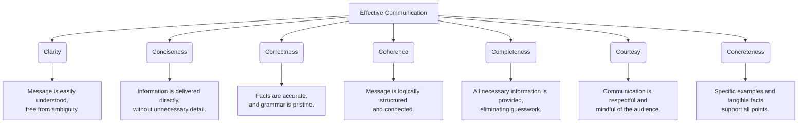

    

<h3 align="center">WELCOME TO</h3>
<h1 align="center">ADVANCED CYBER INTELLIGENCE R&D PROGRAM!</h1>
 
  
 

    

  

  

    

> [NOTE]

This document is a living resource. Suggestions for improvement are welcome and should be directed to the author.

 

> [!IMPORTANT]

This work is licensed under the **Creative Commons Attribution-ShareAlike 4.0 International License** (CC BY-SA 4.0).

When using, redistributing, adapting, or building upon this material, you **must** provide proper attribution by:

- 1. **Clearly stating the original source** as the **ACI R&D GitHub repository**.
- 2. **Including the exact URL(s)** to the relevant repository or file(s).

**Example Attribution Format:**  
- This work is based on content from the ACI R&D GitHub repository, available at:  
- https://github.com/acirdindia/acirdindia

Under the CC BY-SA license, you **must also**:
- Indicate if changes were made.
- License any adapted material under **identical terms** (CC BY-SA 4.0).

Failure to provide accurate source attribution violates the license terms.

    

<h1 align="center">The Executive'S Definitive Guide To Mastering Business Communication For Workplace Success.</h1>

  

### Executive Summary: The New Business Imperative

In the modern enterprise, communication is not merely a "soft skill"—it is the fundamental operating system upon which productivity, innovation, and culture are built. It is the critical differentiator between high-performing, agile teams and those mired in misunderstanding and missed opportunity.

This guide serves as a strategic playbook for leaders and individual contributors. It distills core principles and advanced strategies to empower you to communicate with unwavering clarity, genuine empathy, and measurable impact. Whether you are leading a global team, pitching to a client, or collaborating on a project, the frameworks within this document will help you ensure your message is not just sent, but truly received and understood. Mastering these skills is a strategic investment that pays dividends in team cohesion, operational efficiency, and overall leadership effectiveness.

 

## Part I: The Bedrock of Business Success

### Why Communication is Non-Negotiable

Effective business communication is the deliberate and successful exchange of information, intention, and emotion to achieve a specific purpose. It transcends simple information transfer; it involves actively listening, understanding the context, and making the speaker feel heard and valued. In an era of remote work and digital collaboration, its importance is magnified. Research consistently indicates that poor communication leads to staggering financial losses, project failures, and diminished employee morale.

**The benefits of mastering this craft are profound:**

- **Enhanced Collaboration & Productivity:** Clear instructions and seamless information flow eliminate redundant work, reduce friction, and align diverse teams toward common strategic goals. When everyone understands the "why" and the "how," execution becomes faster and more efficient.

- **Strengthened Trust & Relationships:** Open, honest, and respectful dialogue builds a foundation of psychological safety. In such an environment, teams feel safe to innovate, voice concerns, and take calculated risks without fear of retribution, fostering a stronger, more resilient organizational culture.

- **Improved Employee & Customer Satisfaction:** Internally, transparent communication boosts engagement and makes employees feel valued as integral parts of the mission. Externally, it enables you to deliver personalized experiences, manage expectations proactively, and build the kind of client loyalty that drives long-term growth.

- **Informed Decision-Making:** Leaders rely on the flow of accurate information. When communication channels are open and clear, leaders have access to the concise, complete, and correct data they need to make strategic decisions with confidence and agility.

 

## Part II: The Communication Spectrum

### Mastering the Five Core Types

A versatile communicator adeptly navigates multiple channels. To ensure your message is not just sent but *received* and understood, you must develop proficiency across these five types:

| Communication Type | Definition | Key Success Factors | Common Pitfalls |
| :--- | :--- | :--- | :--- |
| **1. Oral Communication** | The sharing of thoughts through speech. This includes formal presentations, one-on-one meetings, and virtual calls. | Clarity, pacing, vocal tone, and the ability to structure thoughts spontaneously. | Monotone delivery, rambling, failing to check for understanding. |
| **2. Written Communication** | Expressing ideas via text. This encompasses emails, reports, memos, and project documentation. | Clear, concise language; professional formatting; logical flow; and error-free grammar. | Unclear intent, overly long messages, ambiguous language, poor structure. |
| **3. Nonverbal Communication** | Information conveyed without words. Body language, facial expressions, gestures, and tone of voice often carry more weight than the words themselves. | Authentic alignment between verbal and nonverbal cues (congruence). Open and engaged posture. | Crossed arms, lack of eye contact, fidgeting, a tone that contradicts the spoken message. |
| **4. Active Listening** | The practice of fully concentrating on, understanding, and responding to a speaker. It is a proactive process of engagement. | Giving undivided attention, paraphrasing to confirm understanding, asking clarifying questions. | Interrupting, formulating a response while the other person is speaking, passive hearing. |
| **5. Contextual Communication** | The nuanced understanding of the unspoken rules, interpersonal dynamics, and cultural environment that shape how a message is interpreted. | Adapting your language, tone, and medium to fit the specific situation, audience, and cultural norms. | Using the same approach in every situation, ignoring power dynamics, being insensitive to cultural cues. |

 

## Part III: The Hallmarks of an Effective Communicator

An effective communicator is not defined by eloquence alone but by their ability to connect and achieve mutual understanding. These characteristics, famously known as the **7 Cs of Communication**, serve as a universal checklist for ensuring your message is built for impact.

 

## Part IV: A Strategic Framework for Improvement

### Core Tactics for Everyday Excellence

Improving your communication is a deliberate practice. Integrate these strategies into your daily interactions to build a powerful and reliable communication skillset.

- **Know Your Audience:** Before you speak or write, take a moment to consider the person or people you are addressing. Tailor your message to their interests, their existing knowledge of the subject, and their preferred communication style. This simple act of empathy builds immediate rapport and ensures your message is framed in a way that resonates, making engagement far more likely.

- **Prioritize Conciseness with the BRIEF Model:** Time is the non-renewable resource of the business world. Respect your audience's time by making your point quickly and effectively. Use the BRIEF model to structure your messages—especially emails and updates:
    - **B**ackground: What is the context?
    - **R**eason: Why are you communicating?
    - **I**nformation: What are the key facts?
    - **E**nd: What is the desired outcome or next step?
    - **F**ollow-up: What are the agreed-upon actions?

- **Choose the Optimal Medium for the Message:** In a digital world, the medium is a critical part of the message itself. Match the channel to the message's urgency and complexity. Use written forms like email or project management tools for detailed records, data dissemination, and non-urgent updates that require reflection. For sensitive feedback, complex negotiations, or conversations requiring emotional nuance, choose the "richest" medium available—ideally a face-to-face meeting or, failing that, a video call where tone and body language can be fully conveyed.

- **Practice Active Listening with Intent:** Shift your focus from waiting for your turn to speak to genuinely understanding the speaker. Concentrate fully on their words, tone, and body language. A powerful technique is to periodically paraphrase their points to confirm your understanding. Using phrases like, "So, if I'm hearing you correctly, your main concern is..." not only ensures clarity but also signals deep respect and validation.

- **Master Your Nonverbal Cues:** Become a student of your own body language. In meetings, maintain an open posture (uncrossed arms) and appropriate eye contact to signal engagement and honesty. Be acutely aware of your tone of voice—it can convey confidence, uncertainty, frustration, or enthusiasm. The goal is congruence: ensuring your nonverbal signals align perfectly with the words you are speaking to project authenticity.

- **Actively Seek Feedback and Confirm Understanding:** Never assume your message landed exactly as you intended. Communication is a two-way street, and the sender is responsible for confirming receipt and comprehension. Instead of asking "Does that make sense?" (which can invite a polite "yes"), ask open-ended questions like, "What are your initial thoughts on this approach?" or "Based on what I've shared, what do you see as the next steps?"

- **Minimize Distractions to Foster Focus:** Create an environment that is conducive to meaningful exchange. In meetings, this means putting away laptops and smartphones to give people your undivided attention. For remote workers, it means advocating for quiet, uninterrupted space during important video calls and communicating your own focus time to colleagues to manage expectations and reduce digital interruptions.

 

## Part V: Excelling in the Virtual Sphere

### Online Communication Best Practices

The digital workplace introduces unique challenges, from the lack of nonverbal cues to "Zoom fatigue." Mitigate these issues with these adapted strategies:

- **Respect Time Limits and Energy Levels:** Online meetings are prone to fatigue, so keep them brief and ruthlessly focused. Always publish a clear agenda beforehand. Use asynchronous tools like email, shared documents, or project management platforms for follow-up discussions and non-urgent Q&A, rather than letting a single meeting drag on to cover every detail.

- **Assume Competing Priorities:** Recognize that remote participants may have multiple demands on their attention just off-screen. Structure your content to be highly engaging from the start. Use visuals, ask direct questions to specific people, and keep your presentations lively and to-the-point to prevent attention from wandering.

- **Recap Key Points for Shared Understanding:** The lack of casual, real-time feedback in a virtual setting means you cannot rely on subtle nods or puzzled looks to gauge understanding. Compensate for this by explicitly summarizing decisions, action items, and owners at the end of every virtual call. Follow up with a brief, written recap in an email or a shared document to create a single source of truth.

- **Acknowledge Receipt Promptly:** In a text-based environment like email or chat, silence can be deafening and lead to anxiety about whether a message was received. A simple, prompt acknowledgment like "Received, thank you," "I'll look into this by EOD," or "Thanks, I'll need some time to think about this" confirms the message was seen and manages the sender's expectations, maintaining trust and workflow momentum.

 

## Part VI: The Art of Deep Engagement

### How to Be a Better Active Listener

Active listening is the cornerstone of meaningful dialogue. It moves beyond superficial hearing to true comprehension and connection. It is a skill that can be developed with focused practice.

- **Reframe How You Add Value:** Shift your mindset from believing your primary value in a conversation is what *you* say. Often, the greatest gift you can offer another person is your full, focused attention. By listening deeply, you help the speaker clarify their own thoughts, feel heard, and arrive at their own solutions, which is far more empowering than simply giving advice.

- **Paraphrase Without Judgment:** Make it a habit to periodically summarize the speaker's point before injecting your own opinion or analysis. Use their own "sticky" language—their key words and phrases—to show you are truly tuned in. For example, "So the core challenge, as you see it, is the 'integration bottleneck' with the new CRM?" This simple act of mirroring builds profound trust.

- **Ask Catalytic Questions:** Move the conversation forward by asking questions that prompt deeper thinking and self-discovery, rather than simple yes/no answers. Instead of asking "Did you try that?", ask "What led you to that conclusion?" or "How might we test that assumption?" These questions show you are engaged and help the speaker explore the issue from new angles.

- **Interrupt Politely and Purposefully:** Active listening does not mean being completely passive. If a speaker is going down a rabbit hole of irrelevant detail, a polite and validating interruption can keep the conversation productive and focused. Use phrases like, "Thank you for that valuable context. To make sure we cover everything on our list, could we pivot to discussing the budget implications now?" This keeps the conversation on track while respecting their contribution.

 

## Part VII: The Leader's Repertoire

### Advanced Techniques for Influence and Impact

For those tasked with shaping culture, driving performance, and leading teams through complexity, these advanced techniques are indispensable for elevating your influence.

- **Know When to Stop Talking:** One of the most powerful tools in a leader's arsenal is silence. Ask a thoughtful, open-ended question and then genuinely embrace the silence that follows. Resist the urge to fill the space with words, rephrase the question, or offer potential answers. This silence gives others the room to think, reflect, and formulate an authentic response, leading to richer insights and more meaningful dialogue.

- **Cultivate Authenticity, Not Performance:** Effective leadership communication does not require you to adopt a charismatic alter-ego. People are adept at sniffing out inauthenticity. Instead, focus on leveraging your genuine personality—whether you are naturally introverted or extroverted. Project warmth by being approachable and showing genuine interest in others. Project competence by being prepared, clear, and decisive. This genuine combination is far more compelling than any performed persona.

- **Manage Emotions with "The Balcony":** In moments of high stress, conflict, or heated negotiation, emotions can hijack your ability to think clearly. Practice the technique of mentally "going to the balcony." This metaphorical pause allows you to step back from the immediate action, observe the situation and your own emotional reactions dispassionately, manage your fight-or-flight response, and choose a strategic *response* rather than a reactive *reflex*.

- **Infuse Energy and Enthusiasm:** Professionalism and passion are not mutually exclusive; in fact, they are a powerful combination. Let it be evident that you care deeply about your message and your team's work. Authentic energy and enthusiasm are contagious. They signal commitment, inspire others, and make your communication more engaging and memorable. A leader who is passionately clear is a leader people will follow.

- **Seek Connection Before Conversion:** When facing fundamental disagreement or entrenched opposition, your first goal should not be to win the argument, but to find common ground. Prioritize connection over conversion. Identify a shared humanity, a common goal, or a mutually agreed-upon fact. "I think we both want what's best for this project" or "We can all agree that the customer experience is paramount." Building this bridge of goodwill creates the psychological safety necessary for more difficult conversations later.

- **Harness the Power of Storytelling:** Humans are wired for narrative, not just data dumps. While data and logic are necessary to inform and validate an argument, stories are what inspire action and are remembered. Wrap your key messages in a compelling narrative structure—with a relatable challenge, a journey, and a resolution. This connects with your audience on an emotional level, making your message not just understood, but felt and retained.

- **Edit Ruthlessly and "Chunk" Your Information:** Review your own communication—both important written documents and even recordings of your presentations—with a critical eye. Identify and eliminate filler words ("um," "like"), distracting mannerisms, and any information that does not directly serve your core message. Furthermore, avoid overwhelming your audience with complexity. "Chunk" complex data and ideas into smaller, digestible parts, guiding your audience through the logic step by step.

 

### The Continuous Journey

Mastering business communication is not a destination but a continuous journey of practice, feedback, and refinement. The most compelling communicators are not born; they are built through intention, effort, and a relentless commitment to understanding and being understood. By internalizing the principles in this guide and committing to their daily application, you will not only enhance your own career trajectory but also become a catalyst for building a more connected, resilient, and successful organization.

    

<h2 align="center">STAY TUNED FOR THE LATEST UPDATES!</h2>

  

    

 
