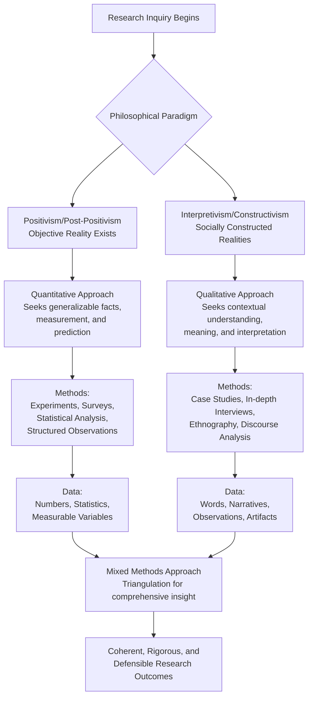
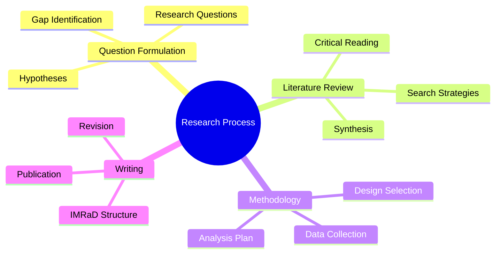

    

<h3 align="center">WELCOME TO</h3>
<h1 align="center">ADVANCED CYBER INTELLIGENCE R&D PROGRAM!</h1>
 
    

> [NOTE]

This document is a living resource. Suggestions for improvement are welcome and should be directed to the author.

 

> [!IMPORTANT]

This work is licensed under the **Creative Commons Attribution-ShareAlike 4.0 International License** (CC BY-SA 4.0).

When using, redistributing, adapting, or building upon this material, you **must** provide proper attribution by:

- 1. **Clearly stating the original source** as the **ACI R&D GitHub repository**.
- 2. **Including the exact URL(s)** to the relevant repository or file(s).

**Example Attribution Format:**  
- This work is based on content from the ACI R&D GitHub repository, available at:  
- https://github.com/acirdindia/acirdindia

Under the CC BY-SA license, you **must also**:
- Indicate if changes were made.
- License any adapted material under **identical terms** (CC BY-SA 4.0).

Failure to provide accurate source attribution violates the license terms.

    

<h1 align="center">The Complete Guide to Writing a Research Paper.</h1>

 

# Table of Contents

1. **Introduction: The Modern Research Landscape**
2. **Part I: Philosophical and Conceptual Foundations**
   - 1.1 What Is Research? Nature and Purpose
   - 1.2 The Scientific Method and Research Paradigms
   - 1.3 Ontology, Epistemology, and Axiology in Research
   - 1.4 Types of Research: A Comprehensive Classification
   - 1.5 Ethical Principles in Academic Research

3. **Part II: The Research Lifecycle—From Idea to Publication**
   - 2.1 Phase 1: Formulating the Research Question
   - 2.2 Phase 2: Conducting the Literature Review
   - 2.3 Phase 3: Developing Hypotheses
   - 2.4 Phase 4: Selecting Research Design and Methodology
   - 2.5 Phase 5: Data Collection
   - 2.6 Phase 6: Data Analysis and Interpretation
   - 2.7 Phase 7: Writing and Dissemination

4. **Part III: Mastering Academic Search and Literature Review**
   - 3.1 Foundational Search Techniques
   - 3.2 Advanced Search Operators
   - 3.3 Strategic Search Methodology
   - 3.4 Source Evaluation and Verification
   - 3.5 Reference Management Tools

5. **Part IV: The Standard Research Paper Structure (IMRaD)**
   - 4.1 Title Page
   - 4.2 Abstract
   - 4.3 Keywords
   - 4.4 Introduction
   - 4.5 Literature Review
   - 4.6 Methodology
   - 4.7 Results
   - 4.8 Discussion
   - 4.9 Conclusion
   - 4.10 References
   - 4.11 Optional Sections

6. **Part V: Study Techniques for Research Success**
   - 5.1 Cognitive Foundations of Active Learning
   - 5.2 Memory Optimization Strategies
   - 5.3 Organizational Frameworks
   - 5.4 Time Management and Habit Formation
   - 5.5 Collaborative Learning Dynamics
   - 5.6 Environmental and Physiological Optimizers

7. **Part VI: Writing Style and Language Guidelines**
8. **Part VII: Common Mistakes and How to Avoid Them**
9. **Part VIII: Final Submission Checklist**
10. **Part IX: Tools and Resources for Researchers**
11. **Conclusion: The Path to Research Mastery**

 

# Introduction: The Modern Research Landscape

Modern scholarship exists at a complex intersection. Today's researcher must ground their investigative endeavors in profound philosophical rigor while simultaneously mastering robust, traditional methodology. This dual requirement demands a clear articulation of assumptions about the nature of reality and the theory of knowledge before designing a study that coherently reflects these foundational beliefs.

Writing a research paper is not merely about constructing long paragraphs or summarizing existing content. It is about presenting a clear problem, a structured method, and logical results in a scientific format that contributes new knowledge to your field. This guide synthesizes centuries of academic tradition with contemporary best practices, providing a complete roadmap for researchers at all levels.

The primary goal of this document is to guide emerging scholars through the complete research lifecycle—from foundational philosophical concepts to final reporting—while emphasizing time-tested, rigorous practices. By meticulously aligning research questions with appropriate paradigms and methods, scholars can produce work that is not only methodologically sound but also philosophically defensible and impactful.

 

# Part I: Philosophical and Conceptual Foundations

## 1.1 What Is Research? Nature and Purpose

Research is a systematic, evidence-based investigation designed to discover, interpret, or revise facts, events, behaviors, or theories. It is the cornerstone of academic progress and professional development.

**A research paper is a formal document that:**

- Identifies a specific problem or gap in knowledge
- Reviews and synthesizes existing knowledge on the topic
- Applies a rigorous method to study the problem systematically
- Presents measurable, verifiable results
- Interprets findings logically within the context of existing literature
- Contributes new knowledge to the academic community

**What research is NOT:**

- An opinion essay based on personal beliefs
- A blog post or informal commentary
- A mere summary or compilation of existing content
- A platform for unsupported claims or emotional arguments

Research must be evidence-based, structured, reproducible, and transparent in its methods and limitations.

## 1.2 The Scientific Method and Research Approaches

The scientific method provides the foundational framework for all rigorous research. It consists of systematic observation, measurement, experimentation, and the formulation, testing, and modification of hypotheses.

**The core steps of the scientific method include:**

1. **Observation:** Identifying a phenomenon or problem worthy of investigation
2. **Question:** Formulating a specific, answerable question about the observation
3. **Hypothesis:** Proposing a tentative explanation or prediction
4. **Prediction:** Deriving logical consequences from the hypothesis
5. **Testing:** Designing and conducting experiments or studies to test predictions
6. **Analysis:** Interpreting the results to determine if they support the hypothesis

## 1.3 Ontology, Epistemology, and Axiology in Research

Every research project is undergirded by a philosophical paradigm—a framework of beliefs that guides the entire investigative process. Understanding these foundations is essential for producing coherent, defensible research.

### Ontology: The Nature of Reality

Ontology addresses the question: What is the nature of reality?

| **Ontological Position** | **Core Belief** | **Implication for Research** |
|:---|:---|:---|
| **Realism** | A single, objective reality exists independently of human perception | Research aims to discover and measure this objective reality |
| **Relativism** | Multiple, socially constructed realities exist based on individual and cultural perspectives | Research seeks to understand how different people construct and experience reality |

### Epistemology: The Nature of Knowledge

Epistemology addresses the question: What is the nature of knowledge and the relationship between the knower and the known?

| **Epistemological Position** | **Core Belief** | **Implication for Research** |
|:---|:---|:---|
| **Positivism/Post-Positivism** | Knowledge can be acquired through measurement, observation, and discovery; the researcher remains objective and detached | Quantitative methods, controlled experiments, statistical analysis |
| **Interpretivism/Constructivism** | Knowledge must be interpreted through subjective experience and context; the researcher is part of the research process | Qualitative methods, interviews, ethnography, case studies |

### Axiology: The Role of Values

Axiology addresses the question: What role do values play in research?

- **Value-Free Research:** The researcher maintains strict neutrality and objectivity
- **Value-Laden Research:** The researcher acknowledges and reflects on how personal values influence the research process
- **Reflexivity:** The practice of critically examining one's own biases, assumptions, and positionality throughout the research process

## 1.4 Types of Research: A Comprehensive Classification

Understanding different research types helps scholars select the most appropriate approach for their specific questions and contexts.

### By Purpose

| **Research Type** | **Description** | **Example** |
|:---|:---|:---|
| **Basic Research** | Conducted to advance fundamental knowledge without immediate practical application | Investigating the neural mechanisms of memory formation |
| **Applied Research** | Conducted to solve specific, practical problems | Developing a more effective reading intervention for dyslexic children |
| **Evaluation Research** | Assesses the effectiveness of programs, policies, or interventions | Evaluating whether a new teaching method improves student outcomes |

### By Methodological Approach

| **Research Type** | **Description** | **Typical Methods** |
|:---|:---|:---|
| **Quantitative Research** | Focuses on numerical data, measurement, and statistical analysis | Surveys, experiments, structured observations |
| **Qualitative Research** | Focuses on non-numerical data, meaning, and interpretation | Interviews, focus groups, ethnography, content analysis |
| **Mixed Methods Research** | Combines quantitative and qualitative approaches for comprehensive understanding | Sequential or concurrent use of both method types |

### By Design

| **Research Type** | **Description** | **Key Characteristics** |
|:---|:---|:---|
| **Experimental Research** | Manipulates variables to establish cause-and-effect relationships | Control groups, random assignment, manipulation of independent variables |
| **Descriptive Research** | Describes characteristics of a population or phenomenon | Surveys, observational studies, no variable manipulation |
| **Correlational Research** | Examines relationships between variables without manipulation | Identifies associations but cannot establish causation |
| **Exploratory Research** | Investigates understudied phenomena to generate hypotheses | Flexible methods, small samples, theory-building orientation |

## 1.5 Ethical Principles in Academic Research

Ethical conduct is non-negotiable in academic research. All scholars must adhere to fundamental ethical principles throughout the research process.

### Core Ethical Principles

| **Principle** | **Description** | **Practical Application** |
|:---|:---|:---|
| **Honesty** | Truthfully report data, methods, and results | No fabrication, falsification, or misrepresentation |
| **Objectivity** | Avoid bias in all aspects of research | Transparent methods, acknowledgment of limitations |
| **Integrity** | Keep promises and agreements | Follow through on commitments, honor confidentiality |
| **Carefulness** | Avoid errors through diligent practice | Rigorous methodology, careful record-keeping |
| **Openness** | Share data and findings | Transparency in methods, willingness to share |
| **Respect for Intellectual Property** | Honor patents, copyrights, and other forms of intellectual property | Proper citation, permission for use |
| **Confidentiality** | Protect sensitive information | Anonymize participants, secure data storage |
| **Non-Discrimination** | Avoid discrimination in all forms | Fair treatment of all participants and colleagues |

### Research with Human Subjects

When research involves human participants, additional safeguards are required:

- **Informed Consent:** Participants must understand the research and voluntarily agree to participate
- **Institutional Review Board (IRB) Approval:** Research must be reviewed and approved by an ethics committee
- **Minimization of Harm:** Research procedures must minimize potential physical or psychological harm
- **Right to Withdraw:** Participants can leave the study at any time without penalty

### Research Misconduct

The following actions constitute serious ethical violations and can result in severe consequences:

- **Fabrication:** Making up data or results
- **Falsification:** Manipulating or changing data to achieve desired results
- **Plagiarism:** Using others' work without proper attribution
- **Self-Plagiarism:** Reusing substantial portions of one's own previously published work without citation

 

# Part II: The Research Lifecycle—From Idea to Publication

The research process follows a systematic progression from initial conception to final dissemination. Understanding this lifecycle helps researchers plan effectively and avoid common pitfalls.

## 2.1 Phase 1: Formulating the Research Question

A strong research paper begins with one clear, focused question. This question guides every subsequent decision in the research process.

### Characteristics of a Strong Research Question

| **Characteristic** | **Weak Example** | **Strong Example** |
|:---|:---|:---|
| **Specific** | "Study of Artificial Intelligence" | "How does Random Forest improve crop yield prediction accuracy compared to Linear Regression?" |
| **Researchable** | "What is the meaning of consciousness?" (philosophical, not empirically answerable) | "What neural correlates are associated with conscious visual perception?" |
| **Significant** | "How many books are in my university library?" | "How has the university library's collection diversity changed over the past decade?" |
| **Original** | "What is the effect of smoking on health?" (well-established) | "How does vaping affect adolescent lung development compared to traditional smoking?" |

### The FINER Criteria for Research Questions

- **F**easible: Can be answered with available time, resources, and expertise
- **I**nteresting: Engages the researcher and the academic community
- **N**ovel: Adds new knowledge to the field
- **E**thical: Can be studied without causing harm
- **R**elevant: Matters to the field and potentially to society

## 2.2 Phase 2: Conducting the Literature Review

Before writing, researchers must thoroughly understand existing work on their topic. The literature review is not merely a summary but a critical synthesis that identifies gaps and positions the new research within the academic conversation.

### Purposes of the Literature Review

- To understand what is already known about the topic
- To identify key theories, methods, and debates in the field
- To discover gaps, inconsistencies, or unanswered questions
- To avoid reinventing the wheel or duplicating existing work
- To situate your research within the broader academic context
- To identify appropriate methodologies and analytical approaches

### Sources for Literature Review

| **Source Type** | **Examples** | **Access Points** |
|:---|:---|:---|
| **Primary Sources** | Original research articles, conference papers, dissertations | Google Scholar, IEEE Xplore, PubMed, JSTOR |
| **Secondary Sources** | Literature reviews, meta-analyses, books | Academic databases, university libraries |
| **Tertiary Sources** | Encyclopedias, textbooks, handbooks | Library reference sections, online resources |

### Critical Reading Strategies

While reading, actively engage with each source by asking:

- What was the research question or purpose?
- What methods were used?
- What were the main findings?
- What are the strengths of this study?
- What are the limitations or weaknesses?
- How does this connect to other work in the field?
- What questions remain unanswered?

## 2.3 Phase 3: Developing Hypotheses

A hypothesis is a testable prediction about the relationship between variables. Not all research requires formal hypotheses (exploratory studies may not), but when used, hypotheses must be clearly stated and testable.

### Types of Hypotheses

| **Hypothesis Type** | **Description** | **Example** |
|:---|:---|:---|
| **Null Hypothesis (H₀)** | States no relationship or no difference between variables | "There is no difference in crop yield prediction accuracy between Random Forest and Linear Regression." |
| **Alternative Hypothesis (H₁ or Hₐ)** | States that a relationship or difference exists | "Random Forest achieves higher crop yield prediction accuracy than Linear Regression." |
| **Directional Hypothesis** | Predicts the specific direction of the relationship | "Random Forest achieves at least 10% higher accuracy than Linear Regression." |
| **Non-Directional Hypothesis** | Predicts a difference but not its direction | "Random Forest and Linear Regression differ in crop yield prediction accuracy." |

### Hypothesis Testing and Errors

When testing hypotheses, two types of errors can occur:

| **Decision** | **Null Hypothesis Is True** | **Null Hypothesis Is False** |
|:---|:---|:---|
| **Reject Null Hypothesis** | Type I Error (False Positive) | Correct Decision |
| **Fail to Reject Null Hypothesis** | Correct Decision | Type II Error (False Negative) |

- **Type I Error (α):** Concluding there is an effect when none exists (false positive)
- **Type II Error (β):** Concluding there is no effect when one actually exists (false negative)

## 2.4 Phase 4: Selecting Research Design and Methodology

Research design is the strategic blueprint for answering the research question. It ensures the study is valid, reliable, and ethical.

### Major Research Designs

| **Design Type** | **Description** | **When to Use** | **Strengths** | **Limitations** |
|:---|:---|:---|:---|:---|
| **Experimental** | Manipulates independent variables to observe effects on dependent variables | Testing causal relationships | High internal validity, strong causal inference | May lack ecological validity, ethical constraints |
| **Quasi-Experimental** | Similar to experimental but without random assignment | Field settings where random assignment is impossible | More practical than true experiments | Weaker causal claims than true experiments |
| **Cross-Sectional** | Collects data from a population at a single point in time | Describing characteristics or relationships at one time | Efficient, relatively inexpensive | Cannot establish temporal relationships |
| **Longitudinal** | Collects data from the same subjects over an extended period | Studying development, change, or long-term effects | Can establish temporal order | Time-consuming, expensive, attrition |
| **Case Study** | In-depth examination of a single instance or system | Exploring complex phenomena in context | Rich detail, contextual understanding | Limited generalizability |
| **Survey** | Collects standardized data from a sample | Describing attitudes, behaviors, or characteristics | Can generalize to population if sampled well | May lack depth, subject to response bias |

## 2.5 Phase 5: Data Collection

Data collection methods vary based on the research question, design, and philosophical paradigm.

### Primary Data Collection Methods

| **Method** | **Description** | **Best For** | **Considerations** |
|:---|:---|:---|:---|
| **Surveys/Questionnaires** | Standardized questions administered to a sample | Collecting large amounts of data efficiently | Requires careful design to avoid bias |
| **Interviews** | Direct questioning of participants, can be structured, semi-structured, or unstructured | In-depth exploration of experiences and perspectives | Time-consuming, requires skilled interviewer |
| **Observations** | Systematic watching and recording of behavior | Studying behavior in natural settings | Observer bias, reactivity of participants |
| **Focus Groups** | Group discussions facilitated by a moderator | Exploring group norms, shared experiences | Group dynamics may influence responses |
| **Experiments** | Controlled procedures to test hypotheses | Establishing cause-and-effect | Artificial settings may limit generalizability |
| **Archival Research** | Analysis of existing records or documents | Studying historical trends or hard-to-reach populations | Data may not have been collected for research purposes |

### Secondary Data Sources

- Government statistics and reports
- Organizational records
- Previously collected research data
- Historical documents
- Media content

## 2.6 Phase 6: Data Analysis and Interpretation

Data analysis transforms raw information into meaningful findings. The analytical approach must align with the research design and type of data collected.

### Quantitative Data Analysis

| **Analysis Type** | **Purpose** | **Examples** |
|:---|:---|:---|
| **Descriptive Statistics** | Summarize and describe data characteristics | Mean, median, mode, standard deviation, range, frequencies |
| **Inferential Statistics** | Draw conclusions about populations from samples | t-tests, ANOVA, chi-square, correlation, regression |
| **Predictive Analysis** | Predict outcomes based on data | Linear regression, logistic regression, machine learning |

### Qualitative Data Analysis

| **Analysis Type** | **Purpose** | **Process** |
|:---|:---|:---|
| **Thematic Analysis** | Identify patterns and themes in qualitative data | Coding, theme development, interpretation |
| **Content Analysis** | Systematically categorize textual content | Develop coding scheme, quantify categories |
| **Discourse Analysis** | Examine language use and meaning | Analyze linguistic features, context, and power relations |
| **Grounded Theory** | Develop theory from data | Iterative coding, constant comparison, theory building |

### Triangulation

Triangulation involves using multiple methods, data sources, or researchers to enhance the validity and credibility of findings. Types include:

- **Method Triangulation:** Using multiple methods to study the same phenomenon
- **Data Triangulation:** Using multiple data sources
- **Investigator Triangulation:** Involving multiple researchers
- **Theory Triangulation:** Using multiple theoretical perspectives

## 2.7 Phase 7: Writing and Dissemination

The final phase involves communicating findings to the academic community through publications, presentations, and other venues.

### Dissemination Options

| **Venue** | **Description** | **Considerations** |
|:---|:---|:---|
| **Journal Articles** | Peer-reviewed publications in academic journals | Most prestigious, rigorous review process, lengthy timeline |
| **Conference Presentations** | Oral or poster presentations at academic conferences | Faster dissemination, networking opportunities, feedback |
| **Book Chapters** | Contributions to edited volumes | Comprehensive treatment, less rigorous than journals |
| **Theses/Dissertations** | Comprehensive reports of graduate research | Required for degree completion, detailed documentation |
| **Preprints** | Early sharing of manuscripts before peer review | Rapid dissemination, feedback, may affect journal submission |

 

# Part III: Mastering Academic Search and Literature Review

In today's information-saturated world, the ability to find precise, relevant, and authoritative information is essential for researchers. Moving beyond simple keyword searches dramatically increases productivity and the quality of results.

## 3.1 Foundational Search Techniques

### Instant Answers and Quick Lookups

Modern search engines provide immediate answers for common queries:

- **Calculations and Conversions:** Enter equations like `(5*22)/7` or use natural language for unit conversions (`km to miles`)
- **Definitions:** Use `define [word]` for definitions and etymology
- **Translations:** Enter `[word] in [language]` for instant translation
- **Real-Time Information:** Get stock prices (`AAPL`), weather forecasts, or world times (`time in Tokyo`)

### Intent-Based Discovery

Structure queries around your research intent:

- **Planning and Comparison:** Search for historical data, trends, or comparisons
- **Media and Documents:** Search for specific document types, datasets, or media
- **People and Institutions:** Search for researchers, universities, or research centers

## 3.2 Advanced Search Operators

Mastering search operators provides precise control over search results.

### Precision Filtering Operators

| **Operator** | **Function** | **Example** | **Use Case** |
|:---|:---|:---|:---|
| `site:` | Restricts search to a specific website or domain | `site:github.com transformer architecture` | Find content within a trusted source |
| `site:.edu` | Restricts to educational institutions | `site:.edu deep learning curriculum` | Find academic content |
| `site:.gov` | Restricts to government websites | `site:.gov climate change data` | Find authoritative government data |
| `filetype:` | Searches for specific file formats | `filetype:pdf reinforcement learning` | Find research papers, reports, presentations |
| `intitle:` | Requires term in page title | `intitle:"systematic review"` | Find articles focused on specific topics |
| `inurl:` | Requires term in URL | `inurl:dataset climate change` | Find data repositories |

### Boolean and Contextual Logic Operators

| **Operator** | **Function** | **Example** | **Use Case** |
|:---|:---|:---|:---|
| `" "` | Exact phrase matching | `"social cognitive theory"` | Find specific phrases or concepts |
| `-` (minus) | Excludes terms | `python -snake -monty` | Remove irrelevant meanings |
| `OR` | Includes either term (must be capitalized) | `TensorFlow OR PyTorch` | Broaden search to related terms |
| `AND` | Requires both terms (often implicit) | `climate AND adaptation AND policy` | Narrow to specific combinations |
| `AROUND(n)` | Terms within n words of each other | `quantum AROUND(5) computing` | Find conceptually related content |
| `*` (wildcard) | Replaces unknown words | `the * of the story` | Find variations of phrases |
| `..` | Numeric range | `temperature "20..30" celsius` | Find data within specific ranges |

### Advanced Utility Operators

| **Operator** | **Function** | **Example** | **Use Case** |
|:---|:---|:---|:---|
| `related:` | Finds sites similar to a known URL | `related:nature.com` | Discover similar journals or sources |
| `cache:` | Retrieves saved version of a page | `cache:example.edu/research.pdf` | Access content if site is down |
| `BEFORE:` | Filters results before a date | `BEFORE:2020-01-01` | Find historical research |
| `AFTER:` | Filters results after a date | `AFTER:2023-01-01` | Find recent publications |

## 3.3 Strategic Search Methodology

Technique must be guided by strategy. A methodological approach transforms random searching into systematic discovery.

### Query Crafting and Iterative Refinement

1. **Start Broad, Then Narrow:** Begin with a general query to assess the landscape, then iteratively refine using more specific keywords and operators based on what you learn.

2. **Use Professional Terminology:** Incorporate domain-specific jargon and technical terms to bypass generic content and reach expert material.

3. **Prioritize Keywords:** Strip sentences down to essential nouns and concepts, removing superfluous words like "the," "how," or "of."

4. **Document Your Search Strategy:** For systematic reviews, maintain a record of databases searched, dates, search strings, and number of results.

### Example: Systematic Search Workflow

**Scenario:** Finding recent research on reinforcement learning for robotic manipulation

1. **Exploratory Phase:** Start broad: `reinforcement learning robotic manipulation`. Identify key sub-topics, common authors, and relevant conferences.

2. **Refinement Phase:** Narrow using advanced operators:
   `"reinforcement learning" "robotic manipulation" filetype:pdf AFTER:2023`

3. **Authority Filtering:** Restrict to academic sources:
   `site:.edu "deep reinforcement learning" "robot manipulation"`

4. **Forward and Backward Chaining:**
   - **Backward:** Examine references in promising papers
   - **Forward:** Use "cited by" features to find newer papers citing key works

5. **Ongoing Monitoring:** Set up alerts for refined search strings to receive notifications of new publications.

## 3.4 Source Evaluation and Verification

Not all search results are equally valuable. Critical evaluation is essential.

### Evaluating Sources: The CRAAP Test

| **Criterion** | **Questions to Ask** |
|:---|:---|
| **Currency** | When was this published? Has it been updated? Is the field evolving quickly? |
| **Relevance** | Does this directly address my research question? Who is the intended audience? |
| **Authority** | Who are the authors? What are their credentials? Is the publisher reputable? |
| **Accuracy** | Is the information supported by evidence? Can it be verified elsewhere? |
| **Purpose** | Why was this created? Is there bias or hidden agenda? |

### Leveraging Authoritative Domains

- `.edu` – Educational institutions (generally credible academic content)
- `.gov` – Government agencies (authoritative data and reports)
- `.org` – Organizations (check individual organization reputation)
- Reputable journals and academic publishers

### Cross-Referencing with Multiple Engines

Different search engines have different indexes and ranking algorithms. Cross-checking can uncover unique sources:

- **Google Scholar:** Broad academic search, citation tracking
- **PubMed:** Biomedical and life sciences
- **IEEE Xplore:** Engineering and computer science
- **Scopus/Web of Science:** Comprehensive, curated databases
- **Semantic Scholar:** AI-powered academic search

## 3.5 Reference Management Tools

Reference managers save time, reduce errors, and maintain consistency in citations.

| **Tool** | **Key Features** | **Best For** |
|:---|:---|:---|
| **Zotero** | Free, open-source, browser integration, collaborative features | Researchers who want free, flexible tool |
| **Mendeley** | Free, PDF management, social networking features | Researchers who work extensively with PDFs |
| **EndNote** | Comprehensive features, integration with Word | Advanced researchers, institutional licenses |
| **Paperpile** | Browser-based, Google Docs integration | Researchers using Google Workspace |

### Benefits of Reference Managers

- Automatic citation and bibliography generation
- PDF storage and annotation
- Searchable personal database
- Collaboration and sharing
- Integration with word processors
- Reduced risk of citation errors

 

# Part IV: The Standard Research Paper Structure (IMRaD)

Most academic journals and conferences follow the IMRaD structure:

> **I**ntroduction
> **M**ethodology
> **R**esults
> **a**nd
> **D**iscussion

This section provides detailed guidance for each component.

## 4.1 Title Page

### Purpose

To clearly and concisely describe what the paper studies, enabling readers to quickly understand the focus and decide whether to read further.

### Must Include

- Clear and specific title
- Author name(s) and institutional affiliation(s)
- Contact information for corresponding author (if required)
- Date of submission or publication
- Journal or conference name (if applicable)

### Title Writing Rules

| **Do** | **Don't** |
|:---|:---|
| Use specific, descriptive language | Use vague words like "Study of" or "Investigation into" |
| Include key variables and focus | Include unnecessary words or jargon |
| Keep concise (typically 10-20 words) | Make titles excessively long or short |
| Reflect the content accurately | Mislead or overpromise |

**Example Titles:**

- Weak: "Study of Machine Learning in Agriculture"
- Strong: "Comparative Analysis of Random Forest and Linear Regression Models for Crop Yield Prediction Using Satellite Data in Midwest United States"

## 4.2 Abstract (150–250 Words)

### Purpose

To provide a complete, self-contained summary of the entire paper, allowing readers to quickly understand the research without reading the full document.

### Structure

| **Component** | **Content** | **Approximate Length** |
|:---|:---|:---|
| **Background** | Context and importance of the problem | 1-2 sentences |
| **Objective** | Research question or purpose | 1 sentence |
| **Method** | Key aspects of methodology | 2-3 sentences |
| **Results** | Most important findings | 2-3 sentences |
| **Conclusion** | Interpretation and implications | 1-2 sentences |

### Key Rules

- Write the abstract last, after completing the full paper
- Do not include citations or references
- Do not include abbreviations without definition
- Keep it precise and self-contained
- Ensure it accurately represents the paper's content

## 4.3 Keywords

### Purpose

To facilitate discoverability in academic databases and search engines.

### Guidelines

- Provide 4-8 keywords
- Reflect core concepts and main topics
- Match common academic search terms in your field
- Avoid overly generic words
- Consider variations and synonyms

**Example:** Machine Learning, Crop Yield Prediction, Random Forest, Agricultural Data Analytics, Satellite Imagery, Precision Agriculture

## 4.4 Introduction

### Purpose

To explain why the research matters, establish context, and guide readers into the study.

### Structure

| **Component** | **Description** | **Key Questions to Answer** |
|:---|:---|:---|
| **Background Context** | Introduce the general topic and its importance | What is the broader field? Why does it matter? |
| **Problem Statement** | Clearly explain the specific issue | What problem needs solving? |
| **Research Gap** | Identify what is missing in current studies | What don't we know? What are limitations of existing work? |
| **Research Objective** | State what the paper aims to achieve | What will this study do? |
| **Contribution** | Mention what the paper adds to the field | How will this advance knowledge? |
| **Roadmap** | Briefly outline the paper's structure | How is the rest of the paper organized? |

### Writing Tips

- Move from broad context to specific focus (funnel structure)
- Cite relevant literature to establish context
- Clearly articulate the gap your research fills
- End with a clear statement of purpose (e.g., "This paper aims to...")
- Keep it logical and focused

## 4.5 Literature Review

### Purpose

To analyze and synthesize previous work, demonstrating your understanding of the field and positioning your research within the academic conversation.

### What Literature Review Is NOT

- A simple list or summary of papers
- An annotated bibliography
- A collection of quotes

### What Literature Review IS

- A critical synthesis of existing research
- An analysis of methods, findings, and limitations
- A identification of patterns, debates, and gaps
- A justification for your own research

### Structure and Approach

| **Approach** | **Description** | **Example** |
|:---|:---|:---|
| **Thematic** | Organize by themes or topics | Studies on accuracy, studies on scalability, studies on interpretability |
| **Chronological** | Organize by development over time | Early approaches, mid-century developments, contemporary methods |
| **Methodological** | Organize by research methods | Quantitative studies, qualitative studies, mixed methods |
| **Theoretical** | Organize by theoretical frameworks | Cognitive theories, behavioral theories, social constructivist approaches |

### Writing Style

Do not just summarize papers. Instead:

- Compare and contrast methods across studies
- Evaluate strengths and weaknesses
- Identify patterns in findings
- Highlight contradictions or inconsistencies
- Show how your research addresses identified gaps

**Example:**

> "Study A used method X and achieved 85% accuracy with a small, controlled sample. Study B used method Y and achieved 82% accuracy with a larger, real-world dataset. However, neither study directly compared X and Y using the same large-scale dataset. Furthermore, both studies focused on temperate agricultural zones, leaving tropical agricultural systems unexplored. This gap motivates the present study, which compares X and Y using a large-scale dataset from tropical regions."

## 4.6 Methodology (Materials and Methods)

### Purpose

To explain exactly how the research was conducted, with sufficient detail that other researchers could reproduce the work.

### Core Requirements

- **Reproducibility:** Another researcher should be able to replicate your study
- **Transparency:** All decisions and procedures should be clearly explained
- **Appropriateness:** Methods should be justified as appropriate for the research question

### What to Include

| **Component** | **Description** | **Examples** |
|:---|:---|:---|
| **Research Design** | Overall approach and structure | Experimental, quasi-experimental, descriptive, case study |
| **Participants/Subjects** | Who or what was studied | Sample size, characteristics, recruitment methods |
| **Materials/Instruments** | Tools used for data collection | Surveys, equipment, software, tests |
| **Procedures** | Step-by-step description of what was done | Data collection steps, experimental protocols |
| **Variables** | Key variables and how they were measured | Independent, dependent, control variables |
| **Data Analysis** | How data were processed and analyzed | Statistical tests, coding procedures, software used |

### Writing Style

- Use past tense (you are describing what you did)
- Use passive voice or active first-person plural ("The data were collected..." or "We collected the data...")
- Be precise and detailed
- Avoid emotional or evaluative language

**Example:**

> "The dataset was collected from public agricultural records between 2015 and 2022. A total of 10,000 farm observations from five Midwestern states were included. The Random Forest algorithm was implemented using Python's scikit-learn library version 1.2.0 with default parameters except for n_estimators, which was set to 100. Model performance was evaluated using 10-fold cross-validation, with accuracy, precision, and recall as primary metrics."

## 4.7 Results

### Purpose

To present findings objectively, without interpretation or commentary.

### What to Include

- Descriptive statistics summarizing the data
- Results of statistical tests
- Tables and figures presenting data visually
- Key findings in narrative form

### Presentation Guidelines

| **Element** | **Purpose** | **Guidelines** |
|:---|:---|:---|
| **Tables** | Present precise numerical data | Clear labels, proper formatting, referenced in text |
| **Figures** | Show patterns and relationships visually | Appropriate type (bar chart, scatter plot, etc.), clear axes, legends |
| **Text** | Guide readers through the results | Highlight key findings, direct attention to tables/figures, do not interpret |

### What NOT to Include

- Interpretation or explanation of findings
- Comparison to other studies
- Discussion of implications
- Speculation about causes

**Example:**

> "Table 1 presents descriptive statistics for all variables. The Random Forest model achieved 92.3% accuracy (SD = 1.2%), while Linear Regression achieved 78.1% accuracy (SD = 2.4%). This difference was statistically significant (t(18) = 5.67, p < 0.001). Figure 1 displays the distribution of prediction errors for both models."

## 4.8 Discussion

### Purpose

To interpret results, explain their meaning, and situate them within the broader context of existing research.

### Structure

| **Component** | **Description** | **Key Questions to Answer** |
|:---|:---|:---|
| **Summary of Key Findings** | Briefly restate main results | What did we find? |
| **Interpretation** | Explain what the findings mean | Why did this happen? What do these results tell us? |
| **Comparison to Literature** | Relate findings to previous research | How does this compare to what others found? Do findings support or contradict existing work? |
| **Implications** | Discuss practical and theoretical significance | What are the real-world applications? How does this advance theory? |
| **Limitations** | Acknowledge constraints of the study | What could not be addressed? What are potential weaknesses? |
| **Future Research** | Suggest directions for further investigation | What questions remain? What should be studied next? |

### Writing Tips

- Begin with a clear, brief restatement of main findings
- Explain, don't just repeat—this section is for interpretation
- Be honest about limitations (all studies have them)
- Connect back to the research question and gap identified in the introduction
- Avoid overgeneralizing beyond your data

**Example:**

> "The finding that Random Forest outperformed Linear Regression by approximately 14% in accuracy aligns with previous research suggesting that ensemble methods capture non-linear relationships more effectively than linear models (Smith et al., 2020; Jones & Lee, 2021). However, our observed accuracy gap is larger than the 5-8% range reported in temperate agricultural studies. This may reflect the greater complexity of tropical agricultural systems, where non-linear interactions between multiple variables are more pronounced. These findings suggest that machine learning approaches may be particularly valuable for complex, real-world agricultural settings, though further research is needed to test this hypothesis across diverse geographic regions."

## 4.9 Conclusion

### Purpose

To summarize the paper and provide closure, emphasizing the main contributions and takeaway messages.

### What to Include

- Brief recap of the research objective
- Summary of key findings
- Main contributions of the study
- Practical and theoretical implications
- Limitations (briefly)
- Future research directions

### What NOT to Include

- New data or findings not presented in results
- New citations not previously discussed
- Extensive new discussion or interpretation
- Unsupported speculation

**Example:**

> "This study investigated the comparative accuracy of Random Forest and Linear Regression for crop yield prediction using satellite data from tropical agricultural regions. Results demonstrated that Random Forest significantly outperformed Linear Regression, achieving 92% accuracy compared to 78%. These findings contribute to the growing literature on machine learning applications in agriculture and suggest that ensemble methods may be particularly valuable in complex tropical systems. The primary limitation is the geographic focus on three Southeast Asian countries; future research should examine whether these findings generalize to other tropical regions. Additionally, future work might explore hybrid approaches combining multiple machine learning methods or incorporating additional data sources such as soil sensors."

## 4.10 References

### Purpose

To credit all sources used in the paper and enable readers to locate them.

### Key Rules

- Every in-text citation must appear in the reference list
- Every reference list entry must be cited in the text
- Formatting must be consistent with the required style
- Accuracy is essential—errors undermine credibility

### Common Citation Styles

| **Style** | **Commonly Used In** | **Key Features** |
|:---|:---|:---|
| **APA (7th ed.)** | Social sciences, education, psychology | Author-date in-text citations, reference list alphabetized |
| **MLA (9th ed.)** | Humanities, literature, arts | Author-page in-text citations, Works Cited page |
| **Chicago/Turabian** | History, humanities, some social sciences | Notes-bibliography or author-date options |
| **IEEE** | Engineering, computer science | Numeric citations in brackets, numbered reference list |
| **Vancouver** | Medicine, health sciences | Numeric citations in text, numbered reference list |

### Using Reference Managers

Reference management tools (Zotero, Mendeley, EndNote) can:

- Automatically format citations and bibliographies
- Store and organize references
- Insert citations as you write
- Switch between styles with one click
- Reduce errors and save time

## 4.11 Optional Sections

Depending on journal requirements or the nature of your research, additional sections may be included:

| **Section** | **Purpose** | **When to Include** |
|:---|:---|:---|
| **Acknowledgements** | Thank individuals and organizations who contributed but are not authors | Always appropriate when others helped |
| **Funding Disclosure** | Declare sources of financial support | Required by many journals and funders |
| **Conflict of Interest** | Declare any potential conflicts | Required by most journals |
| **Ethical Approval** | Document ethics committee approval | Required for research with humans or animals |
| **Appendices** | Provide supplementary material | When detailed information would disrupt flow (e.g., full questionnaires, additional data) |
| **Supplementary Materials** | Online-only additional content | When journals offer this option |

# Part V: Study Techniques for Research Success

Effective learning and productivity are essential for successful research. This section synthesizes empirically validated techniques from cognitive psychology and educational research.

## 5.1 Cognitive Foundations of Active Learning

Deep, durable learning requires active mental construction. Passive methods like re-reading and highlighting are significantly less effective than active engagement strategies.

### Active Recall (Retrieval Practice)

| **Aspect** | **Description** |
|:---|:---|
| **Core Concept** | Actively stimulating memory recall without reference materials—generating answers from memory rather than recognizing them |
| **Psychological Rationale** | Leverages the "testing effect": the act of retrieval strengthens memory traces and slows forgetting |
| **Implementation** | Close materials and write or verbalize what you remember; use flashcards; complete practice problems without solutions |
| **Key Insight** | The effort and occasional failure in active recall are not signs of poor learning but are critical to long-term consolidation |

### The Feynman Technique

| **Aspect** | **Description** |
|:---|:---|
| **Core Concept** | Mastering a concept by explaining it in simple, plain language as if teaching a novice |
| **Psychological Rationale** | Teaching forces explanatory depth; to simplify, you must identify core principles and confront gaps in understanding |
| **Implementation Steps** | 1. Choose a concept 2. Teach it in simple terms 3. Identify gaps in your explanation 4. Review and simplify iteratively |

### Self-Explanation and Elaborative Interrogation

| **Aspect** | **Description** |
|:---|:---|
| **Self-Explanation** | Verbally narrating your reasoning process as you work through problems or texts |
| **Elaborative Interrogation** | Proactively asking "Why is this true?" or "How does this connect to X?" |
| **Psychological Rationale** | Promotes relational and causal encoding, embedding facts within rich meaning networks |
| **Implementation** | Pause while reading to ask and answer "why" questions; talk through problem-solving steps |

## 5.2 Memory Optimization Strategies

Human memory follows predictable patterns of encoding, storage, and decay. These strategies work with the brain's architecture to build durable knowledge.

### Spaced Repetition

| **Aspect** | **Description** |
|:---|:---|
| **Core Concept** | Reviewing information at systematically increasing intervals over time |
| **Psychological Rationale** | Counters Ebbinghaus's forgetting curve; reviewing as information begins to fade signals long-term value |
| **Implementation** | Use algorithm-driven software (Anki, SuperMemo) or manual systems (Leitner System with flashcards) |

**The Leitner System:**

- Box 1: Review daily
- Box 2: Review every 3 days
- Box 3: Review weekly
- Correct answers move to higher box; incorrect answers return to Box 1

### Interleaved Practice

| **Aspect** | **Description** |
|:---|:---|
| **Core Concept** | Mixing different topics or problem types within a single study session |
| **Psychological Rationale** | Prevents contextual overfitting; forces discriminative contrast and conscious strategy selection |
| **Implementation** | In math sessions, mix algebra, geometry, and calculus; in language study, alternate vocabulary, grammar, and reading |

### Dual Coding

| **Aspect** | **Description** |
|:---|:---|
| **Core Concept** | Combining verbal information (words, explanations) with visual information (diagrams, charts, sketches) |
| **Psychological Rationale** | Creates two linked memory representations, providing multiple retrieval routes |
| **Implementation** | Supplement text notes with diagrams, flowcharts, timelines; annotate images with written summaries |

### Mnemonics and the Method of Loci

| **Technique** | **Description** | **Example** |
|:---|:---|:---|
| **Acronyms** | Using first letters to form memorable words | "HOMES" for the Great Lakes (Huron, Ontario, Michigan, Erie, Superior) |
| **Method of Loci** | Visualizing items along a familiar route | Place information at locations in your house; mentally walk to retrieve |
| **Chunking** | Grouping information into meaningful units | Memorizing 5550198 as "555-0198" |

## 5.3 Organizational Frameworks

Effective learning requires structured processes for capturing, connecting, and reviewing information.

### The Cornell Note-Taking System

| **Component** | **Description** | **Purpose** |
|:---|:---|:---|
| **Notes Column (Right)** | Record lecture or reading content during class/reading | Capture information |
| **Cues Column (Left)** | Afterward, write key questions or prompts | Facilitate active recall during review |
| **Summary (Bottom)** | Brief synthesis of the entire page's content | Consolidate understanding |

**Review Method:** Cover the Notes column and use the Cues column to quiz yourself.

### Mind Mapping and Concept Mapping

| **Aspect** | **Description** |
|:---|:---|
| **Core Concept** | Visual, non-linear organization of ideas around a central concept using branches, keywords, colors, and images |
| **Psychological Rationale** | Mirrors the brain's associative, networked thinking; facilitates holistic understanding |
| **Implementation** | Start with central topic, draw branches for subtopics, add sub-branches for details; use keywords and images |

### The SQ3R Reading Method

| **Step** | **Description** | **Action** |
|:---|:---|:---|
| **Survey** | Skim headings, subheadings, figures, abstract | Get the big picture before deep reading |
| **Question** | Turn headings into questions | Set purpose for reading |
| **Read** | Actively read to answer your questions | Engage with text purposefully |
| **Recite/Recall** | After sections, recite answers from memory | Immediate retrieval practice |
| **Review** | After finishing, review questions and answers | Consolidate learning |

## 5.4 Time Management and Habit Formation

Sustaining cognitive effort requires strategic management of attention, time, and behavior.

### The Pomodoro Technique

| **Aspect** | **Description** |
|:---|:---|
| **Core Concept** | Working in focused, timed intervals (traditionally 25 minutes) separated by short breaks |
| **Psychological Rationale** | Matches natural attention rhythms, prevents fatigue, makes tasks manageable |
| **Implementation** | 1. Set timer for 25 minutes 2. Work with zero distractions 3. Take 5-minute break 4. After four intervals, take 15-30 minute break |

### Parkinson's Law and Timeboxing

| **Aspect** | **Description** |
|:---|:---|
| **Core Concept** | Work expands to fill available time; timeboxing assigns fixed time periods to tasks |
| **Psychological Rationale** | Creates beneficial temporal urgency, reducing procrastination and perfectionism |
| **Implementation** | Instead of "study Chapter 5," set "Outline Chapter 5 in 30 minutes" |

### Habit Stacking

| **Aspect** | **Description** |
|:---|:---|
| **Core Concept** | Stacking a new habit onto an existing, well-established habit |
| **Psychological Rationale** | Leverages existing neural pathways; the established habit acts as a reliable trigger |
| **Implementation** | 1. Identify reliable current habit 2. Define new desired habit 3. Stack them: "After [current habit], I will [new habit]" |

## 5.5 Collaborative Learning Dynamics

Learning is inherently social. Interaction with others provides accountability, exposes blind spots, and creates opportunities for cognitive restructuring.

### The Protégé Effect

| **Aspect** | **Description** |
|:---|:---|
| **Core Concept** | Those who teach a topic develop deeper, more durable understanding |
| **Psychological Rationale** | Preparing to teach triggers metacognitive and generative processes; social responsibility increases motivation |
| **Implementation** | Peer tutoring; "rubber duck" method (explain to inanimate object); create study guides |

### Structured Group Discussion

| **Aspect** | **Description** |
|:---|:---|
| **Core Concept** | Purposeful, role-driven collaborative learning |
| **Psychological Rationale** | Exposes learners to multiple perspectives; defending understanding fosters critical thinking |
| **Implementation** | Assign roles (Discussion Leader, Skeptic, Synthesizer); use think-pair-share; debate opposing viewpoints |

## 5.6 Environmental and Physiological Optimizers

Cognitive performance does not occur in a vacuum. Physical state and environment significantly impact learning.

### Environmental Design

- Designate a dedicated study space used only for focused work
- Ensure good lighting, organization, and minimal distractions
- Use website blockers during focus sessions

### Sleep and Memory Consolidation

| **Aspect** | **Description** |
|:---|:---|
| **Core Concept** | The "sleep sandwich": study before sleep, sleep, brief review upon waking |
| **Psychological Rationale** | During deep sleep, the brain reactivates and reorganizes memories, strengthening neural connections |
| **Implementation** | Review difficult material before sleeping; ensure full night's sleep; brief morning review |

### Physiological Supports

| **Factor** | **Impact** | **Action** |
|:---|:---|:---|
| **Hydration** | Mild dehydration impairs attention and memory | Keep water at desk; drink regularly |
| **Nutrition** | Brain requires steady glucose for sustained effort | Complex carbohydrates, healthy snacks |
| **Movement** | Increases blood flow and neurotrophic factors | 5-minute movement breaks during long sessions |

# Part VI: Writing Style and Language Guidelines

Clear, precise writing is essential for effective research communication. Follow these guidelines to enhance readability and impact.

## General Principles

| **Do** | **Don't** |
|:---|:---|
| Use clear, simple English | Use unnecessarily complex language |
| Write concise sentences | Write long, convoluted sentences |
| Be precise and specific | Be vague or ambiguous |
| Use active voice when appropriate (first-person plural acceptable) | Overuse passive voice excessively |
| Define technical terms | Assume readers know all jargon |
| Use headings and subheadings for organization | Present undifferentiated blocks of text |
| Use figures and tables to present data visually | Rely solely on text for complex information |
| Maintain logical flow between sections | Jump between unrelated topics |

## Voice and Tone

- **Objective:** Present information neutrally, without emotional language
- **Precise:** Choose words that accurately convey meaning
- **Formal but accessible:** Maintain academic standards without unnecessary complexity
- **Confident but measured:** Make claims supported by evidence; avoid overstatement

## Common Language Pitfalls to Avoid

| **Pitfall** | **Example** | **Better** |
|:---|:---|:---|
| Informal language | "A bunch of studies looked at this thing" | "Numerous studies have examined this phenomenon" |
| Emotional expressions | "Amazingly, the results were perfect" | "The results demonstrated strong support for the hypothesis" |
| Unsupported claims | "Everyone knows this is true" | "Substantial evidence supports this conclusion" |
| Vague language | "Some researchers did some work" | "Smith et al. (2020) conducted a meta-analysis" |
| Overgeneralization | "This proves that..." | "These findings suggest that..." |

## Tense Usage

| **Section** | **Typical Tense** | **Example** |
|:---|:---|:---|
| Introduction | Present | "Climate change represents a significant challenge..." |
| Literature Review | Present perfect or past | "Previous research has examined... Smith (2019) found..." |
| Methodology | Past | "Data were collected from..." |
| Results | Past | "The model achieved 92% accuracy..." |
| Discussion | Present | "These findings suggest that..." |
| Conclusion | Present | "This study contributes to..." |

# Part VII: Common Mistakes and How to Avoid Them

## Pre-Writing and Planning Mistakes

| **Mistake** | **Consequence** | **Prevention** |
|:---|:---|:---|
| Writing without a clear research question | Unfocused paper, unclear contribution | Use the FINER criteria; complete the sentence: "This paper investigates ______ to solve ______ using ______ and demonstrates that ______." |
| Weak literature review | Missed context, unclear gap, reinventing wheel | Conduct systematic search; read critically; synthesize, don't just summarize |
| No clear research gap | Unclear contribution, "so what?" problem | Explicitly identify what's missing in existing research |
| Poor research design | Invalid or unreliable findings | Align design with question; consult methods literature; seek feedback |

## Writing Mistakes

| **Mistake** | **Consequence** | **Prevention** |
|:---|:---|:---|
| Poor data explanation | Reader cannot understand methods or findings | Be explicit and detailed; include all steps |
| Mixing results and discussion | Confusing, poorly organized paper | Keep Results for facts, Discussion for interpretation |
| Inadequate citation | Plagiarism, lack of credibility | Cite all sources; use reference manager |
| Overly complex language | Reduced readability, reader confusion | Write clearly and simply; have others read your work |
| Lack of logical flow | Reader gets lost | Use headings; outline before writing; check transitions |

## Ethical Mistakes

| **Mistake** | **Consequence** | **Prevention** |
|:---|:---|:---|
| Plagiarism | Serious ethical violation, career damage | Always cite sources; use quotation marks for direct quotes; paraphrase appropriately |
| Data fabrication or falsification | Worst ethical violation, retraction, career ending | Maintain honest, transparent practices; keep detailed records |
| Self-plagiarism | Ethical violation, copyright issues | Cite your own previous work; seek permission for reuse |
| Inadequate informed consent | Ethical violation, harm to participants | Follow IRB requirements; ensure participants understand |

# Part VIII: Final Submission Checklist

## Content and Structure

- [ ] Title is clear, specific, and accurately reflects content
- [ ] Abstract summarizes all key sections (background, objective, method, results, conclusion)
- [ ] Research gap is clearly defined in introduction
- [ ] Research question or hypothesis is explicitly stated
- [ ] Literature review synthesizes, not just summarizes
- [ ] Methodology is detailed enough for reproducibility
- [ ] Results present findings objectively, without interpretation
- [ ] Discussion interprets findings and relates to literature
- [ ] Conclusion summarizes key points and suggests future research
- [ ] All sections follow logical flow

## Citations and References

- [ ] Every in-text citation appears in reference list
- [ ] Every reference list entry is cited in text
- [ ] Citation style is consistent throughout
- [ ] References are formatted correctly per required style
- [ ] No citation errors (correct authors, years, titles)

## Language and Formatting

- [ ] Grammar and spelling checked
- [ ] Clear, concise language throughout
- [ ] No emotional or informal language
- [ ] All figures and tables have clear titles and are referenced in text
- [ ] Consistent formatting (headings, fonts, spacing)
- [ ] Page numbers included
- [ ] Acknowledgments and disclosures included if applicable

## Ethics and Integrity

- [ ] Plagiarism checked (using software if available)
- [ ] All sources properly credited
- [ ] Ethical approval documented if required
- [ ] Funding sources disclosed
- [ ] Conflicts of interest declared

# Part IX: Tools and Resources for Researchers

## Search and Discovery

| **Tool** | **Purpose** | **Website** |
|:---|:---|:---|
| Google Scholar | Broad academic search | scholar.google.com |
| PubMed | Biomedical literature | pubmed.ncbi.nlm.nih.gov |
| IEEE Xplore | Engineering and computer science | ieeexplore.ieee.org |
| Scopus | Comprehensive academic database | scopus.com |
| Web of Science | Curated academic database | webofscience.com |
| JSTOR | Humanities and social sciences | jstor.org |
| Semantic Scholar | AI-powered academic search | semanticscholar.org |

## Reference Management

| **Tool** | **Key Features** | **Website** |
|:---|:---|:---|
| Zotero | Free, open-source, browser integration | zotero.org |
| Mendeley | Free, PDF management, social features | mendeley.com |
| EndNote | Comprehensive, institutional licenses | endnote.com |
| Paperpile | Browser-based, Google Docs integration | paperpile.com |

## Writing and Grammar

| **Tool** | **Purpose** | **Website** |
|:---|:---|:---|
| Grammarly | Grammar and style checking | grammarly.com |
| Hemingway Editor | Readability improvement | hemingwayapp.com |
| LaTeX | Professional typesetting | overleaf.com |
| Microsoft Word | Standard word processing | office.com |

## Data Analysis

| **Tool** | **Purpose** | **Website/Info** |
|:---|:---|:---|
| SPSS | Statistical analysis | ibm.com/spss |
| R | Statistical computing and graphics | r-project.org |
| Python | General-purpose programming with data libraries | python.org |
| NVivo | Qualitative data analysis | qsrinternational.com/nvivo |
| ATLAS.ti | Qualitative data analysis | atlasti.com |
| Excel | Basic data analysis | microsoft.com/excel |

## Plagiarism Detection

| **Tool** | **Purpose** | **Website** |
|:---|:---|:---|
| Turnitin | Academic plagiarism detection | turnitin.com |
| Grammarly | Includes plagiarism checking | grammarly.com |
| iThenticate | Scholarly publishing plagiarism check | ithenticate.com |

## Productivity and Focus

| **Tool** | **Purpose** | **Website/Info** |
|:---|:---|:---|
| Forest | Focus timer, reduces phone use | forestapp.cc |
| Freedom | Blocks distracting websites | freedom.to |
| RescueTime | Tracks time usage | rescuetime.com |
| Anki | Spaced repetition flashcards | ankiweb.net |

# Conclusion: The Path to Research Mastery

This guide synthesizes centuries of academic tradition, decades of cognitive science research, and contemporary best practices into a comprehensive framework for scholarly success. Effective research is not about complexity for its own sake but about clarity, accuracy, and meaningful contribution to knowledge.

The journey from initial idea to published paper is demanding but deeply rewarding. By grounding your work in sound philosophical principles, mastering search and literature review techniques, following established structural conventions, and applying evidence-based learning and productivity strategies, you position yourself for success at every stage.

**Remember the core formula:**

> "This paper investigates ______ to solve ______ using ______ and demonstrates that ______."

If you cannot complete this sentence clearly and confidently, refine your focus before proceeding further.

The path to research mastery is iterative and personal. Begin by integrating one or two new techniques from this guide into your current workflow. Reflect on what works for you, adapt accordingly, and gradually build your personalized system for scholarly excellence. In doing so, you will not only produce better research but also cultivate the most valuable meta-skill of all: learning how to learn, investigate, and contribute effectively—a capability that will serve you throughout your academic and professional career.

**Final Thought:**

A strong research paper is:
- Focused on a clear problem
- Grounded in existing knowledge
- Rigorous in its methods
- Transparent in its reporting
- Honest about its limitations
- Clear in its contribution

Good research writing is not about demonstrating how much you know. It is about communicating what you have discovered in a way that others can understand, evaluate, and build upon. Clarity, accuracy, and contribution—these are the hallmarks of research excellence.

    

<h2 align="center">STAY TUNED FOR THE LATEST UPDATES!</h2>
 
