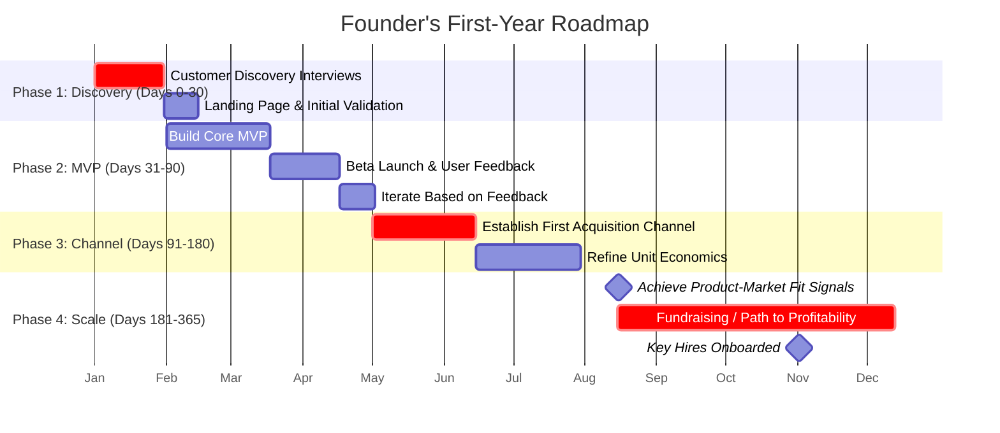

    

<h3 align="center">WELCOME TO</h3>
<h1 align="center">ADVANCED CYBER INTELLIGENCE R&D PROGRAM!</h1>
 
  
 

    

  

  

    

> [NOTE]

This document is a living resource. Suggestions for improvement are welcome and should be directed to the author.

 

> [!IMPORTANT]

This work is licensed under the **Creative Commons Attribution-ShareAlike 4.0 International License** (CC BY-SA 4.0).

When using, redistributing, adapting, or building upon this material, you **must** provide proper attribution by:

- 1. **Clearly stating the original source** as the **ACI R&D GitHub repository**.
- 2. **Including the exact URL(s)** to the relevant repository or file(s).

**Example Attribution Format:**  
- This work is based on content from the ACI R&D GitHub repository, available at:  
- https://github.com/acirdindia/acirdindia

Under the CC BY-SA license, you **must also**:
- Indicate if changes were made.
- License any adapted material under **identical terms** (CC BY-SA 4.0).

Failure to provide accurate source attribution violates the license terms.

    
 
<h1 align="center">The Founder'S Operating System: A Comprehensive Guide For World-Changing Entrepreneurs.</h1>

  

### Table of Contents

**PART I: THE STRATEGIC FOUNDATION**
1.  **The Founder’s Mindset:** Building Your Inner Game of Victory
2.  **From Insight to Opportunity:** The Rigorous Validation Phase

**PART II: THE EXECUTION ENGINE**
3.  **The Build Phase:** From MVP to Product-Market Fit
4.  **Go-to-Market & Early Growth:** Securing Traction
5.  **Fundraising & Capital Strategy:** Fueling the Vision
6.  **Business Operations & Financial Mastery:** Building a Disciplined Engine

**PART III: THE ENDURING INSTITUTION**
7.  **Building Your Tribe:** Team, Culture & Leadership
8.  **The Scaling Journey:** From Survival to Sustainability
9.  **Legal, Compliance & Security:** Protecting Your Foundation

**PART IV: THE ENTREPRENEUR'S COMPASS**
10. **Vision, Values & Ethics:** Your Company Constitution
11. **Exit Strategy & Long-Term Governance:** Planning for the Horizon
12. **The First Year Roadmap:** A 365-Day Action Plan
13. **Curated Resources & Tools:** Equipping Yourself for the Journey

**PART V: THE GLOBAL ENTITY FRAMEWORK**
14. **Comprehensive Global Business Entity Framework for Next-Generation Entrepreneurs**

 

## PART I: THE STRATEGIC FOUNDATION

Your venture will only ever be a reflection of the strategic foundation you lay. Before writing a line of code or selling to a single user, you must forge the mental models and validate the market realities that will guide your path. This phase is about thinking before building, ensuring your efforts are directed at a real, viable opportunity.

### 1. The Founder’s Mindset: Building Your Inner Game of Victory

Your startup’s potential is capped by the quality of your thinking. The most successful founders combine a visionary's optimism with a scientist's brutal honesty and a monk's disciplined action. This isn't just about positive thinking; it's about forging a mental framework for resilience and strategic clarity.

- **Purpose-Driven Clarity:** Define a compelling mission that resonates on a personal level and acts as your ultimate decision-making filter. This mission, the "North Star," must be more than a catchy tagline. It's the strategic lens through which you evaluate every feature, hire, partnership, and dollar spent. When the pressure mounts and distractions multiply, a clear purpose anchors you and your team, providing an unwavering answer to the question, "Why are we doing this?" It’s the difference between building a company and simply chasing a trend.

- **First-Principles Thinking:** Deconstruct complex problems down to their most fundamental, undeniable truths, and then rebuild a solution from the ground up. Too often, we imitate competitors or accept industry norms without question. First-principles thinking, famously used by innovators like Elon Musk, forces you to ignore analogies and challenge assumptions. Ask "Why?" repeatedly until you arrive at basic physics or economic realities. From that foundation, you can architect a solution that is not just an iteration, but a true innovation, unshackled by the limitations of conventional wisdom.

- **Inversion (Failure Anticipation):** To maximize your chances of success, you must first systematically contemplate failure. This technique, championed by thinkers like Charlie Munger, involves conducting a "premortem." Imagine your company has failed six months or a year from now. Gather your team and work backward to construct a plausible story of how that failure happened. Did you run out of cash because of poor planning? Did a key competitor outmaneuver you? Did a critical hire not work out? This exercise surfaces hidden risks and vulnerabilities that optimistic planning often overlooks, allowing you to build proactive safeguards today.

- **Relentless Learning & Iteration:** Adopt a bias for shipping and learning, not for waiting and perfecting. Treat every product launch, every marketing campaign, and every customer interaction as an experiment designed to gather data. The goal of an early release isn't to impress the world; it's to test your core hypotheses with minimal investment. As the Silicon Valley adage wisely states, "If you're not embarrassed by your first release, you waited too long." Launch to learn, not to impress. The feedback loop—build, measure, learn—is your engine for continuous improvement.

- **Marginal Gains & Habitual Progress:** Obsess over the compounding power of small, consistent improvements. The British Cycling team's transformation under Dave Brailsford is a perfect illustration. By improving every single aspect of training by just 1%—from bike ergonomics to pillow quality to hand-washing gel—they aggregated countless marginal gains into a dynasty of Olympic and Tour de France victories. In your startup, this means relentlessly refining your sales call script, improving a line of code, optimizing your customer onboarding email, and enhancing your personal daily routine. A 1% improvement each day leads to a 37x better result over a year. Discipline in the small things creates an unassailable advantage.

- **Bias for Action & Resilience:** Ultimately, mindset is meaningless without action. Motivation will inevitably fluctuate, but discipline must endure. Set clear, measurable goals and ask yourself every single morning: "What is the one thing I will accomplish today that moves us closer to our vision?" The entrepreneurial path is brutal, filled with rejection, self-doubt, and personal sacrifice. Your resilience—the willingness to treat every setback as feedback rather than defeat—is your greatest asset. It’s not about avoiding failure, but about persisting and learning through it, building a deeper and more defensible moat around your business with every challenge you overcome.

### 2. From Insight to Opportunity: The Rigorous Validation Phase

An idea alone is just noise. In a world of scarce resources—your time, energy, and capital—only a validated opportunity deserves your full commitment. This phase is your concept's "stress test," a customer-centered, data-driven process designed to confirm a real, urgent problem and a viable solution before you build anything of scale.

- **Precise Problem Framing:** Before you can solve a problem, you must be able to articulate it with surgical precision. Distill the customer's pain point into a single, powerful sentence. Use this formula: "[Target Customer] struggles with [specific problem], which costs them [X amount of time/money/opportunity] each [period]." This discipline forces you to move beyond vague notions like "people need better communication." It forces you to specify *who* is affected and *how much* they are losing. If you cannot quantify the pain, you haven't yet identified a concrete, buildable problem.

- **Customer Discovery Interviews:** Your next step is to get out of the building and talk to 15 to 50 potential users. Your goal is not to pitch your idea, but to uncover their reality. Ask open-ended, non-leading questions: "Walk me through the last time you faced this problem. What was your workaround? What did you like or dislike about it? On a scale of 1-10, how urgent is fixing this for you?" Record not just their words, but their emotions and the priorities they reveal. These conversations are your ultimate reality check; they can invalidate your core assumptions or, more valuably, uncover hidden opportunities and stakeholder needs you never anticipated.

- **Validate Willingness-to-Pay:** A user liking your idea is not a business. You must test their willingness to pay. In your interviews, gently explore this by asking, "If we built a solution that solved this problem perfectly, would you be willing to pay for it? How much? Why that number?" You can also run low-fidelity experiments, like a landing page with a "Pre-order Now" or "Join the Waitlist" button. The click-through rate on that button is a powerful proxy for genuine interest. This data is pure gold; it transforms a feature idea into a revenue hypothesis.

- **Market Sizing – TAM/SAM/SOM:** You need to ensure the problem you're solving exists in a market large enough to build a meaningful company. This is where you calculate your Total Addressable Market (TAM), the total revenue opportunity if you achieved 100% market share. From that, define your Serviceable Addressable Market (SAM), the segment of TAM you can realistically reach with your product and geography. Finally, estimate your Serviceable Obtainable Market (SOM), the realistic share of SAM you can capture in the next 3-5 years. For a ride-sharing app, TAM might be all commuters globally; SAM, commuters in your first 10 cities; and SOM, the share you can capture given local competitors. Investors will scrutinize this, and it’s essential for your own planning.

- **The Go/No-Go Decision:** At the end of this phase, you must make a clear, data-backed decision. Multiply your validated willingness-to-pay by your reachable customers (SOM) and apply your estimated gross margin. Does the resulting figure suggest a business that can cover its costs and scale? If the math doesn't work—the niche is too small, or margins are too thin—you have a clear signal. This isn't failure; it's a successful validation of a dead end. It's far cheaper to learn this now, before you've spent months and millions on development, and pivot to a more promising opportunity.

 

## PART II: THE EXECUTION ENGINE

With a validated opportunity in hand, you transition from thinking to building. This phase is about disciplined execution: creating a product customers love, finding a repeatable way to reach them, and building the financial and operational machinery to fuel it all.

### 3. The Build Phase: From MVP to Product-Market Fit

This is the execution zone. Your goal is to translate your validated problem and solution hypothesis into a real product and find that magical state where a product meets a strong market demand: Product-Market Fit (PMF). The core principle here is to build with a learning mindset, not a perfectionist one.

- **Defining Your MVP:** The Minimum Viable Product (MVP) is the smallest possible experiment you can run to learn whether your core value proposition resonates. It’s not about building a buggy, half-baked product; it's about stripping your idea down to its absolute essence—the single "job" it does for the customer—and delivering that with the least effort. This allows you to get real-world feedback as quickly as possible. Resist every urge to add "just one more feature." Every feature you don't build is time and money saved, and complexity avoided. The goal is to maximize learning per dollar spent.

- **MVP Archetypes:**
    - **Concierge MVP:** You manually deliver the service to a few customers. This allows you to understand every nuance of the user's problem and the solution workflow without writing a single line of code.
    - **Wizard-of-Oz MVP:** You present the facade of a fully automated product, but manually execute the operations behind the scenes. This tests user interest and workflow in a realistic setting without the initial engineering investment.
    - **Single-Feature MVP:** You build a bare-bones product that solves one core "job to be done" exceptionally well. Google's first search page was a perfect example—a simple interface that delivered unparalleled value.
    - **Landing Page / Smoke Test:** You create a website describing your product with a call-to-action like "Sign up for early access." You then drive traffic to this page to measure conversion rates, validating demand before any product is built.

- **The 8-Week MVP Sprint:** A time-boxed sprint creates urgency and forces focus.
    1.  **Weeks 1-2: Discovery & Design.** Conduct deep-dive customer interviews and map your riskiest assumptions. Define the one metric that will prove or disprove your core hypothesis (e.g., "users complete the core workflow"). Design the minimal feature set to move that metric.
    2.  **Weeks 3-5: Build.** Develop the MVP with a "no polish" ethos. The goal is a functioning, testable product, not a beautiful one.
    3.  **Week 6: Launch & Learn.** Launch to a small, trusted beta group of 10-50 users. Collect qualitative feedback through interviews and surveys, and instrument analytics to track user behavior. A key question to ask: "How would you feel if you could no longer use this product?" If 40% or more say "very disappointed," you have a powerful early signal of PMF.
    4.  **Weeks 7-8: Iterate & Decide.** Based on the data, iterate on the most critical friction points. At the end of week 8, make a clear decision: Persevere (continue refining), Pivot (change a major part of your hypothesis), or Kill the project.

- **Key Metrics for Product-Market Fit:** Look for quantitative signals that users are deriving lasting value. A flattening retention curve (users who come back after Day 1, 7, and 30) is a powerful indicator of stickiness. A high "activation rate" (the percentage of new users who experience the core value) is critical. And organic growth—new users coming from word-of-mouth—is the ultimate validation that your product is worth talking about. By the end of this phase, you will know if you have a product that a market truly wants.

### 4. Go-to-Market & Early Growth: Securing Traction

A great product is useless if no one knows it exists. The go-to-market (GTM) phase is about designing and executing a repeatable strategy to acquire your first 1,000 true fans and build a foundation for scalable growth. This is where your product meets the world.

- **Positioning & Value Proposition:** Before you can acquire customers, you must be able to clearly articulate why they should care. Craft a positioning statement using this template: "For [target customer] who struggles with [core problem], our product is a [new category] that provides [key benefit]. Unlike [the main alternative], we [our unique differentiator]." This is not just internal jargon; it's the foundation for your website, your ads, and your sales pitch. Test this messaging relentlessly. If a potential customer doesn't immediately grasp the value, your messaging needs work.

- **Acquisition Channels:** There is no single "best" channel. Your job is to explore a mix, measure results, and double down on what works.
    - **Paid Ads (Performance Marketing):** Offers the fastest feedback loop. Run small, targeted experiments on Google, LinkedIn, or Meta with strict Cost-Per-Acquisition (CPA) targets. If a channel works, scale it. If it doesn't, kill it quickly.
    - **Content Marketing & SEO:** A slower burn, but it builds a powerful, long-term asset. Create high-quality content—blog posts, guides, videos—that answers your customers' most pressing questions. Over time, this content builds organic traffic, establishes your authority, and draws leads to you without the per-click cost of ads.
    - **Product-Led Growth (PLG):** Engineer your product to drive its own growth. This could be a seamless "invite a collaborator" feature, a freemium model that hooks users and compels them to upgrade, or a viral loop where usage naturally generates invites (like Dropbox's referral program for free storage).
    - **Partnerships & Integrations:** Identify established platforms or communities that serve your target audience. A strategic integration (e.g., a Shopify app for an e-commerce tool) or a co-marketing partnership can give you immediate access to thousands of qualified users.

- **Activation & Engagement Loops:** Acquiring a user is only half the battle. You must guide them to their "aha moment"—that first experience of your product's core value—as quickly as possible. Streamline your onboarding with tooltips, checklists, or milestone emails. Use in-app surveys or a simple Net Promoter Score (NPS) prompt to understand what delights or frustrates users. This constant feedback loop allows you to fix friction and refine the user experience, turning new signups into loyal, engaged customers.

### 5. Fundraising & Capital Strategy: Fueling the Vision

Capital is fuel. It can accelerate your growth, but it is not a substitute for a great product or a viable business. Raise money only when you have a clear, capital-efficient plan for how it will be deployed to create more value and achieve specific, measurable milestones.

- **Understanding Funding Stages:** Matching your stage to the right type of capital is crucial.
    - **Pre-Seed:** Funds from founders, friends, family, and angels to build an MVP and get initial validation.
    - **Seed:** Typically from angel groups and micro VCs to achieve product-market fit and build your initial go-to-market engine.
    - **Series A:** Institutional venture capital to scale a proven business model. Investors at this stage require detailed metrics, strong unit economics, and a clear path to growth.
    - **Series B and Beyond:** Larger rounds for aggressive scaling, market expansion, and acquisitions.

- **The Pitch Deck Essentials:** Your deck is a narrative tool, not a data dump. It should tell a compelling story in about 10 slides:
    1.  **Cover:** Your name, logo, and a powerful one-line tagline.
    2.  **Problem:** Illustrate the pain with a specific customer story or compelling data. Quantify its scale.
    3.  **Solution:** Show, don't just tell. Use a screenshot, a short demo video, or a simple diagram.
    4.  **Market Size (TAM/SAM/SOM):** Demonstrate that the opportunity is large enough to build a significant company.
    5.  **Product & Roadmap:** Highlight key features, your defensible advantage, and your vision for the product's evolution.
    6.  **Business Model:** How do you make money? Show pricing, unit economics (LTV, CAC), and margins.
    7.  **Traction:** Your strongest slide. Show a graph of user growth, revenue, or any key metric trending steeply upward.
    8.  **Competition:** An honest map of the landscape and a clear articulation of your unique advantage.
    9.  **Team:** Showcase the founders and key team members, highlighting why you are the right people to solve this problem.
    10. **The Ask:** State exactly how much you are raising and how you will deploy the capital to hit the next major milestone.

- **Investor Outreach & Communication:** Treat investor outreach like a sales process. Be concise, personalized, and factual. A sample email: "Hi [Investor], I'm [Name], founder of [Company]. We help [customers] achieve [key benefit]. We've seen [impressive metric, e.g., 50% MoM growth] and are raising a [round size] round to [specific goal, e.g., expand the team]. Given your focus on [sector], I thought there might be alignment. Can we schedule a 15-min call? Deck here: [link]."

- **Key Term Sheet Concepts:** Understand the basics. Know the difference between pre-money and post-money valuation. Understand liquidation preferences (1x non-participating is standard) and how they protect investors. Be aware of pro-rata rights and how they affect future rounds. Most importantly, remember that the money you raise in your earliest rounds is the most expensive capital you will ever take. It's not free; it's a tool. Use it wisely, and only when you have a clear plan to multiply its value.

### 6. Business Operations & Financial Mastery: Building a Disciplined Engine

An enduring company has its financial and operational house in order from day one. Treating your startup like a serious business—with real planning, rigorous measurement, and fiscal discipline—is what separates a hobby from a scalable enterprise.

- **The One-Page Business Plan:** A living document that aligns your team and quantifies your assumptions. It should succinctly cover your Vision & Mission, Problem & Solution, Target Market, Business Model, Key Milestones for the next 12 months, and a high-level Financial Summary. This document forces you to be clear and concise, and it’s a powerful tool for onboarding new team members and keeping everyone focused on the same strategic priorities.

- **Building a Financial Model:** Your financial model is a spreadsheet that translates your operational plan into numbers. It’s not about predicting the future with perfect accuracy, but about stress-testing your assumptions. Core tabs should include:
    - **Assumptions:** Your key drivers (user growth, conversion rates, pricing, churn, hiring plans, CAC).
    - **Revenue Forecast:** Projected revenue by month/quarter, broken down by product or customer cohort.
    - **Expense Budget:** Detailed operating costs, from R&D and sales/marketing to G&A.
    - **Headcount Plan:** A hiring timeline with fully-loaded costs for each role.
    - **Outputs:** Projected Profit & Loss (P&L), Cash Flow, and Balance Sheet.
    - **Sensitivity Analysis:** "What if?" scenarios (e.g., "What if our growth is half of what we projected?"). This is invaluable for risk management.

- **Mastering Unit Economics:** This is the heartbeat of your financial health. In a subscription or repeat-purchase model, you must understand the relationship between Customer Acquisition Cost (CAC) and Customer Lifetime Value (LTV).

$$
\text{LTV} = \frac{\text{ARPU} \times \text{Gross Margin (\%)}}{\text{Customer Churn Rate (\%)}}
$$

*Where ARPU is Average Revenue Per User.*

$$
\text{CAC} = \frac{\text{Total Sales & Marketing Spend}}{\text{Number of New Customers Acquired}}
$$

$$
\text{LTV:CAC Ratio} = \frac{\text{LTV}}{\text{CAC}}
$$

Aim for an LTV > 3x CAC, which indicates healthy unit economics. Also, track your CAC Payback Period—the time it takes to earn back the cost of acquiring a customer. A period of under 12 months is a strong target. If your unit economics are broken, you cannot scale profitably.

- **Runway & Burn Rate:** Cash is the oxygen of your startup. Your **burn rate** is the rate at which you are spending cash. Your **runway** is how many months you can operate at that burn rate before running out of money. Track these metrics obsessively. Every significant financial decision—a new hire, a marketing spend, a software subscription—should be evaluated in the context of its impact on your runway. If spending outpaces plan, be prepared to make tough decisions to cut costs and extend your runway. In a crisis, preserving cash becomes the single most important priority.

 

## PART III: THE ENDURING INSTITUTION

Once you've found product-market fit and established a repeatable growth engine, the focus shifts from surviving to building an institution that can endure. This is about moving from founder-led chaos to a well-managed company with a strong culture, scalable processes, and a protected legal foundation.

### 7. Building Your Tribe: Team, Culture & Leadership

Your team is the ultimate multiplier. In a startup, culture isn't just a perk; it's the operating system that governs how decisions are made, how people treat each other, and how the company responds to crisis. It is set by the founders' actions from day one and must be cultivated deliberately.

- **Key Early Hires:** The first few hires you make will disproportionately define your company's trajectory. Prioritize roles that multiply your own impact and fill critical capability gaps. This often means a technical co-founder or lead engineer to build the product, a product/growth lead to translate customer feedback into iteration, and a sales/marketing lead to build the revenue engine. Don't wait too long. A great hire takes months to find, and being understaffed in a critical function can stall your momentum.

- **The Hiring Scorecard:** Don't hire on gut feel. Use a scorecard to evaluate candidates across multiple dimensions. This should include: **Role-Specific Skills** (Can they do the job?), **Analytical & Communication Abilities** (How do they think and express ideas?), **Cultural Alignment** (Do they embody your values in their past actions?), and **Ownership & Passion** (Do they take initiative and care deeply about the mission?). Always include a practical test or case study to see how they approach real-world problems.

- **Codifying Culture & Values:** Your values are not a poster on the wall; they are a set of operating principles. Define 3-5 core, actionable values. Instead of "Integrity," define what integrity looks like in practice: "We do what we say we will do, even when no one is watching." Instead of "Customer Obsession," define it: "Every decision starts with empathy for the customer's needs, and we are willing to sacrifice short-term gain for their long-term trust." Share these values in every onboarding, refer to them in performance reviews, and celebrate team members who exemplify them.

- **Empowered Teams & Radical Transparency:** Aim for a flat, trust-based culture where people have autonomy. Set clear goals using OKRs (Objectives and Key Results) or similar frameworks, then give your team the freedom to figure out how to achieve them. Practice radical transparency: hold regular all-hands meetings, share company metrics (the good and the bad), and create a culture where feedback is encouraged at all levels. When mistakes happen, conduct blameless post-mortems focused on learning and process improvement, not punishment. This creates psychological safety, encouraging people to take intelligent risks.

- **Why Culture Matters:** A strong, positive culture is a competitive advantage. It drives engagement, which in turn drives performance. Engaged teams work smarter, stay longer, and act like owners, which is crucial for navigating the inevitable brutal phases of a startup's life. Conversely, a toxic culture can destroy even the most brilliant business idea. Invest early and consistently in your tribe. Hire carefully, set clear values, and lead by example. Your culture will either be your greatest asset or your most significant liability.

### 8. The Scaling Journey: From Survival to Sustainability

Scaling a startup is not just about getting bigger; it's about transitioning from a chaotic, founder-dependent organism to a stable, process-driven organization. This journey typically follows distinct phases, each requiring a different leadership focus and operational approach.

- **Phase 1: Survival (Pre-Seed/Seed).** In this phase, your sole focus is finding any form of repeatable revenue. Cash is king, and the mindset is one of a firefighter. You may pivot multiple times as you chase traction. Your primary tasks are to obsessively track your burn rate, cut non-essential costs, and find the product tweaks that unlock even small pockets of growth. Most startups fail here because they cannot secure a stable foundation of PMF.

- **Phase 2: Sustainability (Seed/Series A).** You achieve this phase once your unit economics (LTV:CAC) are positive and reliable. Your business begins to fund its own growth to some degree. The focus shifts from pure survival to optimization and steady expansion. You're refining your sales process, improving retention, and cautiously expanding your marketing channels. This is a strong position, but you remain vulnerable to market shifts or aggressive new competitors. Your goal is to build a defensible moat.

- **Phase 3: Scalability (Series A/B and Beyond).** This is the payoff. The company now has predictable, diversified revenue streams, a strong competitive moat (brand, network effects, proprietary tech), and robust processes. You can hire in anticipation of demand, methodically open new markets, and consider strategic moves like acquisitions. The company is no longer reliant on the founders for day-to-day survival; it has become a self-sustaining institution.

- **The Scalability Checklist:**
    - **Documented Processes (SOPs):** Create Standard Operating Procedures for critical functions like customer support, sales handoffs, and onboarding. This ensures quality and consistency as you bring on new team members.
    - **Scalable Systems & Tools:** Replace spreadsheets and ad-hoc tools with scalable infrastructure like a CRM (e.g., Salesforce, HubSpot), an ERP for finances, and a robust analytics stack (e.g., data warehouse + BI tool). These systems centralize information and provide the single source of truth needed to manage complexity.
    - **A Leadership Team:** Build a management bench. By the Series B stage, you need strong leaders in each function—a VP of Sales, a Head of Marketing, a CFO, a CTO—who can run their departments with minimal day-to-day oversight, turning your early management style into a process-driven machine.

### 9. Legal, Compliance & Security: Protecting Your Foundation

Neglecting the legal and security fundamentals is a gamble that can cost you your company. Building a solid foundation from day one protects your personal assets, ensures you can raise capital, and prevents catastrophic surprises during due diligence.

- **Entity Formation:** Incorporate your startup as early as possible. For most ventures planning to seek venture capital in the US, a Delaware C-Corporation is the standard. Delaware's well-established corporate law is familiar and predictable to investors. While an LLC might be suitable for a bootstrap lifestyle business, a C-Corp is the structure that allows for issuing stock to multiple founders, creating an employee option pool, and attracting institutional investment. Consult with a lawyer to choose the right structure for your specific goals and jurisdiction.

- **Intellectual Property (IP):** Your IP is often your most valuable asset. Ensure that all founders, employees, and contractors sign binding IP Assignment Agreements, clearly stating that any work product created for the company is owned by the company. File for trademarks on your company and product names in your key markets. If you have patentable technology, consult with an IP attorney to develop a strategy. Ambiguity around IP ownership is a major red flag for investors and can completely derail an acquisition.

- **Data Security & Privacy:** In today's world, security is a board-level issue. From day one, prioritize secure cloud infrastructure (AWS, GCP, Azure) with proper access controls, strong passwords, and two-factor authentication. If you collect user data, you must comply with relevant regulations like GDPR (in Europe) and CCPA (in California). This means having a clear Privacy Policy, implementing data minimization practices, and having processes to handle user data requests. As you grow and serve enterprise clients, you will likely need to undergo security audits like SOC2, so building good habits early will pay off immensely.

- **Contracts & Terms:** Do not rely on verbal agreements. Draft standard Terms of Service and a Privacy Policy for your product. Use strong contracts with vendors, partners, and customers. For employee and contractor agreements, include robust confidentiality and invention assignment clauses. While these documents may seem like overhead, they are the legal scaffolding that protects your business from disputes, lawsuits, and IP loss. Investing in proper legal documentation is an investment in your company's future stability.

 

## PART IV: THE ENTREPRENEUR'S COMPASS

This section serves as your moral and strategic compass, guiding decisions when the path ahead is unclear. It covers the higher purpose of your venture and provides practical tools for navigating the crucial first year.

### 10. Vision, Values & Ethics: Your Company Constitution

A truly world-changing startup is defined by more than its products or profits. It has a soul, a core philosophy that guides its actions and defines its relationship with the world. This is your company constitution, the set of principles that will outlast any single product cycle or leader.

- **Customer-Centricity:** Embed empathy for the customer into every role and every decision. Before building a feature, ask, "What problem does this solve for the user?" Before responding to a support ticket, ask, "How would I want to be treated?" Companies that are genuinely customer-obsessed build deeper loyalty, generate more valuable word-of-mouth, and are better positioned to evolve with their users' needs. This isn't a marketing slogan; it's a core operational principle.

- **Integrity & Trust:** Be honest, internally and externally. Honor your commitments to employees, customers, and investors. Communicate transparently, especially when the news is bad. Trust is the ultimate force multiplier within an organization; it enables rapid decision-making, empowers teams, and reduces the friction of bureaucracy. A culture of integrity is built through consistent actions, not just words.

- **Innovation & Simplicity:** Foster a culture where new ideas are welcomed and failure is seen as a learning opportunity. Encourage your team to challenge conventions and bring insights from outside your industry. Strive for elegant, simple solutions to complex problems. Complexity is often a sign of a lack of understanding; simplicity, achieved through hard work, delivers the best user experience.

- **Empowerment & Ownership:** Treat your employees like owners, because their actions will determine the company's fate. Give them autonomy, expect them to take initiative, and hold them accountable to outcomes, not just tasks. This sense of ownership fosters a level of engagement and care that cannot be manufactured by policy manuals.

- **Social Responsibility:** Define how your startup contributes positively to society and the planet. This could be through your core mission (e.g., providing access to education) or through specific initiatives (e.g., carbon-neutral operations, ethical supply chains). This commitment is not just about doing good; it resonates deeply with employees and customers, especially in a world where people increasingly seek to align their work and spending with their values.

### 11. Exit Strategy & Long-Term Governance: Planning for the Horizon

Even in the early days, keeping one eye on the long-term horizon helps align your strategy and build a more resilient company. Exit planning isn't about planning to leave; it's about building a business that has value and can endure.

- **Potential Exit Paths:** Most founders and investors build toward one of three outcomes:
    - **Acquisition:** Building a company that is strategically valuable to a larger player. To be "acquirable," you need to build defensible assets—proprietary technology, a unique customer base, valuable data—that fit an acquirer's strategy.
    - **Initial Public Offering (IPO):** A rare and demanding path, typically reserved for companies with hundreds of millions in revenue. It requires rigorous financial controls, a strong governance structure, and the ability to operate as a public entity.
    - **Profitable Independence:** Many founders aim to build a sustainable, profitable company they can run indefinitely. This is a perfectly valid and rewarding outcome, focusing on long-term value and lifestyle over hyper-growth.

- **The Role of Governance:** As you take on outside capital, formal governance becomes non-negotiable. This means establishing a Board of Directors with a mix of founders, investors, and independent experts. The Board's role is to provide oversight, strategic guidance, and hold the CEO accountable. Regular, well-prepared board meetings become a crucial rhythm for the company. Adopting rigorous financial reporting and audit practices early on prepares you for this level of scrutiny.

- **Building for Longevity:** The ultimate goal of governance is to build a company that can outlive any one person. This requires investing in leadership development at all levels, codifying your key processes, and creating a strong, independent company identity that is not solely reliant on the founders' day-to-day presence. A well-governed, financially disciplined company with a deep leadership bench can weather storms, adapt to change, and achieve the legacy its founders envisioned, whether that's a successful exit or a multi-generational private enterprise.

### 12. The First Year Roadmap: A 365-Day Action Plan

This accelerated roadmap provides a tangible framework for your first year. Adapt the specific timelines to your venture, but maintain the logical progression from discovery to scaling.

- **Days 0-30: Problem/Solution Fit.**
    - Conduct 30-50 customer discovery interviews.
    - Define your core value proposition and initial pricing hypothesis.
    - Build a simple landing page to gauge early interest and capture emails.

- **Days 31-90: MVP & Initial Validation.**
    - Launch your MVP to a small beta group of 50-100 users.
    - Track core activation and retention metrics obsessively.
    - Conduct follow-up interviews with early users. Aim to secure your first paying customers or Letters of Intent (LOIs).

- **Days 91-180: Iteration & First Channel.**
    - Based on feedback, iterate rapidly on the product.
    - Identify and establish one repeatable, if small, acquisition channel.
    - Fine-tune your messaging and begin to understand your unit economics.

- **Days 181-365: PMF & Scaling Foundation.**
    - Aim to achieve clear product-market fit signals (strong retention, organic growth, high user satisfaction).
    - Prepare for fundraising (if that's your path) by building your deck and data room.
    - Begin your search for key hires to build out the team.
    - Secure a Seed round or achieve a sustainable, break-even business model.

**First-Year Startup Roadmap (Illustrative Gantt Chart)**

### 13. Curated Resources & Tools: Equipping Yourself for the Journey

No founder builds a company in a vacuum. Leverage the collective wisdom and tools of those who have walked the path before you.

- **Startup Accelerators:** Programs like Y Combinator, Techstars, and 500 Startups provide invaluable mentorship, network, and initial capital. Even if you don't apply, their extensive libraries of blog posts and startup advice are essential reading.
- **Essential Books:**
    - *The Lean Startup* by Eric Ries (Build-Measure-Learn methodology)
    - *Zero to One* by Peter Thiel (Building a monopoly business)
    - *The Hard Thing About Hard Things* by Ben Horowitz (Leading through tough times)
    - *Inspired* by Marty Cagan (Building great tech products)
    - *Atomic Habits* by James Clear (Personal and team productivity)
- **Podcasts:**
    - *How I Built This* (Guy Raz) - In-depth stories behind famous companies.
    - *Masters of Scale* (Reid Hoffman) - Theories on how companies scale.
    - *The Twenty Minute VC* (Harry Stebbings) - Insights into fundraising and venture capital.
- **Online Communities:** Engage on platforms like Hacker News and subreddits like r/startups to learn from peers, ask questions, and share experiences.
- **Productivity & Collaboration Tools:** Figma (design), Miro (whiteboarding), Notion (documentation & wiki), Slack (communication), Zoom/Google Meet (meetings).
- **Analytics & Data:** Google Analytics, Mixpanel, or Amplitude for user behavior tracking.
- **Customer Support:** Intercom or Zendesk for integrated support.
- **Legal & Financial Tools:** Clerky (for incorporation docs), Carta (for cap table management), and QuickBooks/Xero (for bookkeeping).

 

## PART V: THE GLOBAL ENTITY FRAMEWORK

### 14. Comprehensive Global Business Entity Framework for Next-Generation Entrepreneurs

**Executive Summary:**
In the rapidly evolving global business landscape, strategic entity selection represents one of the most consequential decisions an entrepreneur will make. This framework provides a detailed analysis of business structures worldwide, offering next-generation innovators a foundational guide for building ventures that balance operational flexibility, liability protection, tax optimization, and mission alignment. Based on extensive research of global practices and emerging trends, this guide explores how entity selection intersects with funding strategies, governance models, and scalability requirements—whether you're launching a tech startup in Silicon Valley, a social enterprise in Kenya, or a manufacturing operation in Germany.

#### 14.1. Introduction: The Strategic Importance of Entity Selection

Choosing the appropriate business entity is a foundational decision that profoundly impacts everything from daily operations to long-term strategic positioning. This choice establishes the legal framework governing your liability exposure, tax obligations, fundraising capabilities, and governance requirements. For entrepreneurs aiming to transform industries, entity selection must balance protective measures with operational flexibility while facilitating growth.

Beyond mere legal compliance, your entity structure communicates values and intentions. Whether opting for a traditional corporation, a benefit-driven structure, or a cooperative model, you signal your priorities regarding profit distribution, stakeholder consideration, and social responsibility. In an era of conscious capitalism, entity selection has evolved from a technical formality to a strategic statement of purpose.

#### 14.2. Core Business Structures: Comprehensive Analysis

**14.2.1. Sole Proprietorships: Simplicity with Significant Risk**

This is the simplest structure, with no legal distinction between owner and business. It offers unparalleled simplicity in formation and complete managerial control, with profits flowing directly to the owner's personal tax return.

| **Advantages** | **Disadvantages** |
|----------------|-------------------|
| Easiest and least expensive formation | Unlimited personal liability |
| Complete owner control | Extreme difficulty raising capital |
| Minimal regulatory requirements | Business ends with owner's death or exit |
| Pass-through taxation | Personal assets at risk from any lawsuit |

However, this simplicity comes with unlimited personal liability. Business debts and legal judgments become the owner's personal responsibility, exposing personal assets. It is generally unsuitable for ventures with significant risk or plans for external funding.

**14.2.2. Partnerships: Collaborative Ventures**

Partnerships involve two or more individuals sharing ownership. **General Partnerships (GPs)** have all partners sharing unlimited liability. **Limited Partnerships (LPs)** feature general partners (who manage and bear full liability) and limited partners (passive investors with liability limited to their investment). **Limited Liability Partnerships (LLPs)** protect partners from liability for other partners' malpractice, popular among professional service firms.

Partnerships offer pass-through taxation and flexibility in management and profit distribution, but require comprehensive partnership agreements to avoid conflicts. They can face challenges in ownership transition.

**14.2.3. Limited Liability Companies (LLCs): Hybrid Flexibility**

The LLC has become a dominant structure, combining the liability protection of a corporation with the tax flexibility of a partnership. It creates a separate legal entity shielding members' personal assets, while permitting profits and losses to pass through to members' personal tax returns. LLCs offer remarkable operational flexibility with fewer formal requirements than corporations.

| **Country** | **Equivalent Structure** |
|-------------|---------------------------|
| United States | LLC |
| United Kingdom | Private Limited Company (Ltd) |
| Germany | Gesellschaft mit beschränkter Haftung (GmbH) |
| France | Société à responsabilité limitée (SARL) |
| Brazil | Sociedade Limitada (Ltda.) |

While LLCs excel in flexibility, they face limitations in capital formation compared to corporations, as they cannot issue traditional stock and may face resistance from venture capital firms that prefer corporate structures.

**14.2.4. Corporations: Institutional-Grade Frameworks**

Corporations are separate legal entities providing the strongest liability protection while enabling advanced capital formation through stock issuance. **C Corporations** feature a clear structure with shareholders, directors, and officers. This separation establishes clear governance protocols but requires adherence to formalities including annual meetings and detailed minutes.

The C Corporation faces double taxation (corporate level and again as shareholder dividends), but offers unparalleled fundraising advantages. **S Corporations** (US only) provide pass-through taxation with corporate liability protection, but impose restrictions including a 100-shareholder limit and prohibition against non-US resident shareholders.

#### 14.3. Specialized Business Structures: Innovative Models for Specific Purposes

**14.3.1. Benefit Corporations and Certified B Corporations**

These represent innovative responses to demand for businesses balancing purpose and profit. The **benefit corporation** is a legal entity status legally requiring directors to consider stakeholder impacts (workers, community, environment) alongside shareholder profits. **Certified B Corporation** is a third-party certification issued by B Lab to companies meeting rigorous social and environmental performance standards. These structures allow entrepreneurs to embed mission into governance, protecting their purpose through leadership transitions and funding events.

**14.3.2. Cooperatives: Democratic Ownership Models**

Cooperatives are structured around member ownership and democratic control, typically following "one member, one vote" regardless of capital contribution. This structure prioritizes member benefit over profit maximization, with surplus revenues distributed to members based on participation rather than investment. Cooperatives exist across agriculture, retail, housing, and worker-owned ventures, guided by principles including voluntary membership, democratic control, and concern for community.

#### 14.4. Strategic Entity Selection Framework

Selecting the optimal structure requires balancing multiple considerations:

| **Consideration** | **LLC** | **C Corporation** | **Benefit Corp** |
|-------------------|---------|-------------------|------------------|
| **Liability Protection** | Strong | Strongest | Strongest |
| **Tax Flexibility** | Pass-through | Double taxation | Follows underlying structure |
| **Funding Capacity** | Moderate | Strongest | Moderate to Strong |
| **Mission Lock** | Optional | Optional | Legally embedded |
| **Operational Complexity** | Medium | High | High |

- **Liability Protection:** Primary concern for most entrepreneurs, especially in litigation-prone industries.
- **Tax Implications:** Pass-through structures generally benefit early-stage ventures anticipating losses.
- **Funding Strategy:** Venture capital strongly prefers C Corporations for familiar governance and ability to issue preferred stock.
- **Mission Alignment:** Benefit corporations or certified B Corps for those prioritizing social/environmental purpose.

#### 14.5. Implementation and Ongoing Management

Once you select a structure, proper implementation requires careful attention to jurisdictional requirements. Most entities require formal registration with state or national authorities. Drafting comprehensive **operating agreements** (for LLCs) or **bylaws** (for corporations) is critical, establishing governance rules, ownership rights, and dispute resolution mechanisms.

**Ongoing compliance management** ensures maintenance of liability protection. Requirements typically include annual report filings, business license renewals, and tax registrations. Corporations must maintain more formal governance practices including annual meetings and detailed minutes. Implement compliance calendars tracking all filing deadlines, as failure to maintain compliance can jeopardize liability protection.

#### 14.6. Building Foundations for Transformative Ventures

Entity selection represents far more than a legal formality—it establishes the constitutional foundation upon which entrepreneurial ventures build their operations, growth trajectories, and impact pathways. Next-generation entrepreneurs must view this decision through both tactical and strategic lenses: balancing immediate operational needs with long-term vision requirements.

As business environments evolve increasingly toward stakeholder capitalism, entity structures continue developing new variants that balance profit purpose with social and environmental considerations. Entrepreneurs now enjoy unprecedented flexibility in designing governance structures that reflect their values while enabling operational excellence. This framework provides guidance for navigating these decisions, but entrepreneurs should complement this knowledge with specialized professional guidance from attorneys and accountants who understand both their specific industry and jurisdictional requirements. With thoughtful entity selection, entrepreneurs build resilient foundations capable of supporting world-changing ventures.

    

<h2 align="center">STAY TUNED FOR THE LATEST UPDATES!</h2>

  

    

 
