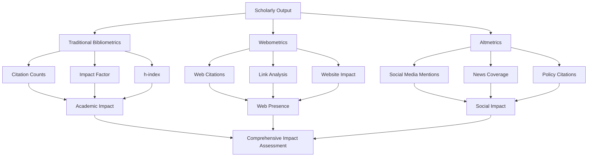

    

<h3 align="center">WELCOME TO</h3>
<h1 align="center">ADVANCED CYBER INTELLIGENCE R&D PROGRAM!</h1>
 
  
 

    

  

  

    

> [NOTE]

This document is a living resource. Suggestions for improvement are welcome and should be directed to the author.

 

> [!IMPORTANT]

This work is licensed under the **Creative Commons Attribution-ShareAlike 4.0 International License** (CC BY-SA 4.0).

When using, redistributing, adapting, or building upon this material, you **must** provide proper attribution by:

- 1. **Clearly stating the original source** as the **ACI R&D GitHub repository**.
- 2. **Including the exact URL(s)** to the relevant repository or file(s).

**Example Attribution Format:**  
- This work is based on content from the ACI R&D GitHub repository, available at:  
- https://github.com/acirdindia/acirdindia

Under the CC BY-SA license, you **must also**:
- Indicate if changes were made.
- License any adapted material under **identical terms** (CC BY-SA 4.0).

Failure to provide accurate source attribution violates the license terms.

    

<h1 align="center">The Next-Generation Researcher's Compendium: Bridging Philosophical Rigor And Traditional Methodology In Modern Scholarship.</h1>

  
 
 

## TABLE OF CONTENTS

**FOREWORD**
- A Message to the Next-Generation Researcher

**INTRODUCTION**
- The Evolving Landscape of Modern Scholarship
- Purpose and Scope of This Compendium
- How to Use This Document

 

**BLOCK I: RESEARCH FUNDAMENTALS**

**UNIT 1: FOUNDATIONS OF RESEARCH**
- 1.1 The Nature, Definition, and Objectives of Research
- 1.2 The Significance of Research in Knowledge Development
- 1.3 The Scientific Method and Core Research Approaches
- 1.4 Major Types of Research: Basic, Applied, Experimental, and Descriptive
- 1.5 Ethical Principles Governing Research Conduct

**UNIT 2: RESEARCH IN LIBRARY AND INFORMATION SCIENCE**
- 2.1 LIS as an Interdisciplinary Field of Inquiry
- 2.2 The Significance of Research within LIS
- 2.3 Key Research Areas and Emerging Frontiers in LIS

**UNIT 3: COMPARATIVE RESEARCH METHODS**
- 3.1 Survey Research: Principles and Applications
- 3.2 The Case Study Method: In-Depth Contextual Analysis
- 3.3 Experimental Research: Establishing Causality
- 3.4 Focus Group Techniques: Capturing Collective Insights
- 3.5 Comparative Analysis of Research Methods

 

**BLOCK II: RESEARCH DESIGN AND PLANNING**

**UNIT 4: FORMULATING THE RESEARCH PROBLEM**
- 4.1 Identifying Research Gaps through Critical Reading
- 4.2 Defining Clear and Focused Research Questions
- 4.3 Establishing Scope and Delimitations

**UNIT 5: CONDUCTING THE LITERATURE REVIEW**
- 5.1 Purposes and Functions of the Literature Survey
- 5.2 Leveraging Libraries and Electronic Information Resources
- 5.3 Information Retrieval Systems and Search Strategies
- 5.4 Abstracting, Documentation, and Citation Management

**UNIT 6: DEVELOPING AND TESTING HYPOTHESES**
- 6.1 Formulating Testable Hypotheses from Research Questions
- 6.2 Understanding Null and Alternative Hypotheses
- 6.3 Hypothesis Testing Procedures and Statistical Inference
- 6.4 Type I and Type II Errors: Avoiding False Conclusions

**UNIT 7: CRAFTING THE RESEARCH DESIGN**
- 7.1 Core Principles of Sound Research Design
- 7.2 Exploratory Research Designs
- 7.3 Descriptive Designs: Cross-Sectional and Longitudinal Studies
- 7.4 Experimental and Quasi-Experimental Designs
- 7.5 Writing the Research Proposal: A Blueprint for Inquiry

 

**BLOCK III: DATA COLLECTION AND MEASUREMENT**

**UNIT 8: DATA COLLECTION METHODS**
- 8.1 Primary versus Secondary Data: Sources and Applications
- 8.2 Observation Techniques: Structured and Unstructured
- 8.3 Interview Methods: From Structured to In-Depth
- 8.4 Library Records, Archives, and Documentary Sources

**UNIT 9: DESIGNING EFFECTIVE QUESTIONNAIRES**
- 9.1 Principles of Questionnaire Construction
- 9.2 Structured versus Unstructured Questionnaires
- 9.3 Scaling Techniques: Likert, Semantic Differential, and Thurstone
- 9.4 Pretesting, Validation, and Reliability Assessment

**UNIT 10: SAMPLING STRATEGIES**
- 10.1 Fundamentals of Sampling: Population, Sample, and Sampling Frame
- 10.2 Probability Sampling Methods: Simple Random, Stratified, Systematic, Cluster
- 10.3 Non-Probability Sampling Methods: Purposive, Snowball, Convenience, Quota

 

**BLOCK IV: DATA ANALYSIS AND RESEARCH REPORTING**

**UNIT 11: DATA PROCESSING AND STATISTICAL ANALYSIS**
- 11.1 Data Preparation: Editing, Coding, and Entry
- 11.2 Descriptive Statistics: Summarizing and Displaying Data
- 11.3 Inferential Statistics: Drawing Conclusions from Samples
- 11.4 Introduction to Statistical Software: SPSS and R Fundamentals

**UNIT 12: RESEARCH REPORTING AND DISSEMINATION**
- 12.1 Structure and Components of Research Reports
- 12.2 Interpreting Findings and Drawing Meaningful Conclusions
- 12.3 Academic Writing Styles: APA, MLA, and Chicago Manual
- 12.4 Presentation Techniques for Scholarly and Professional Audiences

**UNIT 13: INFORMETRICS AND SCHOLARLY COMMUNICATION**
- 13.1 Bibliometrics: Analyzing Publication and Citation Patterns
- 13.2 Scientometrics: Mapping the Structure of Science
- 13.3 Webometrics: Studying Web-Based Scholarly Communication

 

**APPENDICES**
- Appendix A: Glossary of Key Research Terms
- Appendix B: Checklist for Ethical Research Approval
- Appendix C: Sample Research Proposal Outline
- Appendix D: Recommended Readings and Resources

 
 

## INTRODUCTION

### The Evolving Landscape of Modern Scholarship

Contemporary academic inquiry operates at a complex intersection of multiple demands. Today's researcher must navigate between competing expectations: the need for philosophical depth and methodological precision, the tension between innovation and tradition, and the challenge of producing work that is both intellectually rigorous and practically relevant. This landscape requires scholars to ground their investigative endeavors in profound philosophical clarity while simultaneously mastering robust, time-tested methodologies.

The modern research environment is characterized by several distinctive features:

- **Interdisciplinary Collaboration:** Research problems increasingly transcend disciplinary boundaries, requiring scholars to engage with multiple methodological traditions and theoretical frameworks.

- **Technological Transformation:** Digital tools have revolutionized how we access information, collect data, and disseminate findings, yet the fundamental principles of sound inquiry remain unchanged.

- **Heightened Scrutiny:** The replication crisis across multiple fields has intensified demands for transparency, rigor, and methodological accountability.

- **Global Scholarly Networks:** Research is no longer conducted in isolation; scholars participate in global conversations, requiring awareness of diverse academic conventions and standards.

Within this dynamic context, the need for a clear articulation of research fundamentals has never been greater. Before designing any study, researchers must grapple with foundational questions about the nature of reality they seek to understand (ontology) and the theory of knowledge that guides their investigation (epistemology). These philosophical commitments are not abstract exercises; they directly shape every subsequent decision in the research process.

Nowhere is this more critical than in interdisciplinary fields like Library and Information Science (LIS), where inquiries into human information behavior, system design, and resource management must be both intellectually coherent and empirically credible. LIS scholars investigate phenomena that span the technical and the social, the quantitative and the qualitative, requiring methodological versatility grounded in philosophical awareness.

### Purpose and Scope of This Compendium

The primary goal of this compendium is to guide emerging scholars through the complete research lifecycle—from foundational philosophical concepts to final reporting and dissemination. We emphasize time-tested, rigorous practices that have demonstrated their value across decades of scholarly inquiry. By meticulously aligning research questions with appropriate paradigms and methods, scholars can produce work that is not only methodologically sound but also philosophically defensible and practically impactful.

This document serves multiple purposes:

- **As a Textbook:** It provides structured coverage of research fundamentals suitable for graduate coursework and independent study.

- **As a Reference:** It offers concise summaries of key concepts, methods, and techniques that researchers can consult throughout their projects.

- **As a Guide:** It walks readers through the sequential stages of research, from problem identification to final reporting.

- **As a Framework:** It articulates a coherent approach to research that integrates philosophical rigor with methodological precision.

The scope encompasses both the conceptual foundations of research and the practical techniques of investigation. We address quantitative, qualitative, and mixed-methods approaches, recognizing that different research questions demand different strategies of inquiry.

### How to Use This Document

This compendium is organized into four main blocks, each building logically upon the previous:

- **Block I** establishes the fundamental concepts: what research is, why it matters, and the range of methods available to scholars, particularly in LIS.

- **Block II** guides readers through the planning and design phase: formulating problems, reviewing literature, developing hypotheses, and crafting research designs.

- **Block III** addresses the practical work of data collection: methods, instruments, sampling, and measurement.

- **Block IV** covers the final stages: data analysis, interpretation, reporting, and the specialized area of informetrics.

Each unit contains learning objectives, core content, practical examples, and reflection questions. Tables and diagrams throughout the text summarize complex information for easy reference. We recommend reading sequentially for a comprehensive understanding, but each unit can also be consulted independently as needed.

 

## BLOCK I: RESEARCH FUNDAMENTALS

### UNIT 1: FOUNDATIONS OF RESEARCH

#### 1.1 The Nature, Definition, and Objectives of Research

Research, at its core, represents humanity's most systematic effort to understand the world. It is a disciplined process of inquiry designed to discover, interpret, and revise knowledge about phenomena of interest. Unlike casual observation or anecdotal experience, research follows established procedures that ensure findings are credible, verifiable, and contribute meaningfully to our collective understanding.

**Defining Research:** Research can be defined as a systematic, controlled, empirical, and critical investigation of hypothetical propositions about presumed relationships among phenomena. This definition encompasses several essential characteristics:

- **Systematic:** Research follows an ordered procedure, with each step building logically upon previous steps. There is a clear structure to the investigative process.

- **Controlled:** Researchers attempt to account for factors that might influence results, distinguishing between the phenomena of interest and extraneous variables.

- **Empirical:** Research is grounded in observation and experience. Conclusions are based on evidence collected through the senses or extensions thereof.

- **Critical:** Research subjects its own procedures and findings to scrutiny. The researcher maintains a skeptical attitude, recognizing that all knowledge is provisional and subject to revision.

**Objectives of Research:** The purposes of research extend beyond simple information gathering. The fundamental objectives include:

- **Description:** Research aims to describe phenomena accurately and comprehensively. Descriptive research answers questions about what exists, what is happening, and what characteristics define a situation or population.

- **Explanation:** Beyond description, research seeks to explain why phenomena occur. Explanatory research addresses questions of causality, identifying factors that produce particular outcomes.

- **Prediction:** Based on understanding relationships, research may aim to predict future occurrences or outcomes. Predictive capacity allows for planning and intervention.

- **Control:** In some fields, research aims to provide the knowledge necessary to manipulate conditions and produce desired outcomes.

- **Understanding:** Ultimately, research contributes to human understanding, expanding our comprehension of the world and our place within it.

These objectives are not mutually exclusive. A single research project may address multiple objectives, or different studies may build upon one another, with descriptive work laying the foundation for explanatory investigations.

#### 1.2 The Significance of Research in Knowledge Development

Research constitutes the engine of knowledge development across all academic disciplines and professional fields. Without systematic inquiry, human understanding would remain trapped at the level of folk wisdom, casual observation, and unexamined tradition. The significance of research manifests in multiple dimensions:

**For Academic Disciplines:** Research advances the theoretical foundations of fields, testing existing propositions and generating new frameworks for understanding. Each discipline's body of knowledge grows through cumulative research contributions, with new studies building upon and sometimes challenging established findings. This cumulative process ensures that academic knowledge remains dynamic rather than static, responsive to new evidence and refined methods.

**For Professional Practice:** Research provides the evidence base for professional decision-making. In fields ranging from medicine to education to library science, practitioners rely on research findings to guide their choices, justify their actions, and improve their services. Evidence-based practice has become the gold standard across professions, replacing reliance on tradition, intuition, or untested opinion.

**For Policy Development:** Policymakers at institutional, local, national, and international levels depend on research to inform their decisions. Sound policy requires accurate understanding of problems, careful analysis of potential solutions, and evaluation of implemented programs. Research supplies the data and analysis that make evidence-based policy possible.

**For Societal Progress:** At the broadest level, research contributes to human welfare by addressing pressing problems, from disease and poverty to environmental degradation and social conflict. While the path from research to practical application may be long and indirect, virtually every significant advance in human wellbeing has research somewhere in its ancestry.

**For Individual Development:** Engaging in research develops critical thinking skills, deepens subject matter expertise, and cultivates habits of intellectual discipline. The researcher learns to question assumptions, evaluate evidence, and communicate complex ideas clearly—capacities valuable far beyond the specific research context.

#### 1.3 The Scientific Method and Core Research Approaches

The scientific method represents humanity's most successful strategy for generating reliable knowledge. While often associated primarily with the natural sciences, its core principles apply across all disciplines that seek to understand phenomena through systematic, empirical investigation.

**Core Principles of the Scientific Method:**

- **Empiricism:** Knowledge claims must be grounded in observable evidence. The researcher collects data through systematic observation or measurement.

- **Verifiability:** Findings should be capable of verification by other researchers. Procedures are documented clearly enough that others can replicate the investigation.

- **Falsifiability:** Scientific propositions must be testable in ways that could potentially prove them false. Statements that cannot be tested against evidence lie outside the realm of scientific inquiry.

- **Self-Correction:** Science is inherently provisional. Findings are always subject to revision based on new evidence or better methods. No conclusion is ever considered final or absolute.

- **Objectivity:** Procedures aim to minimize the influence of researcher bias. While complete objectivity may be unattainable, the scientific method provides safeguards against systematic distortion.

**Core Research Approaches:** Within the framework of the scientific method, researchers employ three broad approaches to inquiry:

| Approach | Philosophical Basis | Purpose | Typical Methods | Strengths |
|----------|---------------------|---------|-----------------|-----------|
| **Quantitative** | Positivism/post-positivism; reality is objective and measurable | Test hypotheses; establish relationships; generalize findings | Experiments, surveys, statistical analysis | Precision, replicability, generalizability |
| **Qualitative** | Interpretivism/constructivism; reality is socially constructed | Explore meanings; understand context; generate theory | Interviews, observations, case studies | Depth, richness, contextual understanding |
| **Mixed Methods** | Pragmatism; multiple realities and multiple ways of knowing | Integrate quantitative and qualitative perspectives | Sequential or concurrent use of both approaches | Comprehensive insight, triangulation |

The choice among these approaches should be driven by the research question, not by methodological preference or familiarity. Some questions are best answered through quantitative means, others through qualitative investigation, and still others through some combination of both.

#### 1.4 Major Types of Research: Basic, Applied, Experimental, and Descriptive

Research can be categorized along multiple dimensions, including purpose, approach, and outcome. Understanding these categories helps researchers locate their work within the broader landscape of scholarly inquiry and select appropriate methods.

**Basic versus Applied Research:**

- **Basic Research (Pure or Fundamental Research):** Conducted primarily to advance knowledge without immediate practical application. Basic research seeks to understand fundamental principles, test theoretical propositions, and expand the frontiers of human understanding. While its findings may eventually prove useful, that is not its primary motivation. Example: Investigating how people process and retain information about their information-seeking behaviors.

- **Applied Research:** Conducted to address specific practical problems or inform decision-making. Applied research draws upon the findings of basic research but directs them toward concrete applications. Example: Evaluating whether a particular information literacy program improves students' research skills.

The distinction is not absolute; basic research often yields practical applications, and applied research frequently contributes to theoretical understanding. The two forms are complementary rather than competitive.

**Experimental versus Descriptive Research:**

- **Experimental Research:** Involves manipulation of variables to establish cause-and-effect relationships. The researcher deliberately introduces a change (the independent variable) and observes its effects on outcomes (dependent variables) while controlling for extraneous factors. True experiments require random assignment to conditions, while quasi-experiments lack random assignment but still involve manipulation.

- **Descriptive Research:** Aims to describe phenomena as they exist, without manipulation. Descriptive research answers questions about current conditions, attitudes, or characteristics. It can provide valuable baseline information and identify relationships worthy of further investigation, though it cannot establish causality with the same confidence as experimental designs.

**Other Important Distinctions:**

- **Exploratory Research:** Conducted when little is known about a phenomenon. Exploratory studies are flexible and open-ended, designed to generate hypotheses and identify variables for future investigation.

- **Explanatory Research:** Seeks to explain why phenomena occur, identifying causal mechanisms and relationships.

- **Evaluation Research:** Assesses the effectiveness of programs, policies, or interventions, often combining multiple methods to provide comprehensive assessment.

- **Action Research:** Conducted by practitioners to address problems in their own settings, with the dual goals of solving immediate problems and contributing to knowledge.

#### 1.5 Ethical Principles Governing Research Conduct

Ethical considerations permeate every stage of the research process, from initial conception to final dissemination. Ethical research is not merely compliant with regulations; it reflects fundamental respect for the dignity, rights, and welfare of all who are affected by the investigation.

**Core Ethical Principles:**

| Principle | Definition | Implications for Practice |
|-----------|------------|--------------------------|
| **Respect for Persons** | Individuals are autonomous agents whose decisions should be respected | Informed consent; protection for those with diminished autonomy |
| **Beneficence** | Researchers maximize benefits and minimize harm | Risk-benefit analysis; protection from harm |
| **Justice** | Burdens and benefits of research are fairly distributed | Fair participant selection; avoidance of exploitation |
| **Integrity** | Research is conducted honestly and transparently | Avoiding fabrication, falsification, plagiarism |
| **Responsibility** | Researchers are accountable for their work | Proper data management; addressing errors |

**Informed Consent:** Participants must be provided with sufficient information to make voluntary decisions about participation. Essential elements include:

- Purpose of the research
- Procedures involved
- Potential risks and benefits
- Confidentiality protections
- Right to withdraw without penalty
- Contact information for questions

Consent should be documented, though waivers may be appropriate for minimal-risk studies where documentation would create additional risk.

**Privacy and Confidentiality:** Researchers must protect participants' privacy and maintain confidentiality of data. This involves:

- Limiting collection of identifying information
- Storing data securely
- Reporting findings in ways that prevent identification
- Being transparent about limits to confidentiality

**Protection of Vulnerable Populations:** Special protections apply when research involves populations with diminished autonomy or increased vulnerability, including:

- Children
- Prisoners
- Pregnant women
- Cognitively impaired individuals
- Economically or educationally disadvantaged persons

**Institutional Oversight:** Most research involving human participants requires review by an Institutional Review Board (IRB) or Research Ethics Committee. This review ensures that studies meet ethical standards before data collection begins.

**Research Integrity:** Beyond protection of participants, ethical research encompasses honest conduct throughout the investigative process. This includes:

- Avoiding fabrication or falsification of data
- Preventing plagiarism
- Managing conflicts of interest
- Ensuring accurate authorship attribution
- Maintaining data for verification

 

### UNIT 2: RESEARCH IN LIBRARY AND INFORMATION SCIENCE

#### 2.1 LIS as an Interdisciplinary Field of Inquiry

Library and Information Science occupies a distinctive position in the academic landscape, drawing upon multiple disciplinary traditions while maintaining its own coherent identity. This interdisciplinary character is not accidental but reflects the nature of the phenomena LIS investigates: information in all its forms, contexts, and uses.

**Disciplinary Foundations of LIS:**

| Foundation Discipline | Contribution to LIS | Research Applications |
|----------------------|---------------------|----------------------|
| **Social Sciences** | Understanding human information behavior; social contexts of information | User studies; information needs assessment; community analysis |
| **Computer Science** | Information systems; retrieval algorithms; digital libraries | System design; usability testing; information retrieval |
| **Management Studies** | Organization of information resources; strategic planning | Collection management; library administration; program evaluation |
| **Humanities** | Cultural dimensions of information; historical perspectives | Archival studies; preservation; critical information studies |
| **Communication Studies** | Information transmission; media effects | Information dissemination; scholarly communication |
| **Education** | Learning and information literacy | Information literacy instruction; educational program evaluation |

**The Interdisciplinary Advantage:** LIS's interdisciplinary nature offers significant advantages for research:

- **Methodological Richness:** Scholars can draw upon methods from multiple disciplines, selecting the approach best suited to each research question.

- **Comprehensive Understanding:** By examining information phenomena from multiple perspectives, researchers develop more complete understanding than any single discipline could provide.

- **Real-World Relevance:** Information problems in practice rarely respect disciplinary boundaries. Interdisciplinary research aligns more closely with the complexity of actual information environments.

- **Innovation Potential:** The intersection of disciplines often generates novel insights that would not emerge within traditional disciplinary silos.

**Challenges of Interdisciplinarity:** The interdisciplinary character also presents challenges that researchers must navigate:

- Researchers must achieve competence in multiple methodological traditions
- Scholarly communication may require translation across disciplinary languages
- Evaluation criteria may differ across fields
- Publication outlets may favor single-discipline work

Successful LIS researchers develop strategies for managing these challenges while leveraging the advantages of interdisciplinary inquiry.

#### 2.2 The Significance of Research within LIS

Research serves multiple essential functions within the Library and Information Science field, shaping both academic understanding and professional practice.

**Advancing Theoretical Knowledge:** LIS research develops and tests theories about information phenomena. These theories provide frameworks for understanding:

- How people seek, find, and use information
- How information systems should be designed to support human needs
- How information organizations can fulfill their missions
- How scholarly communication evolves and functions

**Informing Professional Practice:** The library and information professions increasingly embrace evidence-based practice, drawing upon research findings to guide decisions about:

- Collection development and management
- Reference and information services
- Information literacy instruction
- Technology implementation
- Facility planning and design
- Program development and evaluation

**Supporting Policy Development:** Research provides the evidence base for policy decisions affecting information access, privacy, intellectual freedom, and related concerns. LIS research informs:

- Institutional policies within libraries and information organizations
- Professional standards and guidelines
- Government legislation affecting information access
- International agreements on information exchange

**Documenting Professional Impact:** LIS research demonstrates the value and impact of libraries and information services, providing evidence that supports advocacy and resource allocation. Impact studies document how information organizations contribute to:

- Educational outcomes
- Economic development
- Community wellbeing
- Research productivity
- Quality of life

**Addressing Emerging Challenges:** Research equips the field to respond to new developments, from technological change to evolving user expectations. Current research frontiers include:

- Artificial intelligence and information systems
- Data curation and management
- Open access and scholarly communication
- Privacy in digital environments
- Equity of information access

#### 2.3 Key Research Areas and Emerging Frontiers in LIS

The scope of LIS research continues to expand as information environments evolve and new questions emerge. While traditional research areas remain vital, new frontiers are continually opening.

**Traditional Research Areas:**

- **Information Seeking and Behavior:** Investigates how people identify, seek, and use information across different contexts and populations.

- **Information Retrieval:** Examines the design and evaluation of systems for storing and finding information, including search algorithms, interface design, and user interaction.

- **Collection Management:** Studies the development, organization, and preservation of information resources in physical and digital formats.

- **Scholarly Communication:** Analyzes the production, dissemination, and use of scholarly information, including publication patterns, citation practices, and open access.

- **Information Literacy:** Investigates how people develop competencies for finding, evaluating, and using information effectively.

- **Library Services and Programs:** Evaluates the design, delivery, and impact of library services across different user populations and institutional contexts.

**Emerging Research Frontiers:**

| Research Area | Focus | Methods Commonly Used |
|---------------|-------|----------------------|
| **Data Science and Data Curation** | Management, preservation, and use of research data; data literacy | Computational methods; case studies; surveys |
| **Digital Humanities** | Integration of computational methods with humanities scholarship | Text mining; digital archives; collaborative research |
| **Social Media and Information** | Information behavior in social media environments; misinformation | Content analysis; network analysis; surveys |
| **Human-Computer Interaction** | Design and evaluation of information systems for human use | Usability testing; ethnographic observation; experiments |
| **Critical Information Studies** | Power, justice, and equity in information systems and practices | Critical discourse analysis; participatory research |
| **Altmetrics and Impact Assessment** | New measures of scholarly and societal impact | Bibliometric analysis; web analytics; mixed methods |

**Methodological Diversity in LIS Research:**

The breadth of LIS research questions demands methodological versatility. As noted by Eldredge (2004), familiarity with a range of methods allows researchers to accurately label and situate their work, selecting the optimal approach based on the research question and context, not methodological convenience. This methodological eclecticism is a strength of the field, but it demands disciplined attention to the alignment between philosophical assumptions, research questions, and methods.

The commitment uniting all LIS research is the use of sound, paradigm-aligned methods to answer critical questions about information in society, ensuring findings are both philosophically coherent and actionable for practitioners and policymakers.

 

### UNIT 3: COMPARATIVE RESEARCH METHODS

#### 3.1 Survey Research: Principles and Applications

Survey research is one of the most widely used methods in social science and LIS inquiry. It involves collecting standardized information from a sample of individuals to describe characteristics, attitudes, behaviors, or experiences of a population.

**Core Principles:**

- **Standardization:** All respondents receive the same questions in the same format, ensuring comparability across responses.

- **Sampling:** Data is collected from a subset of the population, selected using procedures that allow generalization to the larger group.

- **Systematic Measurement:** Variables are measured using carefully designed instruments with demonstrated reliability and validity.

- **Statistical Analysis:** Data is analyzed using statistical techniques appropriate to the research questions and measurement levels.

**Applications in LIS:**

- Assessing user satisfaction with library services
- Measuring information literacy levels among students
- Studying information-seeking behaviors across populations
- Evaluating professional development needs among librarians
- Gathering data on collection use and preferences

**Strengths and Limitations:**

| Strengths | Limitations |
|-----------|-------------|
| Efficient for collecting data from large samples | Cannot establish causality with certainty |
| Results can be generalized when sampling is sound | May lack depth and contextual richness |
| Standardization ensures comparability | Subject to non-response bias |
| Statistical analysis provides precise estimates | Cannot probe or clarify responses |
| Relatively economical per respondent | Social desirability may affect responses |

#### 3.2 The Case Study Method: In-Depth Contextual Analysis

The case study method involves intensive investigation of a single instance, system, or phenomenon within its real-world context. Case studies are particularly valuable when the boundaries between phenomenon and context are not clearly evident.

**Core Principles:**

- **Holistic Investigation:** The case is examined as a whole, with attention to the interrelationships among its components.

- **Contextual Understanding:** The case is studied within its natural setting, with careful attention to contextual factors that shape the phenomena of interest.

- **Multiple Data Sources:** Case studies typically draw upon multiple sources of evidence, including interviews, observations, documents, and artifacts.

- **Rich Description:** Findings are presented in detailed, narrative form that conveys the complexity and texture of the case.

**Applications in LIS:**

- Studying how a particular library implements a new technology
- Investigating information behavior within a specific community
- Examining the development of a digital archive project
- Analyzing organizational change in a library system
- Documenting innovative practices in a single institution

**Strengths and Limitations:**

| Strengths | Limitations |
|-----------|-------------|
| Provides rich, contextual detail | Limited generalizability beyond the case |
| Captures complexity and nuance | Time-intensive to conduct |
| Suitable for contemporary phenomena | Potential for researcher bias in interpretation |
| Can generate hypotheses for further study | Difficult to establish causal relationships |
| Accommodates multiple data sources | May produce overwhelming amounts of data |

#### 3.3 Experimental Research: Establishing Causality

Experimental research is the gold standard for establishing cause-and-effect relationships. By manipulating independent variables and controlling for extraneous factors, experiments allow researchers to draw confident conclusions about causal effects.

**Core Principles:**

- **Manipulation:** The researcher deliberately introduces or varies the independent variable (the presumed cause).

- **Control:** Extraneous variables that might influence outcomes are controlled through design features (random assignment, standardization) or statistical techniques.

- **Random Assignment:** In true experiments, participants are randomly assigned to conditions, ensuring that groups are equivalent before manipulation.

- **Measurement:** Outcomes (dependent variables) are measured precisely, often before and after manipulation.

**Types of Experimental Designs:**

- **True Experiments:** Include random assignment, experimental and control groups, and manipulation of the independent variable.

- **Quasi-Experiments:** Include manipulation but lack random assignment. Useful when random assignment is impractical or unethical.

- **Pre-Experimental Designs:** Lack both random assignment and control groups. Provide weaker evidence but may be useful for exploratory purposes.

**Applications in LIS:**

- Testing the effectiveness of different information literacy instructional methods
- Evaluating the impact of search interface features on retrieval performance
- Comparing user comprehension across different information presentation formats
- Assessing the effects of library programming on specific outcomes

**Strengths and Limitations:**

| Strengths | Limitations |
|-----------|-------------|
| Strongest design for establishing causality | May have low ecological validity (artificial settings) |
| Control over extraneous variables | Ethical constraints on manipulation |
| Replicable procedures | May not capture complex, real-world conditions |
| Precise measurement | Some variables cannot be manipulated |
| Clear interpretation of results | Hawthorne effects from participant awareness |

#### 3.4 Focus Group Techniques: Capturing Collective Insights

Focus groups bring together small groups of participants to discuss specific topics under the guidance of a moderator. The method capitalizes on group interaction to generate data that would not emerge from individual interviews.

**Core Principles:**

- **Group Interaction:** Participants respond not only to the moderator's questions but also to each other's comments, generating discussion and elaboration.

- **Moderator Guidance:** A skilled moderator guides the discussion, ensuring coverage of key topics while allowing natural conversation to flow.

- **Homogeneous Groups:** Participants typically share relevant characteristics, facilitating comfortable discussion of shared experiences.

- **Systematic Analysis:** Discussions are recorded, transcribed, and analyzed using qualitative techniques to identify themes and patterns.

**Applications in LIS:**

- Exploring user perceptions of library services
- Gathering input for facility or program planning
- Understanding information needs of specific populations
- Testing reactions to new services or interfaces
- Investigating sensitive topics where group discussion provides support

**Strengths and Limitations:**

| Strengths | Limitations |
|-----------|-------------|
| Generates rich, interactive data | Not generalizable to populations |
| Efficient for gathering multiple perspectives | Dominant participants may influence discussion |
| Group interaction stimulates ideas | Sensitive topics may not be suitable |
| Flexible and adaptable | Requires skilled moderation |
| Participants may feel supported | Analysis is time-intensive |

#### 3.5 Comparative Analysis of Research Methods

Selecting appropriate methods requires understanding their comparative strengths, limitations, and appropriate applications. The following table summarizes key considerations:

| Method | Best Used When | Data Type | Sample Size | Time Required | Key Consideration |
|--------|----------------|-----------|-------------|---------------|-------------------|
| **Survey** | Describing population characteristics; testing relationships | Quantitative | Large | Moderate | Sampling quality is critical |
| **Case Study** | Understanding complex phenomena in context | Qualitative | Small (1-5 cases) | Extensive | Generalizability is limited |
| **Experiment** | Testing causal relationships | Quantitative | Moderate | Moderate to extensive | Control vs. realism trade-off |
| **Focus Group** | Exploring shared experiences; generating ideas | Qualitative | Moderate (groups of 6-10) | Moderate | Group dynamics matter |
| **Interview** | Understanding individual experiences in depth | Qualitative | Small to moderate | Extensive | Interviewer skill is crucial |
| **Content Analysis** | Analyzing recorded communication | Quantitative or qualitative | Variable | Variable | Context may be missing |
| **Bibliometrics** | Analyzing publication patterns | Quantitative | Large | Moderate | Data quality affects results |

**Method Selection Criteria:**

When selecting methods, researchers should consider:

1. **Research Question:** What kind of answer is sought? Description, explanation, prediction, or understanding?

2. **Philosophical Paradigm:** What assumptions about reality and knowledge guide the inquiry?

3. **Resources Available:** Time, budget, personnel, and access to participants or data.

4. **Audience Expectations:** What methods are valued in the relevant scholarly community?

5. **Researcher Expertise:** What methods can the researcher implement competently?

6. **Ethical Considerations:** What methods respect participants' rights and welfare?

The strongest research designs often combine multiple methods, using each to address different aspects of the research question and triangulating findings across sources.

 

## BLOCK II: RESEARCH DESIGN AND PLANNING

### UNIT 4: FORMULATING THE RESEARCH PROBLEM

#### 4.1 Identifying Research Gaps through Critical Reading

Every research project begins with a problem—a question that has not been adequately answered, a phenomenon that has not been adequately explained, or a situation that requires investigation. Identifying significant research problems requires engagement with existing scholarship and careful attention to what remains unknown or inadequately understood.

**Sources of Research Problems:**

- **Literature Gaps:** Inconsistencies, contradictions, or unanswered questions in published research. Researchers ask: What has not been studied? Where are findings conflicting? What questions remain open?

- **Practical Problems:** Challenges or issues encountered in professional practice. Practitioners ask: What is not working well? What decisions require better information? What problems need solutions?

- **Theory Testing:** Propositions derived from theoretical frameworks that require empirical investigation. Theorists ask: Does this theory hold under specified conditions? What are its boundaries and limitations?

- **Personal Experience:** Observations or questions arising from the researcher's own experience. Reflective practitioners ask: What have I observed that warrants systematic investigation?

- **Social or Policy Issues:** Questions arising from contemporary debates or policy concerns. Socially engaged researchers ask: What information would inform better policy? Whose voices are missing from current discussions?

**Identifying Genuine Gaps:**

Not every unanswered question constitutes a worthwhile research problem. Genuine gaps are characterized by:

- **Significance:** Answering the question would matter—it would advance knowledge, improve practice, or inform policy.

- **Feasibility:** The question can be answered given available resources, access, and methods.

- **Originality:** The question has not been adequately addressed in previous research.

- **Interest:** The researcher has genuine curiosity about and commitment to the question.

#### 4.2 Defining Clear and Focused Research Questions

The research question is the compass that guides the entire investigation. A well-formulated question provides direction, sets boundaries, and establishes criteria for success.

**Characteristics of Good Research Questions:**

- **Clear:** The question is understandable and unambiguous. Readers know exactly what is being asked.

- **Focused:** The question is sufficiently narrow to be answerable within the constraints of a single study.

- **Researchable:** The question can be answered through empirical investigation using available methods.

- **Significant:** Answering the question would contribute to knowledge, practice, or policy.

- **Ethical:** The question can be investigated without violating ethical principles.

**Types of Research Questions:**

| Question Type | Focus | Example |
|---------------|-------|---------|
| **Descriptive** | What is happening? What exists? | What are the information-seeking behaviors of first-generation college students? |
| **Comparative** | How do groups differ? | How do online and in-person information literacy instruction compare in effectiveness? |
| **Relational** | How are variables associated? | What is the relationship between library use and academic achievement? |
| **Causal** | What causes what? | Does participation in summer reading programs improve reading proficiency? |
| **Evaluative** | How well does something work? | How effective is the university's research data management service? |
| **Explanatory** | Why does something happen? | Why do some faculty embrace open access while others resist it? |

**From Problem to Question:**

The process of moving from a broad research problem to a focused question typically involves:

1. **Identifying the general area of interest:** What broad topic or phenomenon captures your attention?

2. **Reviewing relevant literature:** What is already known? What questions remain?

3. **Narrowing the focus:** What specific aspect can you realistically investigate?

4. **Formulating potential questions:** What specific questions could guide inquiry?

5. **Evaluating and refining:** Which questions best meet the criteria for good research questions?

6. **Selecting the final question:** What question will guide your investigation?

#### 4.3 Establishing Scope and Delimitations

No single study can answer every question about a phenomenon. Researchers must make deliberate choices about what their study will and will not address. These choices define the study's scope and delimitations.

**Scope:** The scope defines what the study covers—its boundaries in terms of:

- **Population:** Who or what will be studied? (e.g., undergraduate students at a single university)

- **Geographic Area:** Where will the study take place? (e.g., public libraries in the Midwest)

- **Time Frame:** When will data be collected? (e.g., during the fall semester)

- **Variables:** What factors will be examined? (e.g., library use and academic performance)

- **Phenomena:** What aspects of the topic will be addressed? (e.g., frequency of library visits, not quality of library experience)

**Delimitations:** Delimitations are the boundaries set by the researcher's choices. They explain what the study will not do and why. Common delimitations include:

- Excluding certain populations (e.g., graduate students, when the focus is undergraduates)

- Limiting to specific time periods (e.g., avoiding exam periods when library use patterns differ)

- Focusing on particular variables (e.g., quantity of use rather than quality)

- Using specific methods (e.g., surveys rather than observation)

**Limitations versus Delimitations:**

It is important to distinguish between delimitations (conscious choices made by the researcher) and limitations (constraints that are beyond the researcher's control or that arise from the chosen approach).

- **Delimitations:** Boundaries set by the researcher. Example: "This study is delimited to public libraries in urban areas."

- **Limitations:** Potential weaknesses that may affect interpretation. Example: "The use of self-report measures may introduce social desirability bias."

Both should be acknowledged transparently, allowing readers to interpret findings appropriately.

 

### UNIT 5: CONDUCTING THE LITERATURE REVIEW

#### 5.1 Purposes and Functions of the Literature Survey

The literature review is not merely a summary of previous work; it is a critical, analytical synthesis that situates the proposed study within the broader scholarly conversation. A well-conducted literature review serves multiple essential functions.

**Purposes of the Literature Review:**

| Purpose | Description |
|---------|-------------|
| **Mapping the Territory** | Identifies what is known about the topic, providing context for the study |
| **Identifying Gaps** | Reveals what remains unknown, justifying the need for new research |
| **Avoiding Duplication** | Ensures the study is original, not merely repeating previous work |
| **Informing Methods** | Identifies approaches that have and have not worked in previous studies |
| **Developing Theoretical Framework** | Provides concepts and theories that guide the investigation |
| **Refining Questions** | Helps sharpen and focus research questions based on existing knowledge |
| **Supporting Interpretation** | Provides basis for comparing findings with previous research |

**Types of Literature Reviews:**

- **Narrative Review:** Provides a comprehensive overview of a topic, synthesizing findings from multiple studies. Appropriate for establishing context and identifying major themes.

- **Systematic Review:** Follows rigorous, pre-specified methods to identify, evaluate, and synthesize all available evidence on a focused question. Appropriate for evidence-based practice and policy.

- **Meta-Analysis:** Statistically combines results from multiple quantitative studies to produce summary effect estimates. Appropriate when sufficient comparable studies exist.

- **Scoping Review:** Maps the literature on a broad topic, identifying key concepts, sources, and gaps. Appropriate for emerging topics where boundaries are unclear.

- **Critical Review:** Evaluates the quality and contribution of existing work, often advancing a particular argument or perspective.

#### 5.2 Leveraging Libraries and Electronic Information Resources

Effective literature searching requires familiarity with the information resources available through libraries and digital platforms. The modern researcher must be proficient in navigating both traditional and electronic sources.

**Types of Information Sources:**

| Source Type | Description | Examples |
|-------------|-------------|----------|
| **Primary Sources** | Original research reports, data, or creative works | Journal articles reporting original research, conference papers, dissertations |
| **Secondary Sources** | Syntheses, analyses, or interpretations of primary sources | Literature reviews, textbooks, encyclopedias |
| **Tertiary Sources** | Guides to finding primary and secondary sources | Indexes, databases, bibliographies |
| **Scholarly Books** | Extended treatments of topics, often synthesizing multiple studies | University press monographs, edited collections |
| **Journal Articles** | Relatively brief reports of specific studies or theoretical contributions | Peer-reviewed articles in disciplinary journals |
| **Conference Proceedings** | Papers presented at scholarly conferences | Published proceedings, conference presentations |
| **Grey Literature** | Materials not published through commercial channels | Technical reports, working papers, theses, policy documents |

**Key Databases for LIS Research:**

- Library and Information Science Abstracts (LISA)
- Library, Information Science and Technology Abstracts (LISTA)
- Web of Science
- Scopus
- Google Scholar
- ERIC (education focus)
- PsycINFO (psychological aspects)
- ProQuest Dissertations and Theses

#### 5.3 Information Retrieval Systems and Search Strategies

Effective searching is a skill that develops with practice. Understanding how information retrieval systems work and applying systematic search strategies improves both the efficiency and comprehensiveness of literature reviews.

**Search Strategy Components:**

| Component | Description | Example |
|-----------|-------------|---------|
| **Research Question** | The question guides search terms and boundaries | "What factors influence faculty adoption of open access publishing?" |
| **Key Concepts** | Major ideas extracted from the question | faculty, adoption, open access, publishing |
| **Search Terms** | Specific words and phrases representing concepts | "university faculty," "college teachers," "open access," "scholarly publishing" |
| **Boolean Operators** | Logic terms connecting search concepts | "faculty AND 'open access'" |
| **Limiters** | Restrictions applied to searches | peer-reviewed only, 2010-2024, English language |
| **Databases** | Specific sources searched | LISA, Web of Science, Scopus |

**Search Techniques:**

- **Boolean Searching:** Using AND, OR, NOT to combine terms logically. AND narrows (both terms present), OR broadens (either term present), NOT excludes (term absent).

- **Phrase Searching:** Using quotation marks to search for exact phrases. Example: "information literacy" finds the phrase, not just the individual words.

- **Truncation:** Using symbols to search for word variations. Example: librar* finds library, libraries, librarian, librarianship.

- **Controlled Vocabulary:** Using subject headings or descriptors assigned by databases. Example: "Information Seeking Behavior" as a subject term in LISA.

- **Citation Searching:** Following citations forward (who cited this work?) and backward (whom did this work cite?).

- **Author Searching:** Identifying key researchers and searching for their work.

#### 5.4 Abstracting, Documentation, and Citation Management

As the literature review progresses, systematic documentation becomes essential. Without careful record-keeping, researchers can lose track of what they have read, where they found it, and how it relates to their study.

**Abstracting:** Creating summaries of sources helps researchers capture key information efficiently. Useful abstracts typically include:

- Full citation information
- Research question or purpose
- Methods used
- Key findings
- Relevance to your study
- Methodological quality notes
- Quotations or specific data points (with page numbers)

**Documentation Systems:**

| System | Description | Strengths | Limitations |
|--------|-------------|-----------|-------------|
| **Citation Managers** | Software for organizing references and generating citations | Automates formatting; integrates with word processing | Learning curve; cost for some products |
| **Research Notebooks** | Physical or digital notebooks for recording notes | Flexible; no technology barriers | Difficult to search; can be disorganized |
| **Spreadsheets** | Tabular organization of sources and notes | Sortable; searchable; customizable | Limited for complex notes |
| **Concept Maps** | Visual representation of relationships among sources | Shows connections; aids synthesis | Not a complete record-keeping system |

**Popular Citation Management Tools:**

- Zotero (free, open-source)
- Mendeley (free with premium options)
- EndNote (commercial, institutional licenses often available)
- RefWorks (web-based, often through library subscriptions)

**Recording Bibliographic Information:**

Whatever system is used, complete bibliographic information must be recorded for every source:

- Author(s) (full names as they appear)
- Year of publication
- Title (full title and subtitle)
- Journal title (for articles) or book title (for chapters)
- Volume, issue, and page numbers
- DOI (Digital Object Identifier) if available
- URL and access date for online sources
- Database name (if retrieved from a database)

 

### UNIT 6: DEVELOPING AND TESTING HYPOTHESES

#### 6.1 Formulating Testable Hypotheses from Research Questions

A hypothesis is a specific, testable prediction about the relationship between variables. Not all research requires hypotheses; exploratory and descriptive studies may be guided by research questions rather than hypotheses. However, when prior knowledge is sufficient to make predictions, hypotheses strengthen the research by providing clear criteria for evaluation.

**Characteristics of Testable Hypotheses:**

- **Empirical Referents:** Variables must be observable or measurable. Abstract concepts must be operationalized.

- **Specific Relationships:** The predicted relationship between variables must be clearly stated.

- **Falsifiability:** It must be possible to demonstrate that the hypothesis is false through empirical observation.

- **Consistency with Theory:** Hypotheses should be grounded in existing theoretical understanding.

- **Precision:** Terms should be defined clearly enough that the hypothesis can be tested unambiguously.

**From Questions to Hypotheses:**

| Research Question | Hypothesis |
|-------------------|------------|
| Does library instruction improve student research skills? | Students who receive library instruction will score higher on research skills assessments than students who do not receive instruction. |
| Is there a relationship between library use and academic achievement? | There is a positive correlation between frequency of library use and grade point average among undergraduate students. |
| Do public libraries in urban and rural areas differ in their technology services? | Urban public libraries provide significantly more technology services than rural public libraries. |

#### 6.2 Understanding Null and Alternative Hypotheses

Statistical hypothesis testing involves two complementary hypotheses: the null hypothesis and the alternative hypothesis.

**Null Hypothesis (H₀):** The null hypothesis states that there is no relationship, no difference, or no effect. It represents the default position that any observed pattern in the data is due to chance rather than a real phenomenon. Examples:

- H₀: There is no difference in research skills scores between students who receive library instruction and those who do not.
- H₀: There is no correlation between library use and grade point average.
- H₀: Urban and rural public libraries do not differ in their technology services.

**Alternative Hypothesis (H₁ or Hₐ):** The alternative hypothesis states that there is a relationship, difference, or effect. It represents the researcher's prediction about what will be found. Examples:

- H₁: Students who receive library instruction score higher on research skills assessments than students who do not receive instruction.
- H₁: There is a positive correlation between library use and grade point average.
- H₁: Urban and rural public libraries differ in their technology services.

**Directional versus Non-Directional Hypotheses:**

- **Directional (One-Tailed) Hypotheses:** Predict the direction of the relationship or difference. Example: "Students who receive instruction will score higher than those who do not."

- **Non-Directional (Two-Tailed) Hypotheses:** Predict that a relationship or difference exists but do not specify direction. Example: "There will be a difference in scores between instructed and non-instructed students."

The choice depends on the strength of prior evidence. Strong theoretical or empirical grounds support directional hypotheses; weaker evidence suggests non-directional hypotheses.

#### 6.3 Hypothesis Testing Procedures and Statistical Inference

Hypothesis testing involves using sample data to make inferences about populations. The logic proceeds as follows:

1. **Assume the null hypothesis is true.** Begin by assuming that there is no relationship or difference in the population.

2. **Collect sample data.** Gather data from a sample drawn from the population of interest.

3. **Calculate a test statistic.** Compute a statistic that summarizes the evidence against the null hypothesis (e.g., t-statistic, chi-square, F-ratio).

4. **Determine the probability.** Calculate the probability (p-value) of obtaining a test statistic as extreme as the one observed, assuming the null hypothesis is true.

5. **Make a decision.** If this probability is very small (typically less than 0.05), reject the null hypothesis in favor of the alternative. If the probability is not small, fail to reject the null hypothesis.

**Key Concepts:**

| Concept | Definition | Importance |
|---------|------------|------------|
| **p-value** | Probability of obtaining the observed results (or more extreme) if the null hypothesis is true | Smaller p-values provide stronger evidence against the null |
| **Significance Level (α)** | Threshold below which the null hypothesis is rejected (conventionally 0.05) | Sets the standard for evidence |
| **Statistical Significance** | Result is unlikely to have occurred by chance alone | Does not necessarily imply practical importance |
| **Effect Size** | Magnitude of the relationship or difference | Indicates practical significance |
| **Power** | Probability of correctly rejecting a false null hypothesis | Affected by sample size, effect size, and α |

**Interpretation Caveats:**

- Statistical significance is not the same as practical significance. A very small effect can be statistically significant with a large sample.

- Failure to reject the null hypothesis does not prove it is true. It means the evidence was insufficient to reject it.

- p-values are influenced by sample size. Large samples can produce significant results for trivial effects.

#### 6.4 Type I and Type II Errors: Avoiding False Conclusions

Hypothesis testing involves the risk of two kinds of errors. Understanding these errors helps researchers design studies that minimize their likelihood and interpret results appropriately.

**Type I Error (False Positive):** Rejecting a null hypothesis that is actually true. The researcher concludes that a relationship or difference exists when it does not.

- Probability of Type I error = α (significance level)
- Conventionally set at 0.05, meaning a 5% chance of rejecting a true null
- Controlled by choosing a more stringent α (e.g., 0.01) for critical decisions

**Type II Error (False Negative):** Failing to reject a null hypothesis that is actually false. The researcher concludes that no relationship or difference exists when one actually does.

- Probability of Type II error = β
- Power = 1 - β (probability of correctly rejecting a false null)
- Influenced by sample size, effect size, and α

**Trade-offs and Balancing:**

| | Null Hypothesis True | Null Hypothesis False |
|---|---|---|
| **Reject Null** | Type I Error (α) | Correct Decision (Power) |
| **Fail to Reject Null** | Correct Decision | Type II Error (β) |

The two errors are inversely related: reducing Type I error (choosing a smaller α) increases Type II error for a given sample size. The appropriate balance depends on the consequences of each type of error.

**Factors Affecting Error Rates:**

- **Sample Size:** Larger samples reduce Type II error (increase power) without increasing Type I error.

- **Effect Size:** Larger effects are easier to detect, reducing Type II error.

- **Variability:** Less variable data makes effects easier to detect.

- **Significance Level:** More stringent α reduces Type I error but increases Type II error.

- **Measurement Precision:** More precise measurement increases power.

Researchers should consider both types of error when designing studies, ensuring adequate power to detect meaningful effects while maintaining appropriate control over Type I error.

 

### UNIT 7: CRAFTING THE RESEARCH DESIGN

#### 7.1 Core Principles of Sound Research Design

Research design is the strategic blueprint for answering research questions. It encompasses all decisions about how the study will be conducted, from participant selection through data collection to analysis. A sound design ensures that the study can answer its questions validly, reliably, and ethically.

**Fundamental Principles:**

| Principle | Definition | Implications |
|-----------|------------|--------------|
| **Alignment** | Design components are consistent with research questions and philosophical assumptions | Methods must match questions; philosophical stance should inform choices |
| **Validity** | The study measures what it claims to measure and supports its conclusions | Threats to validity must be identified and addressed |
| **Reliability** | Results would be consistent if the study were repeated | Measurement must be consistent; procedures must be replicable |
| **Generalizability** | Findings apply beyond the specific study context | Sampling and design affect external validity |
| **Feasibility** | The study can be completed given available resources | Design must be realistic about time, budget, access |
| **Ethical Soundness** | The study protects participants and maintains integrity | Ethics are integrated throughout, not added at the end |

**The Design Process:**

1. **Clarify research questions.** What exactly do you want to know?

2. **Identify key variables.** What concepts must be measured or manipulated?

3. **Determine the approach.** Quantitative, qualitative, or mixed methods?

4. **Select design type.** Exploratory, descriptive, experimental, etc.?

5. **Plan sampling.** Who or what will be studied?

6. **Design data collection.** What instruments or protocols will be used?

7. **Plan analysis.** How will data be processed and interpreted?

8. **Address validity/threats.** What could go wrong and how will you prevent it?

9. **Consider ethics.** How will participants be protected?

10. **Write the proposal.** Document all decisions in a coherent plan.

#### 7.2 Exploratory Research Designs

Exploratory research is conducted when little is known about a phenomenon. Its purpose is to investigate understudied topics, generate hypotheses, and identify variables for future research.

**When to Use Exploratory Designs:**

- The topic has received little previous research attention
- The population has not been studied
- Existing theories seem inadequate for the phenomenon
- The researcher is entering a new area of inquiry
- The goal is to generate hypotheses rather than test them

**Characteristics of Exploratory Designs:**

| Characteristic | Description |
|----------------|-------------|
| **Flexibility** | Methods may evolve as understanding develops |
| **Open-Ended** | Broad questions rather than narrow hypotheses |
| **Small Samples** | Depth rather than breadth is prioritized |
| **Qualitative Emphasis** | Methods that capture richness and complexity |
| **Emergent Design** | Decisions may be made as the study progresses |
| **Hypothesis-Generating** | Produces propositions for future testing |

**Common Exploratory Methods:**

- In-depth interviews with knowledgeable informants
- Focus groups with members of the population of interest
- Observation in natural settings
- Case studies of exemplars
- Analysis of documents or archival materials
- Pilot studies testing preliminary ideas

**Limitations of Exploratory Research:**

Exploratory studies cannot provide definitive answers. Their findings are tentative and require confirmation through more rigorous designs. Generalizability is limited, and causal claims cannot be made. However, their value lies in opening new lines of inquiry and providing the foundation for subsequent research.

#### 7.3 Descriptive Designs: Cross-Sectional and Longitudinal Studies

Descriptive research aims to describe characteristics of populations or phenomena. While it cannot establish causality, descriptive designs provide essential information about what exists and how variables are related.

**Cross-Sectional Designs:**

Cross-sectional studies collect data at a single point in time. They provide a snapshot of a population or phenomenon.

- **Purpose:** Describe current characteristics, attitudes, or behaviors; examine relationships among variables at one time.

- **Strengths:** Efficient; relatively quick; can study multiple variables; good for describing prevalence.

- **Limitations:** Cannot establish temporal order; cannot study change over time; cohort effects may confound findings.

- **Example:** Surveying current students about their library use and academic performance.

**Longitudinal Designs:**

Longitudinal studies collect data from the same population at multiple points in time. They track change and development.

| Type | Description | Example |
|------|-------------|---------|
| **Trend Studies** | Different samples from the same population at different times | Surveying different cohorts of first-year students each year about information literacy |
| **Cohort Studies** | Following a specific cohort over time | Tracking the 2020 entering class through their four years of college |
| **Panel Studies** | Following the same individuals over time | Surveying the same 100 students annually throughout their academic careers |

**Strengths of Longitudinal Designs:**

- Can study change and development over time
- Establish temporal order (prerequisite for causal inference)
- Identify patterns and trajectories
- Distinguish age, period, and cohort effects

**Challenges of Longitudinal Designs:**

- Time-consuming and expensive
- Attrition (participants drop out over time)
- Testing effects (repeated measurement may influence responses)
- Logistical complexity
- Delayed results

#### 7.4 Experimental and Quasi-Experimental Designs

Experimental designs are the strongest for establishing causal relationships. They involve manipulation of independent variables and control over extraneous factors.

**True Experimental Designs:**

True experiments require:

- **Manipulation:** Researcher actively introduces or varies the independent variable
- **Random Assignment:** Participants are randomly assigned to conditions
- **Control Group:** A comparison group that does not receive the manipulation

Common true experimental designs:

| Design | Structure | Strengths |
|--------|-----------|-----------|
| **Posttest-Only Control Group** | R: X O1 (experimental) R: O1 (control) | Controls for pretest sensitization |
| **Pretest-Posttest Control Group** | R: O1 X O2 (experimental) R: O1 O2 (control) | Checks initial equivalence; measures change |
| **Solomon Four-Group** | Multiple combinations of pretest/posttest with/without treatment | Controls for pretest effects; strongest design |

**Quasi-Experimental Designs:**

Quasi-experiments include manipulation but lack random assignment. They are used when random assignment is impractical or unethical.

| Design | Description | Example |
|--------|-------------|---------|
| **Nonequivalent Groups** | Compare groups that are not randomly assigned | Comparing information literacy scores between two existing classes, one receiving instruction and one not |
| **Interrupted Time Series** | Multiple observations before and after an intervention | Tracking library usage monthly for a year before and after implementing a new service |
| **Regression Discontinuity** | Assignment based on cutoff score | Students below a test cutoff receive intervention; compare those just above and below |

**Threats to Internal Validity:**

Researchers must guard against factors that could provide alternative explanations for findings:

| Threat | Description | Control Strategy |
|--------|-------------|------------------|
| **History** | External events affect outcomes | Control group; multiple observations |
| **Maturation** | Natural changes over time affect outcomes | Control group; short time frames |
| **Testing** | Pretest affects posttest performance | Solomon design; control group |
| **Instrumentation** | Changes in measurement affect results | Standardized procedures; calibration |
| **Regression** | Extreme scores move toward mean | Control group; avoid extreme selection |
| **Selection** | Pre-existing differences between groups | Random assignment; statistical control |
| **Attrition** | Differential dropout affects groups | Minimize dropout; analyze dropouts |
| **Diffusion** | Treatment spreads to control group | Separate groups; contamination checks |

#### 7.5 Writing the Research Proposal: A Blueprint for Inquiry

The research proposal is a comprehensive document that describes the planned study. It serves multiple purposes: securing approval, obtaining funding, guiding the research process, and demonstrating competence.

**Essential Components of a Research Proposal:**

| Section | Purpose | Key Elements |
|---------|---------|--------------|
| **Title** | Conveys the study's focus concisely | Clear; descriptive; includes key variables |
| **Abstract** | Summarizes the entire proposal | Brief overview of problem, methods, significance |
| **Introduction** | Establishes context and importance | Research problem; background; significance |
| **Literature Review** | Situates study in existing knowledge | Synthesis of relevant research; identification of gaps |
| **Research Questions/Hypotheses** | States what the study will address | Clear, focused questions; testable hypotheses |
| **Theoretical Framework** | Identifies guiding theories | Concepts and relationships guiding the study |
| **Methodology** | Describes how the study will be conducted | Design; population/sample; variables; instruments; procedures; analysis plan |
| **Ethical Considerations** | Addresses protection of participants | Informed consent; confidentiality; risks/benefits |
| **Timeline** | Shows project schedule | Major tasks and completion dates |
| **Budget** | Lists required resources (if applicable) | Personnel; equipment; participant payments; travel |
| **References** | Documents all citations | Complete bibliographic information |
| **Appendices** | Provides supplementary materials | Instruments; consent forms; recruitment materials |

**Characteristics of Strong Proposals:**

- **Clear and Focused:** The reader understands exactly what will be done and why.
- **Well-Grounded:** The proposal demonstrates command of relevant literature.
- **Feasible:** The plan is realistic given available resources.
- **Methodologically Sound:** The design can answer the research questions.
- **Ethically Responsible:** Participant welfare is protected.
- **Significant:** The study will contribute to knowledge or practice.

**Common Proposal Weaknesses:**

- Unclear or overly broad research questions
- Inadequate literature review (missing key works)
- Mismatch between questions and methods
- Insufficient attention to validity threats
- Unrealistic timelines or budgets
- Vague analysis plans
- Inadequate ethical protections

 

## BLOCK III: DATA COLLECTION AND MEASUREMENT

### UNIT 8: DATA COLLECTION METHODS

#### 8.1 Primary versus Secondary Data: Sources and Applications

Data collection begins with a fundamental decision: whether to gather new data specifically for the study (primary data) or to analyze data already collected by others (secondary data).

**Primary Data:**

Primary data are collected by the researcher specifically for the purposes of the current study. The researcher controls the data collection process, ensuring that measures align precisely with research questions.

- **Advantages:** Tailored to research questions; researcher controls quality; can collect precisely what is needed.
- **Disadvantages:** Time-consuming; expensive; requires access to participants; may be limited by resources.
- **Examples:** Surveys administered for the study; interviews conducted with participants; observations recorded specifically for the research.

**Secondary Data:**

Secondary data are data that already exist, having been collected by someone else for another purpose. The researcher analyzes these existing data to answer new questions.

- **Advantages:** Often less expensive; may provide larger samples; allows historical analysis; unobtrusive.
- **Disadvantages:** May not perfectly match research questions; quality may be unknown; variables may be defined differently.
- **Examples:** Census data; institutional records; previously collected survey data; administrative databases; archival materials.

**Secondary Data Sources in LIS:**

| Source Type | Examples | Potential Uses |
|-------------|----------|----------------|
| **National Surveys** | National Center for Education Statistics (NCES) data; Pew Internet surveys | Studying national trends in library use; comparing across institutions |
| **Institutional Records** | Circulation data; reference transaction logs; program attendance records | Analyzing usage patterns; evaluating services |
| **Bibliographic Databases** | Web of Science; Scopus; Google Scholar | Bibliometric analysis; studying scholarly communication |
| **Archival Materials** | Historical records; personal papers; organizational archives | Historical research; studying information practices over time |
| **Social Media Data** | Twitter API; public Facebook posts | Studying information sharing; analyzing public discourse |

#### 8.2 Observation Techniques: Structured and Unstructured

Observation involves systematically watching and recording behavior, events, or conditions. It is particularly valuable for studying actual behavior (rather than self-reports) and for understanding phenomena in natural settings.

**Structured Observation:**

Structured observation uses predetermined categories and systematic recording procedures. The observer knows in advance what to look for and records behavior in standardized ways.

- **Characteristics:** Clear coding schemes; predetermined categories; systematic timing; multiple observers for reliability; quantitative data.
- **Applications:** Counting specific behaviors; recording duration of activities; documenting environmental features.
- **Instruments:** Checklists; rating scales; time-sampling protocols; event-sampling forms.
- **Example:** Observing and recording the number of patrons approaching the reference desk during specified time intervals.

**Unstructured Observation:**

Unstructured observation is more open and flexible. The observer records what seems significant without predetermined categories.

- **Characteristics:** Open-ended recording; holistic focus; emergent categories; rich description; qualitative data.
- **Applications:** Understanding complex social situations; discovering unanticipated phenomena; studying culture and meaning.
- **Recording Methods:** Field notes; audio/video recording; photographs; reflective journals.
- **Example:** Spending time in a library commons area, observing and recording how students use the space, without predetermined categories.

**Observer Roles:**

| Role | Description | Advantages | Challenges |
|------|-------------|------------|------------|
| **Complete Participant** | Observer participates fully, identity as researcher may be hidden | Insider perspective; natural behavior | Ethical concerns; loss of objectivity |
| **Participant as Observer** | Observer participates, identity known | Insider perspective with ethical transparency | May influence behavior |
| **Observer as Participant** | Observer primarily observes, minimal participation | Maintains some distance; ethical clarity | May miss insider perspectives |
| **Complete Observer** | Observer is hidden or unobtrusive | No influence on behavior | Ethical concerns; limited understanding |

**Recording Observation Data:**

- **Field Notes:** Detailed written descriptions of observations, including context, events, and reflections.
- **Checklists:** Predetermined categories marked when observed.
- **Rating Scales:** Judgments about intensity or quality of observed phenomena.
- **Audio/Video Recording:** Permanent records for later analysis.
- **Photographs:** Visual documentation of settings or events.

#### 8.3 Interview Methods: From Structured to In-Depth

Interviews involve direct verbal interaction between researcher and participant to gather information about experiences, perspectives, or knowledge. The degree of structure varies across interview types.

**Types of Interviews:**

| Type | Structure | Characteristics | Best Used When |
|------|-----------|-----------------|----------------|
| **Structured** | Highly structured; predetermined questions; fixed wording and order | Standardized; efficient; quantitative analysis possible | Measuring specific variables; large samples; comparability needed |
| **Semi-Structured** | Interview guide with key questions; flexibility in wording and order | Balance of structure and flexibility; allows probing | Exploring complex topics; need for comparability with depth |
| **Unstructured/In-Depth** | Open-ended; conversational; no predetermined questions | Maximum flexibility; rich data; emergent topics | Exploring new areas; understanding participant perspectives deeply |

**Interview Design Considerations:**

- **Question Types:** Open-ended (broad, allow elaboration) vs. closed-ended (specific, limited response options).
- **Question Wording:** Clear, neutral, avoiding jargon, double-barreled questions, or leading language.
- **Question Order:** Begin with easier, non-threatening questions; progress to more sensitive or complex topics.
- **Probes:** Follow-up questions to elaborate or clarify responses (e.g., "Can you tell me more about that?").

**Conducting Effective Interviews:**

| Stage | Activities | Considerations |
|-------|------------|----------------|
| **Preparation** | Develop guide; pilot test; arrange logistics; obtain consent | Environment should be comfortable and private |
| **Opening** | Establish rapport; explain purpose; review consent; answer questions | Set a welcoming, non-judgmental tone |
| **Questioning** | Ask questions clearly; listen actively; probe appropriately; manage time | Balance consistency with flexibility |
| **Closing** | Summarize key points; invite additional input; thank participant; explain next steps | Leave participant feeling valued |
| **Post-Interview** | Record reflections; ensure recordings are saved; begin transcription | Document immediately while fresh |

**Recording and Transcribing:**

- **Audio Recording:** Preferred for accuracy; requires consent; allows full attention to interview.
- **Note-Taking:** May be necessary if recording not possible; can distract from interaction.
- **Transcription:** Converting audio to text; time-consuming; may be verbatim or summarized depending on analysis needs.

#### 8.4 Library Records, Archives, and Documentary Sources

Libraries and information organizations generate extensive records that can serve as data sources. These documentary materials offer unique opportunities for research.

**Types of Documentary Sources:**

| Source Type | Description | Research Applications |
|-------------|-------------|----------------------|
| **Administrative Records** | Data generated through normal operations | Circulation statistics; program attendance; reference transactions; budget documents |
| **User-Generated Content** | Materials created by library users | Comments; suggestions; survey responses; social media posts |
| **Annual Reports** | Formal summaries of activities and achievements | Documenting organizational priorities; tracking changes over time |
| **Policies and Procedures** | Official documents governing operations | Analyzing organizational values; understanding service frameworks |
| **Archival Collections** | Historical materials preserved for research | Historical research; studying information practices of the past |
| **Personal Papers** | Individual's documents donated to archives | Understanding information behaviors of notable figures; historical context |

**Advantages of Documentary Research:**

- Unobtrusive (no participant burden)
- Allows historical analysis
- May provide longitudinal data
- Often readily available
- Can supplement other methods

**Challenges of Documentary Research:**

- Data not collected for research purposes
- Quality and completeness may vary
- Missing data may be undocumented
- Access may be restricted
- Context may be unclear

 

### UNIT 9: DESIGNING EFFECTIVE QUESTIONNAIRES

#### 9.1 Principles of Questionnaire Construction

Questionnaires are among the most common data collection instruments in LIS research. Their quality directly affects the quality of the data obtained.

**Core Principles:**

| Principle | Description | Implications |
|-----------|-------------|--------------|
| **Clarity** | Questions are easily understood | Simple language; avoid jargon; be specific |
| **Relevance** | Each question addresses research objectives | Every question should have a purpose |
| **Brevity** | Questionnaire is as short as possible | Respect participants' time; reduce fatigue |
| **Neutrality** | Questions do not lead or bias responses | Avoid loaded language; present balanced options |
| **Completeness** | Response options cover all possibilities | Include "other" with space to specify |
| **Mutual Exclusivity** | Response options do not overlap | Each response should fit only one category |
| **Appropriateness** | Questions are suitable for the population | Consider reading level; cultural appropriateness |

**The Questionnaire Development Process:**

1. **Specify information needed.** What constructs must be measured?

2. **Draft questions.** Write items addressing each construct.

3. **Review and revise.** Check for clarity, bias, appropriateness.

4. **Format the questionnaire.** Organize visually; group related items.

5. **Pretest with small sample.** Test with people like the target population.

6. **Revise based on pretest.** Identify and fix problems.

7. **Pilot test (optional).** Test full administration procedures.

8. **Finalize and administer.** Prepare final version for data collection.

#### 9.2 Structured versus Unstructured Questionnaires

Questionnaires vary in the degree of structure provided to respondents.

**Structured Questionnaires:**

Structured questionnaires use closed-ended questions with predetermined response options.

- **Characteristics:** Fixed response categories; standardized; quantitative data; efficient to analyze.
- **Advantages:** Easy to complete; easy to code and analyze; comparable across respondents; reduces variability.
- **Disadvantages:** May force respondents into categories; may miss unanticipated responses; requires thorough development.
- **Examples:** Multiple choice; Likert scales; checklists; ranking questions.

**Unstructured Questionnaires:**

Unstructured questionnaires use open-ended questions allowing respondents to answer in their own words.

- **Characteristics:** No response categories; flexible; qualitative data; rich detail.
- **Advantages:** Captures unexpected responses; allows elaboration; preserves respondent's voice; suitable for exploratory research.
- **Disadvantages:** Time-consuming to complete and analyze; requires more effort from respondents; may produce irrelevant information.
- **Examples:** "Please describe your experience using the library website." "What suggestions do you have for improving library services?"

**Combining Approaches:**

Many questionnaires combine structured and unstructured items, using closed-ended questions for most content with open-ended questions for elaboration or unexpected topics.

#### 9.3 Scaling Techniques: Likert, Semantic Differential, and Thurstone

Scales are composite measures that combine multiple items to measure complex constructs. They provide more reliable measurement than single items.

**Likert Scales:**

Likert scales present statements and ask respondents to indicate their level of agreement.

- **Format:** Statement followed by response options (typically 5 or 7 points) ranging from "Strongly Disagree" to "Strongly Agree."
- **Example:** "The library website is easy to navigate." ☐ Strongly Disagree ☐ Disagree ☐ Neutral ☐ Agree ☐ Strongly Agree
- **Analysis:** Responses are summed or averaged across items measuring the same construct.
- **Considerations:** Balance positive and negative statements to reduce response bias; ensure items measure the same underlying construct.

**Semantic Differential Scales:**

Semantic differential scales present bipolar adjectives and ask respondents to rate concepts between them.

- **Format:** Concept followed by pairs of opposite adjectives with 5-7 points between.
- **Example:** "The library website is:" 
  Difficult ☐ ☐ ☐ ☐ ☐ Easy
  Confusing ☐ ☐ ☐ ☐ ☐ Clear
  Slow ☐ ☐ ☐ ☐ ☐ Fast
- **Analysis:** Responses can be averaged across adjective pairs or analyzed as profiles.
- **Applications:** Measuring attitudes, perceptions, or image of services, organizations, or concepts.

**Thurstone Scales:**

Thurstone scales involve more complex development procedures to create equal-appearing intervals.

- **Process:** Large pool of items is developed; judges rate each item's favorability; items with high agreement among judges are selected; final scale includes items spanning the continuum.
- **Applications:** Measuring attitudes with known intervals between items.
- **Limitations:** Labor-intensive development; less common in contemporary research.

**Scale Development Considerations:**

- **Reliability:** Does the scale produce consistent results? Test-retest; internal consistency (Cronbach's alpha).
- **Validity:** Does the scale measure what it claims to measure? Content validity; construct validity; criterion validity.
- **Length:** Longer scales tend to be more reliable but increase respondent burden.
- **Response Options:** Odd numbers allow neutral midpoint; even numbers force direction.

#### 9.4 Pretesting, Validation, and Reliability Assessment

No questionnaire should be used for data collection without adequate pretesting. Pretesting identifies problems before they compromise data quality.

**Pretesting Methods:**

| Method | Description | Identifies |
|--------|-------------|------------|
| **Expert Review** | Specialists review questionnaire for content and clarity | Coverage; wording; appropriateness |
| **Cognitive Interviews** | Respondents think aloud while completing questionnaire | Comprehension problems; interpretation issues |
| **Small-Scale Pretest** | Administer to small sample similar to target population | Response patterns; missing data; timing |
| **Pilot Study** | Full-scale test of all procedures | All aspects of administration and analysis |

**Reliability Assessment:**

Reliability refers to consistency of measurement. Common reliability measures include:

- **Test-Retest Reliability:** Administer same questionnaire to same respondents at two time points; correlate scores. Indicates stability over time.

- **Internal Consistency:** Do items measuring the same construct correlate with each other? Cronbach's alpha (acceptable > 0.70) indicates average inter-item correlation.

- **Inter-Rater Reliability:** Do different observers or coders produce consistent ratings? Percent agreement; Cohen's kappa.

**Validity Assessment:**

Validity refers to whether the questionnaire measures what it claims to measure.

| Type | Description | Assessment |
|------|-------------|------------|
| **Content Validity** | Items adequately cover the construct | Expert judgment; comparison to theory |
| **Face Validity** | Questionnaire appears to measure what it claims | Subjective judgment; less rigorous |
| **Criterion Validity** | Scores correlate with external standard | Concurrent (correlate with existing measure); predictive (predict future outcome) |
| **Construct Validity** | Measure behaves as theory predicts | Convergent (correlates with similar measures); discriminant (does not correlate with dissimilar measures) |

 

### UNIT 10: SAMPLING STRATEGIES

#### 10.1 Fundamentals of Sampling: Population, Sample, and Sampling Frame

Sampling involves selecting a subset of a population to study, with the goal of drawing conclusions about the population based on the sample.

**Key Concepts:**

| Term | Definition | Example |
|------|------------|---------|
| **Population** | The entire group of interest | All public librarians in the United States |
| **Target Population** | The specific population to which findings will be generalized | Public librarians in the United States who work in libraries serving populations over 100,000 |
| **Sampling Frame** | The list or mechanism used to access the population | Membership list of the Public Library Association |
| **Sample** | The subset actually studied | 500 public librarians selected from the membership list |
| **Sampling Unit** | The element selected in each stage of sampling | Individual librarians |
| **Sampling Error** | Difference between sample statistics and population parameters due to chance | The extent to which sample mean differs from population mean |

**The Sampling Process:**

1. **Define the population.** Who or what is the focus?

2. **Identify the sampling frame.** How can the population be accessed?

3. **Determine sample size.** How many are needed for adequate precision?

4. **Select sampling method.** Probability or non-probability?

5. **Draw the sample.** Implement selection procedures.

6. **Assess sample representativeness.** Compare to population if possible.

#### 10.2 Probability Sampling Methods

Probability sampling methods involve random selection, ensuring that every element in the population has a known, non-zero probability of selection. This allows statistical generalization to the population.

**Simple Random Sampling:**

- **Procedure:** Every member of the population has an equal chance of selection. Select using random number generators or lottery methods.
- **Advantages:** Simple; unbiased; basis for statistical inference.
- **Disadvantages:** Requires complete sampling frame; may be inefficient for dispersed populations.
- **Example:** Randomly selecting 200 students from a complete university enrollment list.

**Stratified Random Sampling:**

- **Procedure:** Population divided into strata (subgroups); random samples drawn from each stratum.
- **Advantages:** Ensures representation of subgroups; may increase precision; allows subgroup comparisons.
- **Disadvantages:** Requires information for stratification; more complex than simple random.
- **Example:** Dividing university students by year (freshman, sophomore, junior, senior) and randomly selecting proportionate numbers from each stratum.

**Systematic Sampling:**

- **Procedure:** Select every kth element from the sampling frame after random start.
- **Advantages:** Simple to implement; efficient.
- **Disadvantages:** Periodicity in list may bias selection.
- **Example:** Selecting every 10th name from an alphabetized list of library patrons.

**Cluster Sampling:**

- **Procedure:** Population divided into clusters (naturally occurring groups); clusters randomly selected; all elements in selected clusters studied (or subsampled).
- **Advantages:** Efficient when population is geographically dispersed; does not require complete list of individuals.
- **Disadvantages:** Larger sampling error than simple random; statistical analysis more complex.
- **Example:** Randomly selecting 20 public libraries from a state list, then surveying all librarians in those libraries.

**Multi-Stage Sampling:**

- **Procedure:** Multiple levels of sampling; clusters selected, then subsampled within clusters.
- **Advantages:** Efficient for large, dispersed populations.
- **Disadvantages:** Complex design; requires careful analysis.
- **Example:** Randomly selecting counties, then selecting libraries within counties, then selecting librarians within libraries.

#### 10.3 Non-Probability Sampling Methods

Non-probability sampling methods do not involve random selection. They are used when probability sampling is not feasible or when the research purpose does not require generalization to a population.

**Purposive Sampling:**

- **Procedure:** Researcher deliberately selects elements based on specific characteristics or qualities.
- **Applications:** Selecting information-rich cases; studying specific subgroups; qualitative research.
- **Example:** Interviewing library directors who have implemented innovative technology programs.

**Snowball Sampling:**

- **Procedure:** Initial participants refer other participants; sample grows like a snowball.
- **Applications:** Studying hard-to-reach or hidden populations; when no sampling frame exists.
- **Example:** Studying information behaviors of undocumented immigrants, asking initial participants to refer others.

**Convenience Sampling:**

- **Procedure:** Selecting elements that are readily available and easy to access.
- **Applications:** Exploratory research; pilot studies; when resources are very limited.
- **Limitations:** High potential for bias; limited generalizability.
- **Example:** Surveying students in the library on a particular day.

**Quota Sampling:**

- **Procedure:** Population divided into subgroups; quotas set for each subgroup; non-random selection within quotas.
- **Applications:** Ensuring diversity when probability sampling not possible.
- **Limitations:** Non-random selection within quotas may introduce bias.
- **Example:** Setting quotas to ensure representation of different age groups, then non-randomly selecting individuals to fill quotas.

**Comparison of Sampling Approaches:**

| Criterion | Probability Sampling | Non-Probability Sampling |
|-----------|---------------------|-------------------------|
| **Generalizability** | Statistical generalization to population | Analytic or theoretical generalization |
| **Bias Control** | Random selection minimizes bias | Potential for unknown bias |
| **Sampling Frame** | Complete frame required | Frame may not be needed |
| **Complexity** | More complex | Simpler |
| **Cost** | Generally higher | Generally lower |
| **Appropriate For** | Descriptive research; hypothesis testing | Exploratory research; qualitative studies |

 

## BLOCK IV: DATA ANALYSIS AND RESEARCH REPORTING

### UNIT 11: DATA PROCESSING AND STATISTICAL ANALYSIS

#### 11.1 Data Preparation: Editing, Coding, and Entry

Before analysis can begin, raw data must be processed into a clean, organized format suitable for statistical procedures.

**Editing:**

Editing involves reviewing data for completeness, legibility, and consistency.

- **Check for completeness:** Are all items completed? If missing, is the pattern random or systematic?
- **Check for legibility:** Can responses be clearly interpreted?
- **Check for consistency:** Are responses logically consistent? (e.g., age and year of birth)
- **Handle problematic responses:** Decide how to treat illegible, inconsistent, or out-of-range responses.

**Coding:**

Coding involves assigning numerical values to responses for quantitative analysis.

- **Closed-ended questions:** Codes are predetermined (e.g., 1=Male, 2=Female; 1=Strongly Disagree to 5=Strongly Agree).
- **Open-ended questions:** May require content analysis to develop coding categories, then assign codes.
- **Codebook:** Document all variable names, labels, and codes for reference.

**Data Entry:**

Data entry involves transferring data from instruments to electronic format.

- **Manual entry:** Typing data into spreadsheet or statistical software.
- **Optical scanning:** Using scanners to read marked forms.
- **Online surveys:** Data automatically captured in database.
- **Verification:** Double-entry or random checks to ensure accuracy.

**Data Cleaning:**

Data cleaning identifies and corrects errors in the dataset.

- **Range checks:** Are values within possible range? (e.g., age 18-100)
- **Logic checks:** Are related values consistent? (e.g., if never used service, satisfaction should be missing)
- **Outlier identification:** Are there extreme values that may be errors?
- **Missing data analysis:** Pattern and extent of missing data; decisions about handling (listwise deletion, imputation, etc.)

#### 11.2 Descriptive Statistics: Summarizing and Displaying Data

Descriptive statistics summarize and describe the characteristics of a dataset. They provide the foundation for understanding the sample and variables.

**Measures of Central Tendency:**

| Measure | Definition | When to Use |
|---------|------------|-------------|
| **Mean** | Arithmetic average | Interval or ratio data; symmetric distributions |
| **Median** | Middle value when data ordered | Ordinal data; skewed distributions |
| **Mode** | Most frequent value | Nominal data; any distribution |

**Measures of Dispersion (Variability):**

| Measure | Definition | Interpretation |
|---------|------------|----------------|
| **Range** | Maximum minus minimum | Crude measure; sensitive to outliers |
| **Interquartile Range** | 75th percentile minus 25th percentile | Spread of middle 50%; robust to outliers |
| **Variance** | Average squared deviation from mean | Basis for many statistical tests |
| **Standard Deviation** | Square root of variance | Interpretable in original units |
| **Coefficient of Variation** | Standard deviation divided by mean | Relative variability; unitless |

**Frequency Distributions:**

Frequency distributions show how often each value occurs.

- **Simple frequencies:** Count of each value.
- **Percentages:** Proportion of total.
- **Cumulative percentages:** Proportion at or below each value.
- **Cross-tabulations:** Frequencies for combinations of variables.

**Data Visualization:**

| Visualization | Purpose | Example Use |
|---------------|---------|-------------|
| **Bar Chart** | Compare categories | Library usage by user type |
| **Histogram** | Show distribution of continuous variable | Age distribution of survey respondents |
| **Box Plot** | Display distribution with quartiles | Comparison of satisfaction scores across groups |
| **Scatter Plot** | Show relationship between two continuous variables | Correlation between library visits and GPA |
| **Pie Chart** | Show parts of a whole | Proportion of budget by category |

#### 11.3 Inferential Statistics: Drawing Conclusions from Samples

Inferential statistics use sample data to draw conclusions about populations. They account for sampling error and provide measures of uncertainty.

**Key Concepts:**

| Concept | Definition |
|---------|------------|
| **Parameter** | Value in the population (usually unknown) |
| **Statistic** | Value calculated from the sample |
| **Sampling Distribution** | Distribution of a statistic across repeated samples |
| **Standard Error** | Standard deviation of the sampling distribution |
| **Confidence Interval** | Range likely to contain the population parameter |
| **Significance Test** | Procedure for evaluating evidence against null hypothesis |

**Common Inferential Tests:**

| Test | Purpose | Level of Measurement | Example |
|------|---------|---------------------|---------|
| **t-test (independent)** | Compare means between two groups | DV: interval/ratio; IV: two categories | Compare information literacy scores between instructed and non-instructed groups |
| **t-test (paired)** | Compare means from same group at two times | DV: interval/ratio; repeated measures | Compare pretest and posttest scores |
| **ANOVA** | Compare means among three or more groups | DV: interval/ratio; IV: categorical with 3+ categories | Compare satisfaction across three types of libraries |
| **Chi-square** | Test association between categorical variables | Both variables categorical | Test relationship between library use (yes/no) and graduation status |
| **Correlation** | Measure strength of linear relationship | Both variables interval/ratio | Measure correlation between library visits and GPA |
| **Regression** | Predict DV from one or more IVs | DV: interval/ratio; IVs: various | Predict information literacy from instruction, prior experience, and demographics |

**Assumptions of Statistical Tests:**

Most statistical tests have assumptions that should be met for valid results:

- **Independence:** Observations are independent of each other.
- **Normality:** Variables are normally distributed in the population (for parametric tests).
- **Homogeneity of variance:** Variances are equal across groups.
- **Linearity:** Relationships are linear (for correlation/regression).

When assumptions are violated, alternatives may include data transformation or non-parametric tests.

#### 11.4 Introduction to Statistical Software: SPSS and R Fundamentals

Statistical software facilitates data management and analysis. Two widely used packages are SPSS and R.

**SPSS (Statistical Package for the Social Sciences):**

SPSS is a point-and-click statistical software widely used in social science research.

- **Advantages:** User-friendly interface; good for beginners; comprehensive output; good documentation.
- **Disadvantages:** Limited flexibility; expensive (though many institutions have licenses); less suitable for complex custom analyses.

**Basic SPSS Operations:**

| Operation | Procedure |
|-----------|-----------|
| **Data Entry** | Data View tab; enter values in spreadsheet format |
| **Variable Definition** | Variable View tab; define name, type, labels, values |
| **Descriptive Statistics** | Analyze → Descriptive Statistics → Frequencies/Descriptives |
| **t-test** | Analyze → Compare Means → Independent-Samples/Paired-Samples t-test |
| **ANOVA** | Analyze → Compare Means → One-Way ANOVA |
| **Correlation** | Analyze → Correlate → Bivariate |
| **Regression** | Analyze → Regression → Linear |
| **Charts** | Graphs → Chart Builder |

**R:**

R is an open-source programming language and environment for statistical computing.

- **Advantages:** Free; extremely flexible; cutting-edge methods; excellent graphics; large user community.
- **Disadvantages:** Steep learning curve; requires programming; less intuitive for beginners.

**Basic R Operations:**

| Operation | R Code Example |
|-----------|----------------|
| **Load data** | data <- read.csv("filename.csv") |
| **Descriptive statistics** | summary(data) |
| **t-test** | t.test(dv ~ iv, data = data) |
| **ANOVA** | aov(dv ~ iv, data = data) |
| **Correlation** | cor(data$var1, data$var2) |
| **Regression** | lm(dv ~ iv1 + iv2, data = data) |
| **Scatter plot** | plot(data$var1, data$var2) |

**Choosing Software:**

The choice between SPSS, R, and other packages depends on:

- **Research needs:** What analyses are required?
- **User expertise:** What is the learning curve?
- **Institutional resources:** What is available?
- **Collaboration:** What do colleagues use?
- **Reproducibility:** What supports open science practices?

 

### UNIT 12: RESEARCH REPORTING AND DISSEMINATION

#### 12.1 Structure and Components of Research Reports

Research reports communicate the purpose, methods, findings, and implications of a study. While specific formats vary by discipline and publication outlet, most reports follow a standard structure.

**Standard Report Structure:**

| Section | Purpose | Key Content |
|---------|---------|-------------|
| **Title** | Convey focus concisely | Key variables; population; design |
| **Abstract** | Summarize entire report | Problem; methods; key findings; conclusions |
| **Introduction** | Establish context and importance | Research problem; background; significance; research questions/hypotheses |
| **Literature Review** | Situate study in existing knowledge | Synthesis of relevant research; identification of gaps |
| **Methodology** | Describe how study was conducted | Design; participants; instruments; procedures; analysis |
| **Results** | Present findings | Descriptive statistics; inferential tests; tables; figures |
| **Discussion** | Interpret findings | Summary of findings; relationship to literature; implications; limitations |
| **Conclusion** | Conclude and recommend | Main takeaways; recommendations; future research |
| **References** | Document citations | Complete bibliographic information |
| **Appendices** | Provide supplementary material | Instruments; consent forms; detailed tables |

**Writing Each Section:**

- **Introduction:** Start broadly, narrow to specific problem, end with research questions. Capture reader interest, establish significance.

- **Literature Review:** Organize thematically, not chronologically. Synthesize, don't just summarize. End with clear statement of gap and how study addresses it.

- **Methodology:** Provide enough detail that study could be replicated. Be precise about procedures. Justify choices.

- **Results:** Present findings without interpretation. Use tables and figures to display data efficiently. Report statistical results in standard format.

- **Discussion:** Interpret findings in light of research questions. Compare to previous research. Address limitations. Discuss implications.

- **Conclusion:** Summarize main contributions. Make recommendations. Suggest future research.

#### 12.2 Interpreting Findings and Drawing Meaningful Conclusions

Interpretation involves making sense of results and drawing conclusions that are warranted by the evidence.

**Guidelines for Interpretation:**

| Principle | Description |
|-----------|-------------|
| **Stay Close to the Data** | Conclusions must be supported by evidence presented |
| **Consider Alternative Explanations** | What else could explain the findings? |
| **Acknowledge Limitations** | Be transparent about study constraints |
| **Distinguish Statistical and Practical Significance** | Statistical significance does not guarantee importance |
| **Connect to Theory** | How do findings inform theoretical understanding? |
| **Consider Implications** | What do findings mean for practice, policy, or future research? |

**Common Interpretation Pitfalls:**

- **Overgeneralization:** Claiming findings apply beyond the study's scope.
- **Causal claims from correlational data:** Implying causation when design does not support it.
- **Ignoring null findings:** Treating non-significant results as if they don't exist.
- **Overinterpreting small effects:** Making much of trivial findings.
- **Confirmation bias:** Emphasizing findings that support hypotheses, downplaying those that don't.

**Drawing Conclusions:**

Conclusions should:

- Directly answer the research questions
- Be warranted by the evidence
- Acknowledge uncertainty and limitations
- Connect to broader significance
- Suggest implications for theory, practice, or policy
- Identify directions for future research

#### 12.3 Academic Writing Styles: APA, MLA, and Chicago Manual

Different disciplines and publications require specific citation and formatting styles. Consistency with the required style is essential for professional credibility.

**APA Style (American Psychological Association):**

- **Used in:** Social sciences, education, psychology, many LIS journals.
- **Key features:** Author-date citations; references list; headings; specific formatting for statistical results.
- **In-text citation:** (Smith, 2020) or Smith (2020) found...
- **Reference example:** Smith, J. A. (2020). *Title of book*. Publisher.

**MLA Style (Modern Language Association):**

- **Used in:** Humanities, literature, languages, some LIS historical work.
- **Key features:** Author-page citations; Works Cited list; emphasis on authorship.
- **In-text citation:** (Smith 45) or Smith argues that... (45).
- **Reference example:** Smith, John A. *Title of Book*. Publisher, 2020.

**Chicago Manual of Style:**

- **Used in:** History, some humanities, multidisciplinary work.
- **Two systems:** Notes-Bibliography (footnotes/endnotes) and Author-Date.
- **Notes-Bibliography example:** 1. John A. Smith, *Title of Book* (Publisher, 2020), 45.
- **Author-Date example:** (Smith 2020, 45)

**Style Guide Resources:**

- **APA:** Publication Manual of the American Psychological Association (7th ed.)
- **MLA:** MLA Handbook (9th ed.)
- **Chicago:** The Chicago Manual of Style (17th ed.)
- **Online resources:** Purdue OWL; official style websites; citation managers with style support

#### 12.4 Presentation Techniques for Scholarly and Professional Audiences

Research findings must be communicated effectively to various audiences through different formats.

**Conference Presentations:**

| Element | Best Practices |
|---------|----------------|
| **Slides** | Clean, uncluttered; key points only; visuals over text; consistent design |
| **Content** | Clear structure; focus on key findings; tell a story; appropriate for time limit |
| **Delivery** | Practice; maintain eye contact; speak clearly; manage time; engage audience |
| **Visuals** | High-quality figures; readable tables; avoid excessive detail |

**Poster Presentations:**

| Element | Best Practices |
|---------|----------------|
| **Layout** | Logical flow; clear sections; readable from distance |
| **Content** | Concise text; key findings prominent; visuals central |
| **Design** | Attractive but professional; consistent fonts; appropriate use of color |
| **Interaction** | Prepare brief summary; anticipate questions; engage viewers |

**Professional Reports:**

- **Audience:** Practitioners, administrators, policymakers
- **Focus:** Practical implications; actionable recommendations
- **Style:** Clear, accessible language; minimize jargon; emphasize relevance
- **Format:** Executive summary; clear sections; visual presentation of key findings

**Writing for Publication:**

| Stage | Activities |
|-------|------------|
| **Select Journal** | Match scope and audience; review author guidelines |
| **Prepare Manuscript** | Follow journal format; write clearly; revise thoroughly |
| **Submit** | Complete all requirements; write cover letter |
| **Respond to Reviews** | Address comments respectfully; revise thoughtfully; explain changes |
| **Promote Published Work** | Share through professional networks; social media; institutional repositories |

 

### UNIT 13: INFORMETRICS AND SCHOLARLY COMMUNICATION

#### 13.1 Bibliometrics: Analyzing Publication and Citation Patterns

Bibliometrics applies quantitative methods to the study of publications and their characteristics. It provides tools for understanding scholarly communication, research impact, and the structure of scientific fields.

**Core Concepts:**

| Concept | Definition | Applications |
|---------|------------|--------------|
| **Publication Count** | Number of publications by author, institution, country, etc. | Research productivity assessment |
| **Citation Count** | Number of times a publication is cited | Research impact measurement |
| **Impact Factor** | Average citations per article in a journal | Journal prestige assessment |
| **h-index** | Author-level metric: h papers with at least h citations each | Individual research impact |
| **Citation Networks** | Patterns of citing relationships among publications | Mapping intellectual structure of fields |
| **Co-authorship Analysis** | Patterns of collaboration among researchers | Understanding research collaboration |

**Bibliometric Laws:**

| Law | Description | Implication |
|-----|-------------|-------------|
| **Bradford's Law** | Small core of journals account for most articles in a field | Core journals exist; literature scatters |
| **Lotka's Law** | Few authors produce most publications | Scientific productivity is highly skewed |
| **Zipf's Law** | Few words account for most occurrences in text | Word frequency follows predictable pattern |

**Bibliometric Methods:**

- **Citation Analysis:** Studying patterns of citations among publications.
- **Co-citation Analysis:** Publications cited together reveal intellectual connections.
- **Bibliographic Coupling:** Publications sharing references reveal relatedness.
- **Author Co-citation Analysis:** Authors cited together reveal scholarly communities.

**Applications in LIS:**

- Identifying core journals in library and information science
- Mapping the intellectual structure of LIS research
- Assessing research productivity of institutions or countries
- Studying interdisciplinary connections
- Evaluating research impact for promotion and tenure

#### 13.2 Scientometrics: Mapping the Structure of Science

Scientometrics extends bibliometric methods to study the structure and dynamics of science as a whole. It examines patterns of scientific communication, collaboration, and development.

**Key Focus Areas:**

| Area | Description | Methods |
|------|-------------|---------|
| **Science Mapping** | Visualizing the structure of scientific fields | Co-citation analysis; co-word analysis; network visualization |
| **Research Evaluation** | Assessing scientific productivity and impact | Citation analysis; indicator development; peer review comparison |
| **Science Policy** | Informing decisions about research funding and direction | Indicator development; trend analysis; forecasting |
| **Collaboration Patterns** | Studying scientific teamwork | Co-authorship analysis; international collaboration measurement |
| **Knowledge Diffusion** | Tracking how ideas spread across fields | Citation analysis; interdisciplinary indicators |

**Key Indicators:**

| Indicator | What It Measures | Limitations |
|-----------|------------------|-------------|
| **Field-Weighted Citation Impact** | Citation performance relative to field average | Field classification issues |
| **Output in Top Percentiles** | Proportion of publications in highly cited group | Threshold choices affect results |
| **Collaboration Indicators** | Extent of national, international, or sectoral collaboration | Collaboration definitions vary |
| **Interdisciplinary Indicators** | Extent of engagement across fields | Field classification challenges |

**Data Sources for Scientometrics:**

- Web of Science (Clarivate Analytics)
- Scopus (Elsevier)
- Google Scholar
- Dimensions (Digital Science)
- Microsoft Academic Graph (historical)
- OpenAlex (open source)

#### 13.3 Webometrics: Studying Web-Based Scholarly Communication

Webometrics applies informetric methods to the World Wide Web, studying the structure, use, and impact of web-based information.

**Key Dimensions:**

| Dimension | Focus | Methods |
|-----------|-------|---------|
| **Webometrics (narrow sense)** | Quantitative study of web phenomena | Link analysis; web citation analysis |
| **Web Impact Measurement** | Assessing impact of web-based content | Link counts; mentions; altmetrics |
| **Web Structure Analysis** | Mapping connections among websites | Network analysis; hyperlink analysis |
| **Social Media Metrics** | Studying scholarly communication on social platforms | Altmetrics; social media analytics |

**Altmetrics:**

Altmetrics (alternative metrics) measure attention to scholarly outputs through online platforms and social media.

| Source Type | Examples | What They Measure |
|-------------|----------|-------------------|
| **Social Media** | Twitter, Facebook, LinkedIn | Public engagement; discussion |
| **News Media** | Mainstream news; blogs | Media attention; public visibility |
| **Online Reference Managers** | Mendeley; Zotero | Readership; scholarly use |
| **Policy Documents** | Government reports; NGO documents | Policy impact |
| **Wikipedia** | Citations in Wikipedia articles | Public information use |

**Relationship Between Metrics:**

**Applications in LIS:**

- Measuring impact of digital libraries and repositories
- Studying scholarly communication in digital environments
- Evaluating web presence of libraries and information organizations
- Understanding information dissemination through social media
- Developing comprehensive approaches to research evaluation

**Limitations and Considerations:**

- Metrics can be manipulated
- Coverage varies across platforms and disciplines
- Meaning of metrics requires contextual interpretation
- Should complement, not replace, qualitative assessment
- Ethical considerations in data collection and use

 

## APPENDICES

### Appendix A: Glossary of Key Research Terms

| Term | Definition |
|------|------------|
| **Alternative Hypothesis** | The hypothesis that there is a relationship or difference in the population |
| **Applied Research** | Research conducted to address specific practical problems |
| **Basic Research** | Research conducted to advance knowledge without immediate practical application |
| **Bibliometrics** | Quantitative analysis of publications and citations |
| **Case Study** | In-depth investigation of a single instance or phenomenon in context |
| **Causality** | Relationship where one variable produces an effect on another |
| **Confidence Interval** | Range of values likely to contain the population parameter |
| **Confidentiality** | Protecting participant identity by not disclosing identifying information |
| **Construct Validity** | Extent to which a measure accurately represents the theoretical concept |
| **Content Analysis** | Systematic analysis of textual or visual content |
| **Control Group** | Group that does not receive treatment in an experiment |
| **Convenience Sampling** | Selecting readily available participants |
| **Correlation** | Statistical relationship between variables |
| **Cross-Sectional Design** | Data collected at a single point in time |
| **Data Saturation** | Point in qualitative research where no new themes emerge |
| **Dependent Variable** | Outcome variable; what is measured or observed |
| **Descriptive Statistics** | Statistics that summarize and describe data |
| **Effect Size** | Magnitude of a relationship or difference |
| **Empirical** | Based on observation or experience |
| **Epistemology** | Theory of knowledge; assumptions about how knowledge is acquired |
| **Ethnography** | In-depth study of culture through prolonged engagement |
| **Experimental Research** | Research involving manipulation to establish causality |
| **External Validity** | Extent to which findings generalize to other populations or settings |
| **Focus Group** | Group discussion guided by a moderator |
| **Grounded Theory** | Qualitative approach developing theory from data |
| **Hypothesis** | Testable prediction about relationships between variables |
| **Independent Variable** | Variable that is manipulated or presumed to cause change |
| **Inferential Statistics** | Statistics used to draw conclusions about populations from samples |
| **Informed Consent** | Voluntary agreement to participate after understanding the research |
| **Internal Validity** | Extent to which causal conclusions are warranted |
| **Interview** | Verbal interaction to gather information |
| **Literature Review** | Critical synthesis of existing research |
| **Longitudinal Design** | Data collected at multiple points over time |
| **Mean** | Arithmetic average |
| **Median** | Middle value in a distribution |
| **Mixed Methods** | Combining quantitative and qualitative approaches |
| **Null Hypothesis** | Hypothesis of no relationship or difference |
| **Observation** | Systematically watching and recording behavior |
| **Ontology** | Assumptions about the nature of reality |
| **p-value** | Probability of obtaining results if null hypothesis is true |
| **Paradigm** | Framework of beliefs guiding inquiry |
| **Population** | Entire group of interest |
| **Positivism** | Paradigm assuming objective reality and value-free inquiry |
| **Power** | Probability of correctly rejecting a false null hypothesis |
| **Qualitative Research** | Research focused on meaning, context, and understanding |
| **Quantitative Research** | Research focused on measurement, numbers, and statistics |
| **Quasi-Experiment** | Experiment without random assignment |
| **Questionnaire** | Written instrument for data collection |
| **Random Assignment** | Assigning participants to conditions by chance |
| **Random Sampling** | Selecting sample elements by chance |
| **Reliability** | Consistency of measurement |
| **Research Design** | Overall plan for conducting research |
| **Sample** | Subset of population studied |
| **Sampling Frame** | List or mechanism for accessing population |
| **Scientometrics** | Quantitative study of science as a system |
| **Secondary Data** | Data collected by others for different purposes |
| **Significance Level (α)** | Threshold for rejecting null hypothesis |
| **Survey** | Systematic collection of standardized data |
| **Theory** | Systematic explanation of phenomena |
| **Triangulation** | Using multiple methods or sources to enhance validity |
| **Type I Error** | Rejecting a true null hypothesis (false positive) |
| **Type II Error** | Failing to reject a false null hypothesis (false negative) |
| **Validity** | Extent to which a study measures what it claims |
| **Variable** | Characteristic that can vary across cases |
| **Webometrics** | Quantitative study of web-based phenomena |

 

### Appendix B: Checklist for Ethical Research Approval

**Before Submitting for Ethics Review:**

**Research Design:**
- [ ] Research questions are clearly stated
- [ ] Design is appropriate for questions
- [ ] Risks have been identified and minimized
- [ ] Benefits justify any risks
- [ ] Vulnerable populations are appropriately protected

**Participant Recruitment:**
- [ ] Recruitment materials are prepared and approved
- [ ] Inclusion/exclusion criteria are clear and justified
- [ ] Recruitment procedures are respectful and non-coercive
- [ ] Sample size is justified

**Informed Consent:**
- [ ] Consent form includes all required elements
  - [ ] Purpose of research
  - [ ] Procedures involved
  - [ ] Potential risks and benefits
  - [ ] Confidentiality protections
  - [ ] Voluntary participation and right to withdraw
  - [ ] Contact information
- [ ] Language is appropriate for population
- [ ] Process for obtaining consent is described
- [ ] Special procedures for vulnerable populations

**Confidentiality and Privacy:**
- [ ] Data collection minimizes identifying information
- [ ] Data storage procedures are secure
- [ ] Access to data is limited to research team
- [ ] Plans for data sharing or destruction are specified
- [ ] Limits to confidentiality are disclosed

**Data Collection:**
- [ ] Instruments are finalized
- [ ] Procedures minimize participant burden
- [ ] Sensitive topics are handled appropriately
- [ ] Debriefing procedures are planned

**Researcher Qualifications:**
- [ ] Research team has appropriate training
- [ ] Supervision is arranged for student research
- [ ] Cultural competence is addressed

**Institutional Requirements:**
- [ ] Required training is complete (e.g., CITI certification)
- [ ] All required forms are completed
- [ ] Departmental approvals are obtained
- [ ] Funding sources are disclosed

 

### Appendix C: Sample Research Proposal Outline

**Title Page**
- Title of proposed research
- Researcher name and affiliation
- Date
- For whom proposal is prepared

**Abstract**
- Brief overview (150-250 words)
- Research problem, methods, significance

**Introduction**
- Background and context
- Research problem
- Significance of the study
- Research questions or hypotheses
- Definition of key terms

**Literature Review**
- Review of relevant theoretical and empirical literature
- Identification of gaps this study addresses
- Conceptual or theoretical framework

**Methodology**
- Research design and rationale
- Population and sample
- Sampling procedures
- Data collection methods and instruments
- Procedures for data collection
- Data analysis plan
- Strategies for ensuring quality (validity, reliability, trustworthiness)

**Ethical Considerations**
- Potential risks and benefits
- Informed consent procedures
- Confidentiality protections
- Data security
- Institutional approvals

**Timeline**
- Major activities and completion dates
- Gantt chart or table format

**Budget** (if applicable)
- Personnel costs
- Equipment and supplies
- Participant payments
- Travel
- Other expenses
- Total requested

**References**
- Complete citations for all sources cited

**Appendices**
- Instruments (questionnaires, interview guides)
- Consent forms
- Recruitment materials
- Approval letters (if any)

 

### Appendix D: Recommended Readings and Resources

**Research Fundamentals:**

Booth, A., Sutton, A., & Papaioannou, D. (2016). *Systematic approaches to a successful literature review* (2nd ed.). Sage.

Creswell, J. W., & Creswell, J. D. (2018). *Research design: Qualitative, quantitative, and mixed methods approaches* (5th ed.). Sage.

Kumar, R. (2019). *Research methodology: A step-by-step guide for beginners* (5th ed.). Sage.

**Philosophical Foundations:**

Crotty, M. (1998). *The foundations of social research: Meaning and perspective in the research process*. Sage.

Guba, E. G., & Lincoln, Y. S. (1994). Competing paradigms in qualitative research. In N. K. Denzin & Y. S. Lincoln (Eds.), *Handbook of qualitative research* (pp. 105-117). Sage.

**LIS Research Methods:**

Connaway, L. S., & Radford, M. L. (2021). *Research methods in library and information science* (7th ed.). Libraries Unlimited.

Pickard, A. J. (2013). *Research methods in information* (2nd ed.). Facet Publishing.

Wildemuth, B. M. (2017). *Applications of social research methods to questions in information and library science* (2nd ed.). Libraries Unlimited.

**Qualitative Methods:**

Merriam, S. B., & Tisdell, E. J. (2016). *Qualitative research: A guide to design and implementation* (4th ed.). Jossey-Bass.

Saldana, J. (2021). *The coding manual for qualitative researchers* (4th ed.). Sage.

**Quantitative Methods and Statistics:**

Field, A. (2018). *Discovering statistics using IBM SPSS Statistics* (5th ed.). Sage.

Pallant, J. (2020). *SPSS survival manual* (7th ed.). Open University Press.

**Informetrics:**

De Bellis, N. (2009). *Bibliometrics and citation analysis: From the Science Citation Index to cybermetrics*. Scarecrow Press.

Mingers, J., & Leydesdorff, L. (2015). A review of theory and practice in scientometrics. *European Journal of Operational Research*, 246(1), 1-19.

**Academic Writing:**

Swales, J. M., & Feak, C. B. (2012). *Academic writing for graduate students: Essential tasks and skills* (3rd ed.). University of Michigan Press.

**Ethics:**

Israel, M., & Hay, I. (2006). *Research ethics for social scientists*. Sage.

Resnik, D. B. (2020). What is ethics in research and why is it important? National Institute of Environmental Health Sciences.

**Key Journals:**

- Journal of the Association for Information Science and Technology (JASIST)
- Library and Information Science Research
- Journal of Documentation
- Scientometrics
- College and Research Libraries
- Information Research
- Journal of Academic Librarianship

**Professional Organizations:**

- Association for Information Science and Technology (ASIS&T)
- American Library Association (ALA) Library Research Round Table
- Association of College and Research Libraries (ACRL)
- International Society for Scientometrics and Informetrics (ISSI)

 

## CONCLUSION: THE ENDURING VALUE OF RIGOROUS TRADITION

This compendium has articulated a framework for next-generation scholarship that is both timeless and urgently relevant. By championing a research process consciously grounded in philosophical clarity and methodological rigor, we empower scholars to produce work that is reliable, reproducible, and profoundly meaningful.

The principles articulated across these pages represent the accumulated wisdom of generations of researchers who have refined the craft of systematic inquiry. While technologies evolve and research contexts shift, the fundamental requirements of credible scholarship remain constant: clear questions, appropriate methods, ethical conduct, transparent reporting, and thoughtful interpretation.

This traditional approach to research—which emphasizes foundational understanding over fleeting methodological fads—remains the immutable foundation of credible academic contribution. It is through the disciplined application of these principles that researchers can truly bridge the enduring tenets of rigorous inquiry with the evolving challenges of modern scholarship, thereby generating knowledge that meaningfully advances fields like Library and Information Science and beyond.

As you embark on your own research journey, carry these principles with you. Let them guide your decisions, shape your practice, and anchor your contributions to the scholarly community. The path is demanding, but the rewards—in knowledge advanced, problems solved, and understanding deepened—are immeasurable.
 
 

    

<h2 align="center">STAY TUNED FOR THE LATEST UPDATES!</h2>

  

    

 
